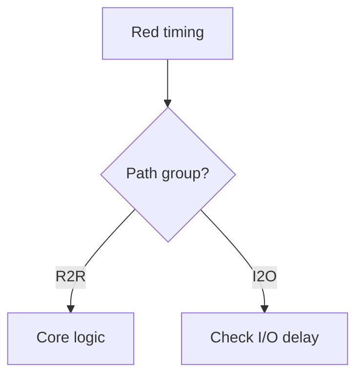

# Mermaid + Tcl smoke test

## Flow

## SDC (unfenced on purpose)

create_clock -name CLK -period $T [get_ports clk]
set_clock_uncertainty -setup [expr {0.05*$T}] [get_clocks CLK]

## Math still works

Setup: \( t_{cq} + t_{pd} + t_{su} \le T \)
