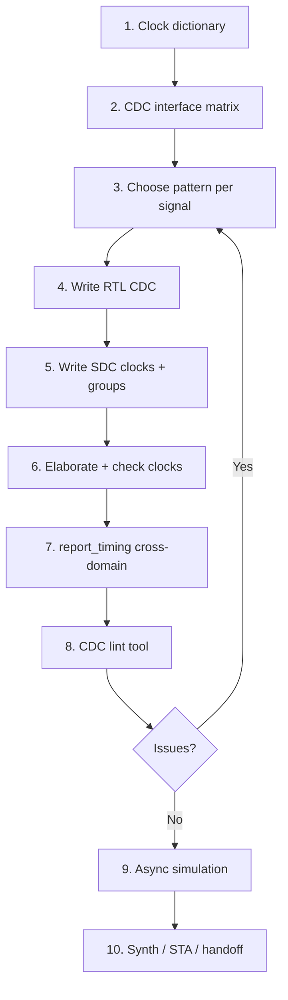
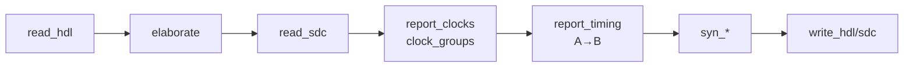
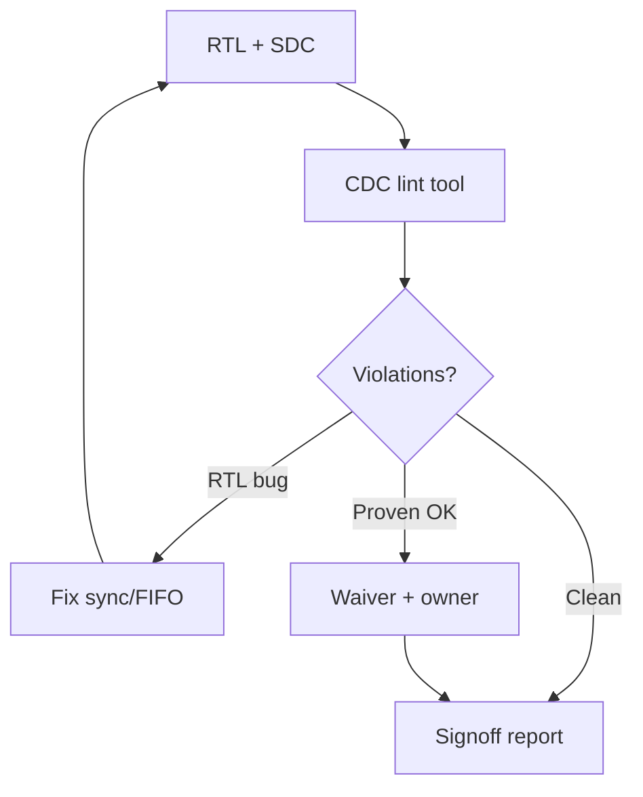

# CDC Complete User Guide & Manual

**Industry CDC manual** (single document). Applies to any multi-clock SoC — examples may use `cdc_lab`, but methods are general.  

**Contents:** theory, flows, how to **write** CDC RTL & SDC, check clocks/paths, helpers, illegal patterns, lint, issues, interview Q&A.  

| | |
|--|--|
| **Tool (STA/SDC)** | Cadence Genus — `PLAN/misc/genus_commands/` |
| **Structural signoff** | Spyglass CDC / Questa CDC / etc. |
| **Optional example lab** | `practice/cdc_lab/` |
| **All clocks deep dive** | **`CLOCKS_COMPLETE_USER_GUIDE.md`** |
| **Curriculum index** | **`GENUS_COMPLETE_INDEX.md`** |

---

## Table of contents

1. [What / why / where CDC fits](#1-what--why--where-cdc-fits)
2. [End-to-end CDC flows](#2-end-to-end-cdc-flows)
3. [Metastability & fundamentals](#3-metastability--fundamentals)
4. [Clock relationships (sync / exclusive / async)](#4-clock-relationships-sync--exclusive--async)
5. [How to write CDC (RTL patterns)](#5-how-to-write-cdc-rtl-patterns)
6. [What is illegal / common bugs](#6-what-is-illegal--common-bugs)
7. [How to write CDC SDC](#7-how-to-write-cdc-sdc)
8. [How to check clocks](#8-how-to-check-clocks)
9. [How to check which path has which clock](#9-how-to-check-which-path-has-which-clock)
10. [Helper commands — when to use what](#10-helper-commands--when-to-use-what)
11. [Command reference (usage details)](#11-command-reference-usage-details)
12. [CDC matrix & documentation](#12-cdc-matrix--documentation)
13. [Stage-by-stage checklist](#13-stage-by-stage-checklist)
14. [Issue → diagnose → fix encyclopedia](#14-issue--diagnose--fix-encyclopedia)
15. [Lab walkthrough (`cdc_lab`)](#15-lab-walkthrough-cdc_lab)
16. [CDC lint tool flow (signoff)](#16-cdc-lint-tool-flow-signoff)
17. [Relation to synth / UPF / pad_top](#17-relation-to-synth--upf--pad_top)
18. [Interview & FAQ](#18-interview--faq)
19. [Appendices](#19-appendices)

---

## 1. What / why / where CDC fits

### 1.1 What is CDC?

**Clock Domain Crossing:** data or control launched under **clock A** and captured under **clock B**, where A and B do **not** share a known, fixed phase relationship usable for normal setup/hold the way same-domain R2R does.

```text
  Domain A (clk_a)                    Domain B (clk_b)
  ┌─────────────┐                     ┌─────────────┐
  │  FF launch  │──── signal(s) ────►│  FF capture │
  └─────────────┘     CDC path        └─────────────┘
```

### 1.2 Why does CDC need special handling?

| Reason | Explanation |
|--------|-------------|
| **Metastability** | Capture edge vs async data → FF may go meta |
| **STA model** | Tools assume deterministic delays; meta is statistical |
| **Multi-bit** | Independent bits can form illegal intermediate values |
| **Pulses** | Short pulses can be **missed** in a slower domain |

So CDC is **architecture + RTL + SDC + lint + sim**, not “one synthesis switch.”

### 1.3 Where CDC appears

| Where | Example |
|-------|---------|
| Multi-PLL SoC | CPU, DDR, PCIe clocks |
| Same PLL, **mesochronous** / no fixed usable phase | Dividers without known phase relationship for STA |
| Always-on vs core | 32 kHz RTC ↔ GHz core |
| Chip ↔ external | System clk ↔ recovered PHY clk |
| SoC multi-IP | Always-on slow clock vs core GHz |
| Clock mux modes | Func vs scan (often **exclusive**, not classic async) |
| DFT | Shift clocks vs functional (usually exclusive groups) |
| Your `pad_top` | **No multi-clock CDC** (single functional clock) |
| Your `cdc_lab` | **Yes** — `clk_a` and `clk_b` |

### 1.3b What “CDC flow” means (end-to-end checklist)

Not one Genus button:

```text
1. Architecture: list clocks + which signals cross
2. RTL: legal synchronizers / FIFO / handshake (not raw multi-bit)
3. SDC: create_clock + set_clock_groups -asynchronous (or exclusive)
4. CDC lint: structural + reconvergence + missing sync
5. STA: no false expectation of sync timing on true async paths
6. Simulation: async clocks + reset + stress
7. Silicon: MTBF-aware synchronizer design / placement
```

### 1.4 What CDC is **not**

| Not CDC | Handled by |
|---------|------------|
| Same clock, long combo | Timing closure / pipeline |
| Power domain crossing only | **UPF** (ISO/LS) — different problem |
| Pad I/O external delay | `set_input_delay` / `set_output_delay` |
| Clock gating inside one domain | LP / ICG |

### 1.5 Roles of tools

| Tool | CDC role |
|------|----------|
| **RTL + review** | Correct synchronizers / FIFO / handshake |
| **Genus + SDC** | Define clocks; `set_clock_groups`; STA won’t demand impossible sync paths |
| **CDC lint** | Missing sync, multi-bit, reconvergence, combo clouds |
| **Simulator** | Functional correctness under async clocks |
| **PnR** | Place sync flops carefully (MTBF), don’t destroy chains |

---

## 2. End-to-end CDC flows

### 2.1 Full methodology flow (how / why)



| Step | What | Why | Where (artifact) |
|------|------|-----|------------------|
| 1 | List every clock: name, period, source, group | Know domains | Spec / `report_clocks` |
| 2 | List every crossing signal | Nothing forgotten | CDC matrix spreadsheet |
| 3 | 2FF / pulse / handshake / FIFO | Correct structure | Architecture |
| 4 | Implement modules | Silicon-safe behavior | RTL |
| 5 | `create_clock` + `set_clock_groups` | STA intent | SDC |
| 6–7 | Verify clocks & path clocks | Catch missing async group | Genus reports |
| 8 | Structural lint | Catch bad multi-bit etc. | Spyglass CDC… |
| 9 | Sim with independent clocks | Functional proof | TB |
| 10 | Continue chip flow | Don’t break CDC in opt | Netlist + SDC |

### 2.2 Genus-only mini flow (lab)



```text
read_hdl → elaborate cdc_top → read_sdc
  → report_clocks / report_clock_groups
  → report_timing -from CLK_A -to CLK_B
  → syn_generic → syn_map → syn_opt
  → write_hdl / write_sdc
```

Script: `practice/scripts/run_genus_cdc_lab.tcl`

### 2.3 CDC lint flow (signoff-class)



```text
RTL + SDC (+ clock intent file)
  → CDC tool: define clocks / async pairs
  → Run structural + reconvergence checks
  → Waive only with written proof
  → Clean report for tapeout
```

### 2.4 When to run CDC work in the project calendar

| Phase | CDC activity |
|-------|----------------|
| Architecture | Clock & interface list |
| RTL coding | Write synchronizers with IP |
| Pre-synth | CDC lint first pass |
| After elaborate | SDC clocks + groups in Genus |
| Pre-tapeout | CDC lint freeze + sim stress |
| Post-synth | Don’t dissolve sync chains (preserve if needed) |

---

## 3. Metastability & fundamentals

### 3.1 Setup/hold failure → metastability

If `D` of a FF changes near the capturing clock edge, the FF may enter **metastability**: output hangs between 0 and 1, then resolves after an unknown time.

If data changes inside the capture window of `clk_b`, the FF output may:

1. Stay between 0 and 1 for a while  
2. Resolve late to 0 or 1  
3. Cause downstream logic to sample a late/glitchy value  

### 3.2 2FF synchronizer (why it helps)

```text
  async_in --> FF1 (may go meta) --> FF2 (unlikely still meta) --> sync_out
                 ^                      ^
              clk_dst                clk_dst
```

| FF / property | Role |
|---------------|------|
| FF1 | Absorbs metastability (may go meta) |
| FF2 | Samples FF1 later; probability both meta is tiny |
| **MTBF** | Mean time between failures — grows with more stages / slower clocks / better FF |
| **2FF** | Industry default for many control bits |
| **3FF** | Higher reliability / faster dest clocks |

**MTBF** also rises with clean input (no glitches on async path into first FF).

**Does not** make multi-bit buses safe by itself (see reconvergence).

### 3.3 What STA cannot do / what 2FF does not fix

STA assumes deterministic delays. Metastability is **statistical**. So:

- You **do not** “close setup” on a raw async path the way you do R2R  
- You **mark domains async** and **structurally** implement safe CDC  

2FF alone also does **not** fix:

- Multi-bit bus coherence  
- Missed short pulses into slow clocks  
- Gray-code-less counters across domains  

---

## 4. Clock relationships (sync / exclusive / async)

| Relationship | Meaning | STA treatment (typical) | SDC |
|--------------|---------|-------------------------|-----|
| **Synchronous** | Same source, known phase/period | Timed paths | Same clock or `create_generated_clock` |
| **Logically exclusive** | Never both active as functional clocks | No paths between groups | `set_clock_groups -logically_exclusive` |
| **Physically exclusive** | Muxed clocks, only one physical | No paths between groups | `set_clock_groups -physically_exclusive` |
| **Asynchronous** | No known phase relationship | No normal inter-group setup/hold | `set_clock_groups -asynchronous` |

```tcl
# Genus-verified (PLAN/misc/genus_commands/set_clock_groups.txt)
set_clock_groups -asynchronous -name async_ab \
  -group [get_clocks CLK_A] \
  -group [get_clocks CLK_B]

set_clock_groups -logically_exclusive -name excl \
  -group [get_clocks FUNC_CLK] \
  -group [get_clocks SCAN_CLK]
```

| Flag | Use |
|------|-----|
| `-asynchronous` | True CDC domains |
| `-logically_exclusive` | Modes where only one clock “counts” |
| `-physically_exclusive` | Clock mux |
| `-allow_paths` | Still allow some timing between async groups (advanced) |
| `-name` / `-comment` | Name/document the grouping |

**Deep flag manual:** `CLOCKS_COMPLETE_USER_GUIDE.md` §22.

**Generated clocks:** If B is `create_generated_clock` from A with known divide/multiply, treat as **synchronous family** — do **not** mark async to master.

---

## 5. How to write CDC (RTL patterns)

### 5.1 Decision table (what pattern where)

| Signal type | Pattern | Module in lab |
|-------------|---------|---------------|
| 1-bit **level** (enable, flag), rare changes | 2FF (or 3FF) | `sync_2ff.v` |
| 1-cycle **pulse** / event | Toggle + 2FF + edge | `sync_pulse.v` |
| Multi-bit **data**, low rate / config | Req/ack handshake or multi-cycle + sync enable | `cdc_handshake.v` |
| Multi-bit **stream** | Async FIFO (gray ptrs) | (design yourself next) |
| Reset | Async assert, **sync deassert** per domain | (extend lab) |
| Related clocks (PLL/N) | Often **no** async CDC — use sync STA | `create_generated_clock` |

### 5.2 Single-bit 2FF — how to write

**Use for:** level signals (enable, config bit, status) that change **infrequently** relative to dest clock.

```text
src_bit (clk_a) --> [2FF on clk_b] --> dst_bit
```

**Rules:**

1. Source signal should be a **registered** level in domain A (avoid combo glitches).  
2. Exactly **one bit** into the chain.  
3. Both flops on **destination** clock only.  
4. No combo between FF1 and FF2.  
5. Don’t use `sync_out` asynchronously into another domain again without re-sync.  
6. Prefer clean FF output from source domain.

```verilog
// Pattern
always @(posedge clk_dst or negedge rst_n) begin
  if (!rst_n) begin s0 <= 0; s1 <= 0; end
  else begin s0 <= async_in; s1 <= s0; end
end
assign sync_out = s1;
```

**Why:** Maximizes chance FF2 is stable when used. Lab: `sync_2ff.v` → `bit_a` → `bit_b_sync`.

### 5.3 Pulse CDC — how to write

**Problem:** Pulse high for 1 cycle of fast `clk_a` may not be seen by slow `clk_b` if only level-synced.

**How:**

1. On pulse in A: **toggle** a bit in A.  
2. 2FF-sync that toggle into B.  
3. In B: `pulse_b = sync ^ sync_d` (edge).

**Why:** Toggle is a **level change** that persists until next event; B will eventually see it.

**Limits:** If pulses in A are faster than B can process, events can still coalesce — need handshake/FIFO for every event. Lab: `sync_pulse.v`.

### 5.4 Multi-bit handshake — how to write

**Problem:** Bits of a bus can take different times through meta → **incoherent** word (reconvergence).

**How:**

```text
A: hold data_stable; assert req
B: 2FF(req) → when req rises, sample data, assert ack, pulse valid
A: 2FF(ack) → when ack rises, deassert req
```

**Why data is safe:** Data does not change while `req` is high; B only samples after seeing stable `req`. Bits don’t need individual 2FFs.

**Must:** Data and `req` launched from same domain with data held. Lab: `cdc_handshake.v`.

### 5.5 Async FIFO (gray) — how to write (outline)

**Use for:** streaming throughput between domains.

```text
Write domain: data RAM[wr_ptr]; wr_ptr binary → gray → sync to read domain
Read domain:  gray wr → binary; compare to rd_ptr for full/empty
Read domain:  rd_ptr binary → gray → sync to write domain
```

**Why gray:** Only one bit changes per count → multi-bit sync of gray pointer is safe enough for pointer CDC (standard technique). Not fully coded in this lab (handshake is enough for first practice).

### 5.6 Quasi-static / multi-cycle path (MCP)

If data is guaranteed stable for N dest cycles and control is synced:

- Synced “load enable” + stable data bus  
- Document as MCP / false path carefully with proof  

Still not “free multi-bit 2FF.”

### 5.7 Reset CDC — how to write

| Edge | Recommendation |
|------|----------------|
| Assert async reset | Often async to FFs (`negedge rst_n`) |
| **Deassert** | Synchronize release to **each** clock domain |

```text
  rst_n async assert → sync release per clock domain
```

**Why:** Async release can free some FFs earlier than others → illegal state.  
Lab SDC uses `set_false_path -from rst` as data-path simplification; real chips need reset synchronizers.

### 5.8 What **not** to write

```verilog
// BAD: multi-bit each bit 2FF
// BAD: always @(posedge clk_b) data_b <= data_a;  // raw CDC
// BAD: combo between domains then sample
// BAD: sample bus when only one bit is synced  // see cdc_top data_b_bad
```

### 5.9 Naming / structure tips

| Tip | Why |
|-----|-----|
| Prefix modules `sync_*`, `cdc_*` | Easy lint & review |
| Keep sync chain in one module | Don’t let opt retime across chain (use preserve if needed) |
| Document clock of every port | CDC matrix |
| One synchronizer instance per bit | Clarity |

### 5.10 Lab intentional BAD path (learn from it)

In `cdc_top.v`, `data_b_bad` samples full `data_a` when only MSB is synced.  
**Why bad:** Remaining bits still async → reconvergence / corruption.  
**Fix in real design:** Use only `cdc_handshake` / FIFO path; delete bad path.

---

## 6. What is illegal / common bugs

| Bug | Why bad |
|-----|---------|
| Multi-bit bus → each bit 2FF independently | **Reconvergence** — corrupted vector |
| Combo logic between domains without sync | Glitches + multi-path meta |
| Pulse into slow domain with only 2FF level sync | Missed events |
| Assuming STA “closed” async path | False confidence |
| `set_false_path` on everything CDC without RTL sync | Hides missing synchronizer |
| Same edge, related clocks, treated async | Lost optimization / wrong |
| No synchronizer on control bit | Meta into FSM |

**Intentional BAD path in lab** (`cdc_top` → `data_b_bad`): uses synced MSB only, samples whole `data_a` — classic multi-bit CDC fail.

---

## 7. How to write CDC SDC

### 15.1 Goals of SDC for CDC

| Goal | SDC mechanism |
|------|----------------|
| Define each domain root | `create_clock` / `create_generated_clock` |
| Tell STA domains are async | `set_clock_groups -asynchronous` |
| Exclusive mode clocks | `-logically_exclusive` / `-physically_exclusive` |
| Don’t time async reset as data | `set_false_path -from rst` (with care) |
| Rare: budget quasi-static | `set_max_delay` |

**SDC never inserts synchronizers.**

### 15.2 Minimal async dual-clock SDC

```tcl
set_units -time ns

create_clock -name CLK_A -period 5.0  -waveform {0.0 2.5}  [get_ports clk_a]
create_clock -name CLK_B -period 6.66 -waveform {0.0 3.33} [get_ports clk_b]

set_clock_uncertainty -setup 0.05 [get_clocks {CLK_A CLK_B}]
set_clock_uncertainty -hold  0.03 [get_clocks {CLK_A CLK_B}]

set_clock_groups -asynchronous -name async_ab \
  -group [get_clocks CLK_A] \
  -group [get_clocks CLK_B]

set_false_path -from [get_ports rst_n_a]
set_false_path -from [get_ports rst_n_b]
```

Lab file: `cdc_lab/sdc/cdc_top.sdc`

### 15.3 `set_clock_groups` options (what / when)

| Option | What | When |
|--------|------|------|
| `-asynchronous` | No phase relationship | True CDC |
| `-logically_exclusive` | Never both functional at once | Func vs test modes |
| `-physically_exclusive` | Only one exists on silicon at a time | Clock mux |
| `-allow_paths` | Still analyze some paths between groups | Advanced exceptions |
| `-group {…}` | List of clocks in one domain group | Required, ≥2 groups |
| `-name` | Name the grouping | Debug / reports |

Verified usage (Genus):

```tcl
set_clock_groups [-name <string>] [-comment <string>]
  [-logically_exclusive] [-physically_exclusive] [-asynchronous]
  [-allow_paths] (-group <string>)+
```

### 15.4 Generated clocks (often **not** async CDC)

```tcl
create_generated_clock -name CLK_DIV2 \
  -source [get_ports clk_a] -divide_by 2 [get_pins u_div/Q]
```

| If edges known from master | Treat as **synchronous** family — time paths with multicycle if needed |
| If you wrongly set async to master | Lose real timing checks |

Full clocks guide (divide / multiply / edges / latency / groups): **`CLOCKS_COMPLETE_USER_GUIDE.md`**.

### 11.5 I/O delays with multi-clock

Associate external delays with the **correct** clock:

```tcl
set_input_delay  -clock CLK_A ... [get_ports data_a*]
set_output_delay -clock CLK_B ... [get_ports data_b*]
```

### 11.6 False path vs clock groups

| Mechanism | Scope | Use |
|-----------|-------|-----|
| `set_clock_groups -asynchronous` | All paths between clock groups | Default for async domains |
| `set_false_path -from A -to B` | Specific objects | Point cases, static signals |
| Both | — | Groups preferred for domain-wide async |

**Never** use false path as a substitute for missing RTL synchronizers.

### 11.7 Optional: max_delay for special CDC

Some methodologies apply `set_max_delay` between async domains for quasi-static signals (datapath delay budget). Only with **documented** protocol. Not used in the basic lab SDC.

---

## 8. How to check clocks

### 10.1 List all clocks

```tcl
all_clocks
get_clocks *
get_clocks CLK_A
report_clocks
report_clocks -generated
report_clocks -uncertainty_table
report_clocks -ideal
report_clocks > clocks.rpt
```

| Command | What you learn |
|---------|----------------|
| `report_clocks` | Name, **period**, rise/fall, **source port/pin**, #registers |
| `-generated` | Dividers / derived clocks |
| `-uncertainty_table` | Setup/hold uncertainty matrix |
| `get_db clocks .period` | Scriptable period (attr names may vary) |
| `report_units` | ns vs ps for period meaning |

### 10.2 Period, frequency, duty cycle

From `report_clocks` (example):

```text
Name   Period  Rise  Fall  Source
CLK_A  5000.0  0.0   2500  clk_a
```

| Quantity | How |
|----------|-----|
| Period | Column **Period** (in time unit) |
| Frequency | \(f = 1/T\) → if period 5 ns → **200 MHz** |
| Duty high | \((t_{fall}-t_{rise})/T\) → 50% if 0 and T/2 |

```tcl
report_units
# MHz ≈ 1000/period_ns if units are ns
```

### 10.3 Which registers are on which clock

```tcl
report_clocks
# "No of Registers" column per clock

# Script-style exploration
get_db clocks
# Fanout of clock network / sinks — tool-specific attrs; use report_clocks first
```

### 8.4 Clock groups (async intent)

```tcl
report_clock_groups
report_clock_groups -group async_ab
report_clock_groups > clock_groups.rpt
```

**What you want to see:** `CLK_A` in one group, `CLK_B` in another, relationship **asynchronous**.

### 8.5 Missing clock / unconstrained clock pins

```tcl
check_timing
report_timing -unconstrained -max_paths 50
# Lint summary: "Sequential clock pins without clock waveform"
```

| Symptom | Fix |
|---------|-----|
| Clock pin without waveform | `create_clock` / generated clock on that pin |
| Multiple waveforms on one pin | Conflicting creates — fix SDC |
| Unconnected clocks | Connectivity / port name |

### 8.6 Checklist: clocks OK?

- [ ] Every root clock has `create_clock`  
- [ ] Generated clocks have correct `-source` and factor  
- [ ] Periods match architecture  
- [ ] Async pairs listed in `set_clock_groups -asynchronous`  
- [ ] Exclusive pairs use exclusive (not async) if appropriate  
- [ ] `report_clocks` register counts look sane  

---

## 9. How to check which path has which clock

### 15.1 Read a timing path header (primary method)

```tcl
report_timing -max_paths 5 -path_type full_clock
```

Typical header fields:

```text
Startpoint: ... (rising edge-triggered flip-flop clocked by CLK_A)
Endpoint:   ... (rising edge-triggered flip-flop clocked by CLK_B)
Path Group: ...
```

Or in your Genus-style report:

```text
Startpoint: (R) ...
     Clock: (R) CLK_A
 Endpoint:  (F) ...
     Clock: (R) CLK_B
```

| Field | Meaning |
|-------|---------|
| **Startpoint + Clock** | **Launch** clock domain |
| **Endpoint + Clock** | **Capture** clock domain |
| Same clock both ends | Intra-domain path (R2R etc.) |
| Different clocks | Cross-domain — should be async group or intentional exception |

### 15.2 Force cross-domain path search

```tcl
# All worst paths launched by A, captured by B
report_timing -from [get_clocks CLK_A] -to [get_clocks CLK_B] \
  -max_paths 50 -nworst 1 -path_type full

report_timing -from [get_clocks CLK_B] -to [get_clocks CLK_A] \
  -max_paths 50 -path_type full
```

| After correct async groups | Often **no** timed setup paths (or empty) between pure async groups |
| If many violations | Groups missing / wrong, or `-allow_paths`, or related clocks |

### 15.3 Path through a specific CDC net/pin

```tcl
report_timing -through [get_pins u_sync/r0/D] -max_paths 10
report_timing -through [get_ports bit_a] -to [get_ports bit_b_sync] -max_paths 5
report_timing -from [get_ports data_a] -to [get_ports data_b_hs] -max_paths 5
```

### 15.4 Path type options (what you see)

```tcl
report_timing -path_type full          ;# data path detail
report_timing -path_type full_clock    ;# include clock network
report_timing -path_type summary       ;# short
report_timing -path_type endpoint      ;# per endpoint
report_timing -exception_data          ;# which exceptions applied
report_timing -unconstrained           ;# no valid start/end check
```

### 11.5 Domain filter

```tcl
report_timing -domain <clock_domain> -max_paths 20
```

Use when tool organizes **clock domains** as objects (`report_clocks` domain column).

### 11.6 GUI

```tcl
report_timing -from [get_clocks CLK_A] -to [get_clocks CLK_B] -gui
# Select path → schematic: see launch/capture clocks on path
```

### 11.7 Interpreting launch vs capture in CDC context

| Launch clk | Capture clk | Expected treatment |
|------------|-------------|--------------------|
| CLK_A | CLK_A | Normal sync STA |
| CLK_A | CLK_B | Async CDC → groups; RTL sync required |
| CLK_A | generated from A | Often sync family |
| virtual clock | real | I/O path modeling |

### 11.8 “Which clock clocks this flop?”

1. `report_timing -to <flop/D or Q>` and read endpoint clock  
2. Or inspect netlist: flop `.CK` / `.CP` connectivity  
3. `report_clocks` + hierarchy tracing  

```tcl
# Example endpoint-oriented
report_timing -to [get_db pins *u_bit*/r1*] -max_paths 5 -path_type full_clock
```

### 11.9 Verify async grouping worked

```tcl
# Before set_clock_groups: may show A→B setup fails
# After:
report_timing -from [get_clocks CLK_A] -to [get_clocks CLK_B] -max_paths 20
report_clock_groups
```

**Pass criteria for lab:** no bogus “must meet period of A vs B” on pure async data; CDC handled by RTL.

---

## 10. Helper commands — when to use what

### 10.1 By project stage

| Stage | Commands | Purpose |
|-------|----------|---------|
| **Architecture** | (docs) | Clock list, CDC matrix |
| **RTL write** | — | `sync_2ff`, handshake, FIFO |
| **After elaborate** | `report_clocks`, `check_timing` | Clocks reach flops? |
| **After read_sdc** | `report_clocks`, `report_clock_groups`, `report_port -delay` | Intent applied? |
| **CDC STA check** | `report_timing -from/-to clocks` | Cross-domain timed? |
| **Constraint lint** | `check_timing`, `report_timing -unconstrained` | Missing clocks/delays |
| **Debug one net** | `report_timing -through`, `-from`/`-to` pins | Path clocks |
| **Synth** | `syn_generic/map/opt` | Implement gates |
| **Preserve sync** | `set_db … preserve`, `set_dont_touch` | Protect 2FF chain |
| **Handoff** | `write_sdc`, `write_hdl` | Downstream |
| **Signoff CDC** | External CDC tool | Structural bugs |

### 10.2 By question you have

| Your question | Command(s) |
|---------------|------------|
| What clocks exist? | `report_clocks`, `all_clocks` |
| Period / duty / source? | `report_clocks`, `report_units` |
| Are A and B async in SDC? | `report_clock_groups` |
| Does path X launch/capture which clock? | `report_timing … -path_type full_clock` |
| Any A→B timed paths left? | `report_timing -from CLK_A -to CLK_B` |
| Unconstrained logic? | `report_timing -unconstrained` |
| I/O delays present? | `report_port -delay` |
| Exceptions on path? | `report_timing -exception_data` |
| Case analysis mode? | `report_case_analysis` |
| Design structure OK? | `check_design -all` |

### 10.3 Order to run after loading a multi-clock design

```tcl
report_units
report_clocks > rpt/clocks.rpt
report_clock_groups > rpt/clock_groups.rpt
check_timing > rpt/check_timing.rpt
report_timing -from [get_clocks CLK_A] -to [get_clocks CLK_B] -max_paths 20 > rpt/a2b.rpt
report_timing -from [get_clocks CLK_B] -to [get_clocks CLK_A] -max_paths 20 > rpt/b2a.rpt
report_timing -unconstrained -max_paths 50 > rpt/unconst.rpt
report_timing -max_paths 10 -path_type full_clock > rpt/worst_fullclk.rpt
```

---

## 11. Command reference (usage details)

### 15.1 `create_clock`

```tcl
create_clock -name CLK_A -period 5.0 -waveform {0.0 2.5} [get_ports clk_a]
```

| Arg | Meaning |
|-----|---------|
| `-name` | STA clock object name |
| `-period` | Cycle time (time unit) |
| `-waveform {rise fall}` | Edge times in period |
| port/pin | Where clock is applied |

**When:** Every independent root clock.

### 15.2 `create_generated_clock`

```tcl
create_generated_clock -name GCLK -source [get_ports clk_a] \
  -divide_by 2 [get_pins u_div/Q]
```

| Arg | Meaning |
|-----|---------|
| `-source` | Master pin/port |
| `-divide_by` / `-multiply_by` | Ratio |
| `-master_clock` | Disambiguate if multiple clocks on source |
| `-edges` | Custom edge mapping |
| `-invert` | Invert generated waveform |

**When:** Dividers, PLL models in STA. Usually **sync** to master — not async CDC.

### 15.3 `set_clock_groups`

```tcl
set_clock_groups -asynchronous -name async_ab \
  -group [get_clocks CLK_A] \
  -group [get_clocks CLK_B]
```

**When:** After all `create_clock` for those domains.

### 15.4 `set_false_path`

```tcl
set_false_path -from [get_ports rst_n_a]
set_false_path -from [get_clocks CLK_A] -to [get_clocks CLK_B]  ;# often redundant w/ groups
```

**When:** Proven non-timed; **not** a cure for missing sync.

### 11.5 `set_max_delay` / `set_min_delay` / `set_multicycle_path`

| Command | CDC use |
|---------|---------|
| `set_max_delay` | Sometimes quasi-static CDC budget |
| `set_min_delay` | Rare special cases |
| `set_multicycle_path` | **Related** clocks with multi-cycle architecture — not classic async |

### 11.6 `report_clocks`

```tcl
report_clocks [-ideal] [-generated] [-uncertainty_table] [-view <v>] [<clock>+]
```

### 11.7 `report_clock_groups`

```tcl
report_clock_groups [-design <d>] [-group <name>]
```

### 11.8 `report_timing` (CDC essentials)

```tcl
report_timing \
  -from [get_clocks CLK_A] -to [get_clocks CLK_B] \
  -max_paths 50 -nworst 1 \
  -path_type full_clock \
  -exception_data
```

| Flag | Why for CDC |
|------|-------------|
| `-from`/`-to` **clocks** | Cross-domain filter |
| `-path_type full_clock` | See launch/capture clock path |
| `-exception_data` | See groups/FP applied |
| `-unconstrained` | Missing clock/exception |
| `-through` | Focus on sync cell |
| `-gui` | Visual path |

### 11.9 `check_timing`

```tcl
check_timing
# Often prints: unconstrained endpoints, missing clocks, etc.
```

### 11.10 Collections

```tcl
all_clocks
get_clocks *
get_clocks -regexp {CLK_.*}
get_ports clk_a
get_pins */CK
```

### 11.11 Case analysis (modes)

```tcl
set_case_analysis 0 [get_ports test_mode]
report_case_analysis
```

**When:** Scan vs func changes which clock is active — pairs with exclusive clock groups.

### 11.12 Preserve synchronizer cells (optional)

```tcl
set_db [get_db insts *u_sync*] .preserve true
# or set_dont_touch on instances
```

**Why:** Prevent aggressive retiming from breaking 2FF adjacency.

---

## 12. CDC matrix & documentation

Maintain a table for every crossing:

| Signal | Width | From clk | To clk | Pattern | RTL module | SDC note | Lint ID | Owner |
|--------|-------|----------|--------|---------|------------|----------|---------|-------|
| bit_a | 1 | CLK_A | CLK_B | 2FF | sync_2ff | async groups | | |
| pulse_a | 1 | CLK_A | CLK_B | pulse | sync_pulse | async groups | | |
| data_a | 8 | CLK_A | CLK_B | handshake | cdc_handshake | async groups | | |
| data_b_bad | 8 | CLK_A | CLK_B | **ILLEGAL** | cdc_top | teach only | | |

**Why:** Reviews, waivers, interviews, tapeout audits.

---

## 13. Stage-by-stage checklist

### 15.1 RTL complete?

- [ ] Every async bit has 2FF/3FF or is part of gray/handshake/FIFO  
- [ ] No raw multi-bit CDC  
- [ ] Pulses use pulse-safe pattern  
- [ ] Resets synchronized on deassert per domain  
- [ ] No combo clouds on async inputs to first sync FF  

### 15.2 SDC complete?

- [ ] All root clocks created  
- [ ] Generated clocks correct  
- [ ] Async pairs in `set_clock_groups -asynchronous`  
- [ ] Exclusive clocks not marked async by mistake  
- [ ] I/O delays use correct clocks  
- [ ] `report_clock_groups` matches intent  

### 15.3 Genus checks done?

- [ ] `report_clocks` OK  
- [ ] Cross-domain `report_timing` sane  
- [ ] `check_timing` / unconstrained reviewed  
- [ ] Sync chains not destroyed post-opt  

### 15.4 Signoff

- [ ] CDC lint clean or waived with proof  
- [ ] Async sim pass  
- [ ] Matrix signed  

---

## 14. Issue → diagnose → fix encyclopedia

| # | Symptom | Diagnose | Fix |
|---|---------|----------|-----|
| 1 | Huge A→B setup fails | `report_timing -from CLK_A -to CLK_B` | Add `set_clock_groups -asynchronous` + ensure RTL sync |
| 2 | Still timed A→B after groups | `report_clock_groups`; wrong clock names | Fix group membership; check generated clocks |
| 3 | Unconstrained endpoints | `report_timing -unconstrained` | Missing `create_clock` or I/O delay |
| 4 | Clock pin no waveform | `check_timing` / report | `create_clock` on port/pin |
| 5 | Multi-bit garbage in sim | Waveforms on bus | Handshake/FIFO; remove N×2FF |
| 6 | Missed pulse | Pulse width vs dest period | Toggle/handshake |
| 7 | Meta into FSM | Single FF sample | 2FF minimum |
| 8 | Glitchy async input | Combo before sync | Register in source domain |
| 9 | Only SDC false_path, no RTL sync | RTL review | Implement real CDC |
| 10 | Related clocks marked async | Clock architecture | Use sync STA / generated clock |
| 11 | Scan vs func both timed | Mode clocks | `-logically_exclusive` + case analysis |
| 12 | Reset partial release | X at startup | Reset synchronizer |
| 13 | Opt broke 2FF | Netlist inspect | `preserve` / dont_touch sync |
| 14 | Wrong I/O delay clock | `report_port -delay` | `set_input_delay -clock` correct |
| 15 | Empty `get_clocks CLK_A` | Typo / not created | `report_clocks` |
| 16 | FIFO full/empty fail | Gray logic | Standard async FIFO |
| 17 | Hold fail on sync chain | Over-constraint | Review exceptions; don’t force false sync hold badly |
| 18 | Lint reconvergence | CDC tool | Gray or handshake |
| 19 | `data_b_bad` style bug | Code review | Delete; use handshake only |
| 20 | pad_top “CDC” confusion | Single clock | No internal async CDC |

---

## 15. Lab walkthrough (`cdc_lab`)

### 15.1 Files

```text
practice/cdc_lab/
  rtl/sync_2ff.v
  rtl/sync_pulse.v
  rtl/cdc_handshake.v
  rtl/cdc_top.v
  sdc/cdc_top.sdc
  README.md
practice/scripts/run_genus_cdc_lab.tcl
practice/docs/CDC_USER_GUIDE.md      ← this file (single CDC manual)
```

### 15.2 How to run Genus

```bash
cd /mnt/data2/hemanth/manual_asic/practice
genus -batch -f scripts/run_genus_cdc_lab.tcl
```

### 15.3 What to open

| Report | Expect |
|--------|--------|
| `reports/genus_cdc_lab/clocks.rpt` | CLK_A, CLK_B, periods |
| `timing_a_to_b.rpt` | No bogus sync closure demand after groups |
| `qor.rpt` | Intra-domain QoR |

### 15.4 Manual learning steps / exercises

1. Draw timing of 2FF and mark meta window on first FF.  
2. Trace handshake req/ack in `cdc_handshake.v`.  
3. Explain `data_b_bad` failure mode; rewrite using only handshake path.  
4. Run with and without `set_clock_groups` (comment out) — compare A→B `report_timing`.  
5. Change periods (A much faster than B) — discuss pulse miss risk.  
6. Fill a CDC matrix for all ports: width, pattern, SDC treatment.  

### 15.5 Mapping lab → real chip

| Lab | Real SoC |
|-----|----------|
| `clk_a` / `clk_b` | Two PLL outputs |
| `sync_2ff` | Library or hardened sync cell |
| Handshake | CSR / config bus CDC |
| Async FIFO | Streaming DMA CDC |
| `set_clock_groups` | Same in chip SDC |

---

## 16. CDC lint tool flow (signoff)

When Spyglass CDC / Questa CDC / similar is available:

```text
1. Read RTL (+ libraries if needed)
2. Read / define clocks (often from SDC)
3. Declare async clock groups (same intent as set_clock_groups)
4. Run structural CDC
5. Review: missing sync, multi-bit, reconvergence, combo logic, reset CDC
6. Fix RTL or waive with written protocol proof
7. Freeze waiver list for tapeout
```

| Genus alone | Not a substitute for this step on complex multi-clock SoCs |

---

## 17. Relation to synth / UPF / pad_top

| Topic | Relation to CDC |
|-------|-----------------|
| **pad_top** | Single clock today → **no multi-clock CDC** inside core |
| **I/O timing** | Chip I/O external delay is **not** the same as internal async CDC |
| **UPF** | Power domains ≠ clock domains (different problem; see UPF docs) |
| **Logical synth** | Can implement sync flops; CDC correctness is **architecture + lint** |
| **Generated clocks** | Related to master — usually **sync** family, not async CDC |
| **Next step after lab** | Multi-clock real IP, or CDC lint tool if available |

---

## 18. Interview & FAQ

**Q: What is CDC?**  
Crossing of signals between clock domains without a fixed timing relationship.

**Q: Why 2FF?**  
Reduce metastability probability before use of the signal.

**Q: Why not 8×2FF for a byte?**  
Reconvergence — bits settle at different times.

**Q: Role of `set_clock_groups -asynchronous`?**  
STA: don’t apply normal inter-clock setup/hold. **Does not** implement CDC.

**Q: How do you check which clock is on a path?**  
`report_timing -path_type full_clock` — read launch/capture clocks; or `-from/-to [get_clocks …]`.

**Q: How do you check clocks?**  
`report_clocks`, `report_clock_groups`, `check_timing`.

**Q: Pulse CDC?**  
Toggle or handshake — level 2FF can miss pulses.

**Q: Async FIFO key idea?**  
Gray-coded pointers synchronized across domains.

**Q: False path everything between clocks?**  
Dangerous if it hides missing synchronizers; prefer clock groups + correct RTL.

**Q: Sync vs exclusive vs async?**  
Sync: time paths. Exclusive: never simultaneous. Async: simultaneous unknown phase.

**Q: MTBF?**  
Expected time to metastability failure; increases with sync stages and better electrical design.

**Q: 2FF vs async FIFO?**  
2FF: single-bit / slow control. FIFO: multi-bit streaming bandwidth.

**Q: False path vs clock groups?**  
Groups scale multi-clock; FP is point exceptions. Prefer groups for domain-wide async.

---

## 19. Appendices

### A. One-page command card

```tcl
# Define
create_clock -name CLK_A -period 5.0  [get_ports clk_a]
create_clock -name CLK_B -period 6.66 [get_ports clk_b]
set_clock_groups -asynchronous -name async_ab \
  -group [get_clocks CLK_A] -group [get_clocks CLK_B]

# Check clocks
report_units
report_clocks
report_clocks -generated
report_clock_groups
check_timing

# Check path clocks
report_timing -max_paths 5 -path_type full_clock
report_timing -from [get_clocks CLK_A] -to [get_clocks CLK_B] -max_paths 20
report_timing -from [get_clocks CLK_B] -to [get_clocks CLK_A] -max_paths 20
report_timing -through [get_pins <sync_ff>/D] -max_paths 5
report_timing -unconstrained -max_paths 50
report_timing -exception_data -max_paths 5

# I/O
report_port -delay [all_inputs]
report_port -delay [all_outputs]
```

### B. RTL pattern card

| Need | Write |
|------|-------|
| Bit level | 2FF on dest clk |
| Pulse | Toggle + 2FF + XOR |
| Multi-bit rare | Req/ack + hold data |
| Multi-bit stream | Async FIFO gray |
| Reset deassert | Per-domain sync release |

### C. Flow card

```text
Matrix → RTL patterns → SDC clocks+groups → report_clocks →
report_timing cross-domain → CDC lint → sim → handoff
```

### D. File index

| Path | Role |
|------|------|
| **This file** | **Only** CDC manual (merged) |
| `CLOCKS_COMPLETE_USER_GUIDE.md` | All clocks / set_clock_groups deep dive |
| `cdc_lab/` | Practice RTL+SDC |
| `scripts/run_genus_cdc_lab.tcl` | Genus automation |
| `PLAN/misc/genus_commands/set_clock_groups.txt` | Authoritative flags |
| `PLAN/misc/genus_commands/report_timing.txt` | Path reporting flags |

### E. Glossary

| Term | Meaning |
|------|---------|
| CDC | Clock domain crossing |
| MTBF | Mean time between metastability failures |
| Reconvergence | Multi-bit paths reconverge to illegal values |
| Gray code | Single-bit-change encoding for pointer CDC |
| Async group | SDC: clocks with no timing relationship |
| Synchronizer | FF chain sampling async input |
| Handshake | Req/ack multi-cycle multi-bit CDC |
| Quasi-static | Data stable long enough after synced qualify |

---

*Single CDC playbook (merged). Write RTL (§5), illegal patterns (§6), write SDC (§7), check clocks (§8), path clocks (§9), helpers (§10–11), issues (§14), lab (§15). Clocks deep dive: `CLOCKS_COMPLETE_USER_GUIDE.md`.*
