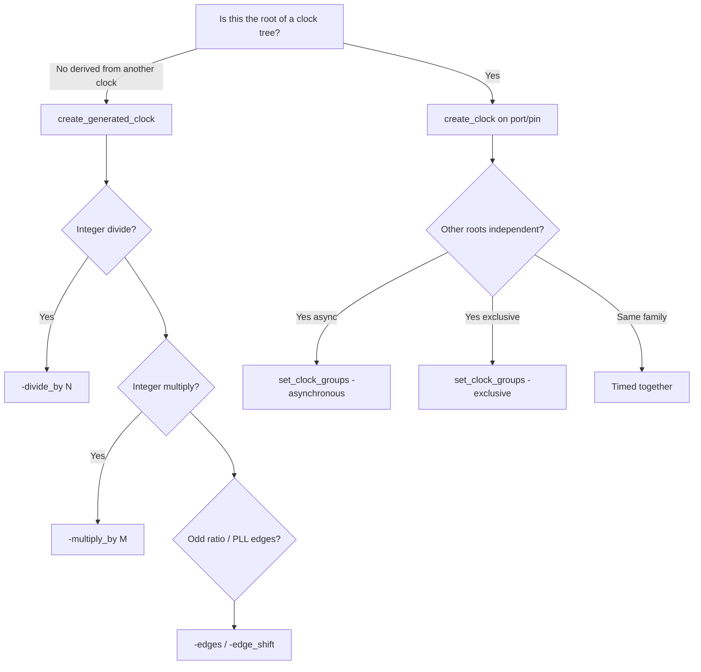
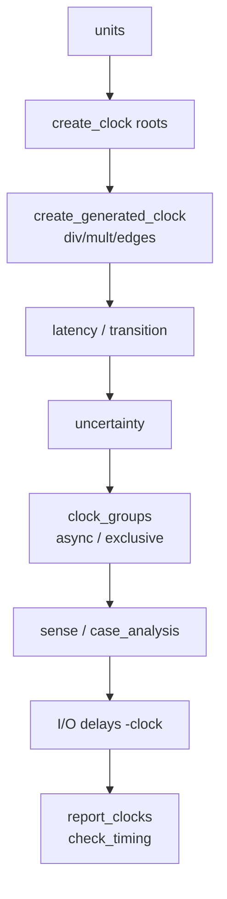

# Complete Clocks User Guide (Genus / SDC)

**Industry manual for everything about clocks** (any design): root clocks, **generated clocks** (`-divide_by`, `-multiply_by`, `-edges`, invert, duty), latency, uncertainty, transition, groups (all flags), ideal vs propagated, virtual clocks, muxes, DFT test clocks, `set_db` clock attrs, how to check clocks, path launch/capture clocks, CDC vs sync relationships, issues & fixes.  

**Tool:** Cadence Genus Common UI. Flags from `PLAN/misc/genus_commands/`.  
**Curriculum index:** `GENUS_COMPLETE_INDEX.md`.  
**CDC RTL/flow:** `CDC_USER_GUIDE.md`.

---

## Table of contents

1. [What a “clock” means in STA](#1-what-a-clock-means-in-sta)
2. [Clock taxonomy (what kind do I need?)](#2-clock-taxonomy-what-kind-do-i-need)
3. [Period, frequency, waveform, duty cycle](#3-period-frequency-waveform-duty-cycle)
4. [Root clocks — `create_clock`](#4-root-clocks--create_clock)
5. [Generated clocks — full guide](#5-generated-clocks--full-guide)
6. [divide_by vs multiply_by vs edges — when and why](#6-divide_by-vs-multiply_by-vs-edges--when-and-why)
7. [Clock network modeling (latency, transition, uncertainty, skew)](#7-clock-network-modeling-latency-transition-uncertainty-skew)
8. [Clock groups (async / exclusive)](#8-clock-groups-async--exclusive)
9. [Clock sense, stop propagation, active clocks](#9-clock-sense-stop-propagation-active-clocks)
10. [Ideal vs propagated clocks](#10-ideal-vs-propagated-clocks)
11. [Virtual clocks & I/O](#11-virtual-clocks--io)
12. [Clock muxes and multiple clocks on one pin](#12-clock-muxes-and-multiple-clocks-on-one-pin)
13. [How to check clocks (reports & scripts)](#13-how-to-check-clocks-reports--scripts)
14. [How paths get launch/capture clocks](#14-how-paths-get-launchcapture-clocks)
15. [Where each clock construct is required (by design type)](#15-where-each-clock-construct-is-required-by-design-type)
16. [End-to-end clock constraint flows](#16-end-to-end-clock-constraint-flows)
17. [Command encyclopedia](#17-command-encyclopedia)
18. [Issue → fix playbook](#18-issue--fix-playbook)
19. [Worked examples](#19-worked-examples)
20. [Interview FAQ](#20-interview-faq)
21. [Appendices](#21-appendices)
22. [`set_clock_groups` deep manual (all flags)](#22-set_clock_groups-deep-manual-all-flags)
23. [CDC-related clock commands (full helper list)](#23-cdc-related-clock-commands-full-helper-list)
24. [Clock-related `set_db` attributes](#24-clock-related-set_db-attributes)
25. [Exceptions used with multi-clock / CDC designs](#25-exceptions-used-with-multi-clock--cdc-designs)
26. [Reset / get / report helpers (clocks)](#26-reset--get--report-helpers-clocks)
27. [DFT / test clocks (vs functional CDC)](#27-dft--test-clocks-vs-functional-cdc)

---

## 1. What a “clock” means in STA

In synthesis/STA, a **clock** is not just a net named `clk`. It is an **analysis object** that defines:

| Property | Role |
|----------|------|
| **Period** | Time between same edges (setup budget for 1-cycle paths) |
| **Waveform** | Rise/fall times within the period (duty, half-cycle) |
| **Source** | Port or pin where the ideal edge is defined |
| **Network** | How the edge arrives at sequential CK pins (ideal or propagated) |
| **Relationships** | Sync / generated / async / exclusive vs other clocks |

**Why define clocks?** Without them:

- No setup/hold checks on flops  
- No path groups by clock  
- CDC cannot be classified  
- I/O delays have no reference  

---

## 2. Clock taxonomy (what kind do I need?)



| Kind | Command | Example |
|------|---------|---------|
| **Primary / root** | `create_clock` | Chip pin `pad_clk`, board oscillator port |
| **Generated** | `create_generated_clock` | DIV2, DIV3, PLL×2 model, inverted clock |
| **Virtual** | `create_clock` with no real port / virtual | External device clock for I/O delay |
| **Gated functional** | Still same clock object; ICG on network | Clock gating does **not** create a new domain by itself |

---

## 3. Period, frequency, waveform, duty cycle

### 3.1 Period and frequency

| Quantity | Formula | Example |
|----------|---------|---------|
| Period \(T\) | From `create_clock -period` | \(T = 2.0\) ns |
| Frequency | \(f = 1/T\) | \(f = 500\) MHz |
| If unit is **ns** | \(f_{\mathrm{MHz}} = 1000 / T_{\mathrm{ns}}\) | \(T=5\) → 200 MHz |
| If unit is **ps** | \(f_{\mathrm{MHz}} = 10^6 / T_{\mathrm{ps}}\) | \(T=5000\) → 200 MHz |

**Always** run `report_units` before interpreting numbers.

### 3.2 Waveform and duty cycle

```tcl
create_clock -name CLK -period 10.0 -waveform {0.0 5.0} [get_ports clk]
# rise at 0, fall at 5 → 50% duty
```

| Duty high | \((t_{fall} - t_{rise}) / T \times 100\%\) |
| 20/80 | e.g. `-waveform {0 2}` with \(T=10\) → 20% high |
| Why duty matters | Half-cycle paths (posedge→negedge) get window \(= t_{fall}-t_{rise}\) |

### 3.3 Edge names in reports

| Report mark | Meaning |
|-------------|---------|
| `(R)` | Rising edge |
| `(F)` | Falling edge |
| Launch edge time | When source FF is clocked |
| Capture edge time | When dest FF is clocked (often +1 period for setup) |

---

## 4. Root clocks — `create_clock`

### 4.1 What / why / where

| | |
|--|--|
| **What** | Defines a **master** periodic waveform at a source |
| **Why** | Root of timing for all flops reached by that clock network |
| **Where** | Chip clock ports, PLL output pins (if modeled as root), virtual clocks |

Genus help dump is thin; industry SDC form:

```tcl
create_clock -name <NAME> -period <T> [-waveform {rise fall}] \
  [-add] [-comment "..."] [get_ports|get_pins <source>]
```

### 4.2 Options (practical)

| Option | Function | When required |
|--------|----------|---------------|
| `-name` | Clock object name used everywhere | Always (clear names: `CLK_CORE`) |
| `-period` | Cycle time | Always |
| `-waveform {r f}` | Edge times | Explicit duty; default ~50% if omitted |
| source port/pin | Where ideal clock is defined | Always for real clocks |
| `-add` | Add another clock on same source | Multiple clocks on one pin (mux) |

### 4.3 Examples

```tcl
# pad_top style
create_clock -name CLK -period 3.0 -waveform {0.0 1.5} [get_ports pad_clk]

# Two independent roots (cdc_lab)
create_clock -name CLK_A -period 5.0  [get_ports clk_a]
create_clock -name CLK_B -period 6.66 [get_ports clk_b]
```

### 4.4 When root clock is **required**

| Situation | Required? |
|-----------|-----------|
| Any edge-triggered sequential logic | **Yes** at least one clock |
| Each independent oscillator / PLL output treated as root | **Yes** each |
| Pure combo feedthrough only | Clock optional but I/O still needs reference often |

---

## 5. Generated clocks — full guide

### 5.1 What is a generated clock?

A clock whose **edges are defined as a function of another clock’s edges** (the **master**), applied at a **downstream pin** (divider Q, PLL out model, inverter output, mux out).

```text
  create_clock @ port clk
         │
         ▼
      [DIV2 flops]
         │
         ▼
  create_generated_clock -divide_by 2 @ div/Q
```

### 5.2 Why generated clocks exist

| Reason | Explanation |
|--------|-------------|
| **Correct period** | DIV2 flops need period \(2T\), not \(T\) |
| **Correct edge alignment** | Capture/launch edges must match real divide relationship |
| **Source latency chain** | Tool can include master network + generate path |
| **Half-cycle / edge paths** | Waveform must reflect inverted or shifted clocks |
| **PLL modeling** | Multiply/divide + phase in STA without full analog PLL |

**Without generated clock:** flops on div output may be analyzed with **wrong period** (master period) → false pass/fail.

### 5.3 Verified Genus usage

```text
create_generated_clock [-name <string>] [-comment <string>]
  [-domain <string>] [-add] [-dont_create_cost_group]
  -source <pin|hpin|port> [-master_clock <clock>]
  [-divide_by <integer>] [-multiply_by <integer>] [-duty_cycle <float>]
  [-invert] [-source_invert] [-edges <integer>+] [-edge_shift <float>+]
  [-apply_inverted <object>+] [-combinational]
  <pin|hpin|port>+
```

| Option | Function |
|--------|----------|
| **`-source`** | Master pin/port the generate relationship is measured from (**required**) |
| **`-master_clock`** | Which clock on `-source` if **multiple** clocks exist there |
| **`-divide_by N`** | Period_gen = N × Period_master (edge every N master edges) |
| **`-multiply_by M`** | Period_gen = Period_master / M (PLL-style faster clock) |
| **`-duty_cycle`** | High pulse % for multiply-generated clocks (0–100) |
| **`-invert`** | Invert generated waveform |
| **`-source_invert`** | Invert master waveform before generating |
| **`-edges {e1 e2 e3}`** | Map generated edges to master edge numbers (non-integer ratios / precise PLL) |
| **`-edge_shift`** | Shift those edges in time (phase offset) |
| **`-combinational`** | Source latency includes combo path from master to generate pin |
| **`-add`** | Add clock at pin instead of replacing |
| **`-name`** | Name of generated clock object |
| **`-domain`** | Clock domain name if used by flow |
| **`-dont_create_cost_group`** | Don’t auto path-group for this clock |
| targets | Pin(s)/port(s) where generated clock is **applied** (divider output, etc.) |

### 5.4 Where to apply generated clocks

| Target | Example |
|--------|---------|
| Divider register Q | `u_clkdiv/q_reg/Q` |
| Hierarchical clock pin | `u_core/clk_div2` |
| PLL model output pin | `u_pll/CLKOUT0` |
| Inverted clock buffer out | rarely; often `-invert` on same network |

**Do not** put `create_generated_clock` on the **same** pin as master root without clear mux/`-add` intent.

---

## 6. divide_by vs multiply_by vs edges — when and why

### 6.1 `-divide_by N` (most common)

| | |
|--|--|
| **What** | Generated period = **N ×** master period |
| **Why** | Hardware **frequency divider** (counters, /2 FF, /3 logic) |
| **Where** | Clock divider IP, “clk_div2”, scan vs slow clocks |
| **Edge relation** | Typically every Nth rising edge of master (tool models) |

```tcl
# Master 500 MHz (T=2 ns) → gen 250 MHz (T=4 ns)
create_clock -name CLK -period 2.0 [get_ports clk]
create_generated_clock -name CLK_DIV2 \
  -source [get_ports clk] \
  -divide_by 2 \
  [get_pins u_div/Q]
```

| N | Freq ratio | Period ratio |
|---|------------|--------------|
| 2 | 1/2 | ×2 |
| 3 | 1/3 | ×3 |
| 4 | 1/4 | ×4 |

**Required when:** Any sequential logic is clocked by a **divided** version of another defined clock and you need correct STA.

**Not required when:** Divider is only combinatorial glitch filter with same rate (unusual) — still usually define gen clock if flops use that pin.

### 6.2 `-multiply_by M`

| | |
|--|--|
| **What** | Generated period = master_period / **M** (faster clock) |
| **Why** | Model **PLL/FLL multiply**, SERDES high-speed clock from ref |
| **Where** | PLL output pins in STA model, “clk_×2” |
| **`-duty_cycle`** | Often needed for multiply to set high time % |

```tcl
# Ref 100 MHz (T=10 ns) → PLL ×4 → 400 MHz (T=2.5 ns)
create_clock -name CLK_REF -period 10.0 [get_ports clk_ref]
create_generated_clock -name CLK_PLL \
  -source [get_ports clk_ref] \
  -multiply_by 4 \
  -duty_cycle 50.0 \
  [get_pins u_pll/clkout]
```

| M | Freq | Period |
|---|------|--------|
| 2 | ×2 | /2 |
| 4 | ×4 | /4 |

**Required when:** Capture/launch flops run on **multiplied** clock derived from a ref you already defined.

**Caution:** Real PLLs have jitter/phase — often add **uncertainty** or latency; multiply is an **ideal** model.

### 6.3 Can I use both divide and multiply?

Some flows allow ratio as multiply/divide combo; Genus lists them as separate options. Typical:

- Pure divide **or** pure multiply per generated clock  
- Complex ratios → **`-edges`** method  

Check project methodology; don’t invent unsupported combos.

### 6.4 `-edges` and `-edge_shift` (precise / non-trivial ratios)

| | |
|--|--|
| **What** | Define generated rising/falling edges as specific **master edge indices** (+ optional time shifts) |
| **Why** | Odd ratios, PLL phase offsets, non-50% relationships not captured by simple divide/multiply |
| **Where** | Advanced PLL models, phase-shifted clocks, fractional relationships approximated by edges |

```tcl
# Conceptual: map gen edges to master edge numbers
# (exact edge numbering is tool-defined — verify with report_clocks)
create_generated_clock -name CLK_PHASE \
  -source [get_ports clk] \
  -edges {1 3 5} \
  -edge_shift {0.0 0.0 0.0} \
  [get_pins u_pll/clk_ph]
```

| When required | Simple integer divide/multiply is **not** enough |
| When not | Normal /2 /3 /4 dividers — use `-divide_by` |

### 6.5 `-invert` / `-source_invert`

| Option | Effect | Where used |
|--------|--------|------------|
| `-invert` | Generated waveform inverted | Inverted domain clocks, negedge domains modeled as inverted posedge clock |
| `-source_invert` | Treat master as inverted before generate | Special topology |

```tcl
create_generated_clock -name CLK_N \
  -source [get_ports clk] \
  -divide_by 1 \
  -invert \
  [get_pins u_inv/Y]
```

**Why:** Paths between `CLK` and `CLK_N` become **half-cycle** style relationships with known phase.

### 6.6 `-combinational`

| | |
|--|--|
| **What** | Include **combinational delay** from master source to generate pin in **source latency** of generated clock |
| **Why** | Divider not only sequential; clock mux + combo; so path delay is part of clock insertion |
| **Where** | Clock muxes, combo glitch filters on clock, ICG modeling styles |

```tcl
create_generated_clock -name CLK_G \
  -source [get_ports clk] \
  -divide_by 1 \
  -combinational \
  [get_pins u_mux/Y]
```

### 6.7 `-master_clock` (required when?)

| | |
|--|--|
| **What** | Names which clock object is the master when **several clocks** reach `-source` |
| **Why** | Ambiguous master otherwise |
| **Where** | Clock mux output used as source; multiple `create_clock -add` on same pin |

```tcl
create_generated_clock -name DIV_A \
  -source [get_pins u_mux/Y] \
  -master_clock CLK_A \
  -divide_by 2 \
  [get_pins u_div/Q]
```

### 6.8 Decision table: which generate method?

| Hardware / intent | Use |
|-------------------|-----|
| FF toggle /2 | `-divide_by 2` |
| Counter /N | `-divide_by N` |
| PLL ×M from ref | `-multiply_by M` (+ duty) |
| 90° phase, odd ratio | `-edges` + `-edge_shift` |
| Inverted clock tree | `-invert` or `-divide_by 1 -invert` |
| Combo from master to pin | `-combinational` |
| Multiple masters on source | `-master_clock` |
| Independent crystal | **New `create_clock`**, not generated |

### 6.9 Generated clock vs async CDC

| Relationship | STA | CDC? |
|--------------|-----|------|
| `CLK` and `CLK_DIV2` with proper generated clock | **Synchronous family** — paths timed with edge alignment | Usually **not** async CDC |
| `CLK_A` and `CLK_B` two roots | No edge relation unless specified | **Async CDC** if unrelated |
| Wrong: two roots that are really DIV related | False CDC or wrong period | Fix with `create_generated_clock` |

**Rule:** If hardware derives B from A with fixed divide/multiply, **model generated clock**, do **not** mark them `-asynchronous`.

---

## 7. Clock network modeling (latency, transition, uncertainty, skew)

### 7.1 `set_clock_latency`

```tcl
set_clock_latency [-source] [-early|-late] [-max|-min] [-rise|-fall] \
  <value> <clock|port|pin>
```

| Type | Meaning | When |
|------|---------|------|
| **Source latency** (`-source`) | Off-chip / PLL internal delay before port | Board + PLL |
| **Network latency** (default) | On-chip tree delay to sinks | Pre-CTS estimate |
| Early / late | Hold vs setup pessimism | OCV-style |

**Why:** Models insertion delay before real CTS; after CTS often **propagated** clocks replace ideal network latency.

### 7.2 `set_clock_uncertainty`

```tcl
set_clock_uncertainty -setup 0.05 [get_clocks CLK]
set_clock_uncertainty -hold  0.03 [get_clocks CLK]
# Inter-clock:
set_clock_uncertainty -setup -from [get_clocks A] -to [get_clocks B] 0.1
```

| Why | Jitter, margin, simple skew budget |
| Setup unc | Shrinks setup window (harder setup) |
| Hold unc | Harder hold |
| Inter-clock | Extra margin between domains |

### 7.3 `set_clock_transition`

```tcl
set_clock_transition -max 0.05 [get_clocks CLK]
```

| Why | Ideal clock edge slew at sources/sinks when not fully propagated |
| Where | Early synth; reduced after CTS with real transitions |

### 7.4 `set_clock_skew` (legacy-style)

```tcl
set_clock_skew [-minus_uncertainty] [-plus_uncertainty] <float> <clock|port>
```

| Why | Older skew modeling; many flows prefer uncertainty + latency |
| Use | Only if methodology says so |

### 7.5 Effect on setup (reminder)

\[
S_{\mathrm{setup}} \approx T - T_{co} - T_{dp} - T_{su} - T_{unc} - (T_{cp,launch}^{late} - T_{cp,capture}^{early})
\]

Latency and uncertainty plug into this equation.

---

## 8. Clock groups (async / exclusive)

```tcl
set_clock_groups -asynchronous -name async_ab \
  -group [get_clocks CLK_A] -group [get_clocks CLK_B]

set_clock_groups -logically_exclusive -name func_scan \
  -group [get_clocks CLK_FUNC] -group [get_clocks CLK_SCAN]

set_clock_groups -physically_exclusive -name mux_clks \
  -group [get_clocks CLK_A] -group [get_clocks CLK_B]
```

| Kind | Meaning | Timing between groups |
|------|---------|------------------------|
| **Asynchronous** | Unknown phase | No normal sync setup/hold (CDC) |
| **Logically exclusive** | Never both active functionally | No paths between (mode) |
| **Physically exclusive** | Only one exists | No paths between |
| **`-allow_paths`** | Exception | Some analysis still allowed |

**Where required:** Multi-clock chips; see `CDC_USER_GUIDE.md`.  
**Not for:** `CLK` vs `CLK_DIV2` if generated properly (they are related).

**Full flag-by-flag manual, why async, exclusivity, allow_paths, reset, vs false_path:** → **[§22](#22-set_clock_groups-deep-manual-all-flags)**.  
**All CDC helper commands:** → **[§23](#23-cdc-related-clock-commands-full-helper-list)**.  
**`set_db` clock attributes:** → **[§24](#24-clock-related-set_db-attributes)**.

---

## 9. Clock sense, stop propagation, active clocks

### 9.1 `set_clock_sense`

```tcl
set_clock_sense [-positive|-negative] [-stop_propagation] \
  [-clocks <clks>] <pins>
```

| Use | Force sense through inverters/logic; stop clock propagation at a pin |
| Where | Complex clock logic, blocking false clock paths |

### 9.2 `set_active_clocks`

```tcl
set_active_clocks [get_clocks CLK_A]
```

| Use | Limit analysis to subset of clocks (debug / mode) |

---

## 10. Ideal vs propagated clocks

| Mode | Behavior | When |
|------|----------|------|
| **Ideal** | Zero or user latency; infinite drive on clock net | Pre-CTS synth, early STA |
| **Propagated** | Real delay/slew along clock network | Post-CTS, signoff |

```tcl
# Concept (tool-specific command names may vary)
# set_propagated_clock [get_clocks CLK]   ;# if available in your flow
```

**Why switch:** After CTS, ideal network latency is wrong; propagation uses actual tree.

**Genus:** Confirm with `help set_propagated_clock` / docs in your version if present.

---

## 11. Virtual clocks & I/O

**Virtual clock:** exists for timing math but not on a real chip pin (or not the board clock pin).

```tcl
create_clock -name VCLK -period 10.0
# no port — or create_clock on virtual object depending on tool
set_input_delay 2.0 -clock VCLK [get_ports data_in]
```

| Why | Model external device clock for I/O budgets |
| Where | Interface SDC when chip clock ≠ external clock name |

**Related:** `set_input_delay` / `set_output_delay` `-clock` must reference a defined clock (real or virtual).

---

## 12. Clock muxes and multiple clocks on one pin

### 12.1 Modeling

```tcl
create_clock -name CLK_A -period 5 [get_ports clk_a]
create_clock -name CLK_B -period 7 [get_ports clk_b]
# After mux:
create_generated_clock -name CLK_MUX_A \
  -source [get_ports clk_a] -master_clock CLK_A -divide_by 1 -add \
  [get_pins u_mux/Y]
create_generated_clock -name CLK_MUX_B \
  -source [get_ports clk_b] -master_clock CLK_B -divide_by 1 -add \
  [get_pins u_mux/Y]
set_clock_groups -physically_exclusive \
  -group [get_clocks CLK_MUX_A] -group [get_clocks CLK_MUX_B]
```

| Why exclusive | Only one mux input active |
| `-add` | Multiple clocks on same mux output pin |

### 12.2 Case analysis

```tcl
set_case_analysis 0 [get_ports clk_sel]  ;# select one path
```

---

## 13. How to check clocks (reports & scripts)

### 13.1 Essential reports

```tcl
report_units
report_clocks
report_clocks -generated
report_clocks -uncertainty_table
report_clocks -ideal
report_clock_groups
all_clocks
get_clocks *
```

### 13.2 What to read in `report_clocks`

| Field | Meaning |
|-------|---------|
| Name | Clock object |
| Period | \(T\) in time unit |
| Rise / Fall | Waveform edges |
| Source Pin/Port | Root or generate application point |
| No of Registers | Sinks timed with this clock |
| Domain | Clock domain id |

### 13.3 Verify generated relationship

```tcl
report_clocks -generated
# Expect: generated clock lists master / divide / multiply
```

Manually: \(T_{gen} \approx T_{master} \times N\) for divide_by N.

### 13.4 Register count sanity

| Oddity | Check |
|--------|-------|
| 0 registers on main clock | Clock not reaching CK pins / wrong source |
| Registers on wrong clock | Mux / generate missing |
| Duplicate clocks on same sinks | `-add` / conflicting definitions |

### 13.5 Constraint lint

```tcl
check_timing
# "clock pins without clock waveform" → missing create_*clock
# "multiple clock waveforms" → conflict
```

---

## 14. How paths get launch/capture clocks

### 14.1 Path report is truth

```tcl
report_timing -max_paths 5 -path_type full_clock
```

```text
Startpoint: ff1/Q   Clock: CLK_A (rise)
Endpoint:   ff2/D   Clock: CLK_DIV2 (rise)
```

| Launch clock | Clock of start sequential (or input delay clock) |
| Capture clock | Clock of end sequential (or output delay clock) |

### 14.2 Cross-clock path types

| Launch | Capture | Expected |
|--------|---------|----------|
| CLK | CLK | Same domain R2R |
| CLK | CLK_DIV2 (generated) | **Sync** multi-cycle often (period expands) |
| CLK_A | CLK_B async groups | **CDC** — not normal setup |
| CLK | inverted CLK | Half-cycle |

### 14.3 Filter by clocks

```tcl
report_timing -from [get_clocks CLK] -to [get_clocks CLK_DIV2] -max_paths 20
report_timing -from [get_clocks CLK_A] -to [get_clocks CLK_B] -max_paths 20
```

### 14.4 Setup edge relationship with divide

For master period \(T\), `divide_by 2`:

- Generated period \(2T\)  
- Setup paths within div domain use **2T** budget  
- Paths from master domain to div domain use **aligned edges** (tool edge mapping)

**Why generate clock is mandatory:** Without it, tool may use \(T\) for div flops → **false violations** or **false passes**.

---

## 15. Where each clock construct is required (by design type)

| Design situation | create_clock | generated divide | generated multiply | edges | clock_groups async | exclusive groups | latency/unc |
|------------------|--------------|------------------|--------------------|-------|--------------------|------------------|-------------|
| Single clock core (`pad_top`) | **Yes** | If on-chip div used | If PLL model | Rare | No | Scan vs func maybe | Yes margins |
| On-chip /2 /3 clocks | Root + | **Yes** | | | No between master/div | | Yes |
| PLL ×N output timed | Ref root | | **Yes** | Or edges | Async to unrelated | | Jitter unc |
| Two crystals | Two roots | | | | **Yes** | | Yes |
| Func vs scan mux | Both + gen at mux | often | | | | **Yes** | |
| CDC lab A/B | Two roots | | | | **Yes** | | Yes |
| External I/O only virtual | Virtual + real | | | | maybe | | I/O delays |

---

## 16. End-to-end clock constraint flows



### 16.1 Simple single clock

```tcl
create_clock -name CLK -period 3.0 -waveform {0 1.5} [get_ports pad_clk]
set_clock_uncertainty -setup 0.05 [get_clocks CLK]
set_clock_uncertainty -hold  0.02 [get_clocks CLK]
# optional latency / transition
set_input_delay  ... -clock CLK ...
set_output_delay ... -clock CLK ...
```

### 16.2 Master + divider

```tcl
create_clock -name CLK -period 2.0 [get_ports clk]
create_generated_clock -name CLK2 \
  -source [get_ports clk] -divide_by 2 [get_pins u_div/Q]
set_clock_uncertainty 0.05 [get_clocks {CLK CLK2}]
# Usually NO set_clock_groups between CLK and CLK2
report_clocks -generated
report_timing -from [get_clocks CLK] -to [get_clocks CLK2] -max_paths 10
```

### 16.3 Ref + PLL multiply

```tcl
create_clock -name REF -period 10 [get_ports clk_ref]
create_generated_clock -name FOUT \
  -source [get_ports clk_ref] -multiply_by 4 -duty_cycle 50 \
  [get_pins u_pll/clkout]
set_clock_uncertainty -setup 0.08 [get_clocks FOUT]  ;# PLL jitter budget
```

### 16.4 Dual async roots (CDC)

```tcl
create_clock -name CLK_A -period 5 [get_ports clk_a]
create_clock -name CLK_B -period 6.66 [get_ports clk_b]
set_clock_groups -asynchronous -group [get_clocks CLK_A] -group [get_clocks CLK_B]
# + RTL synchronizers — see CDC_USER_GUIDE.md
```

### 16.5 Order of writing SDC clocks

```text
1. report_units / set_units
2. create_clock (all roots)
3. create_generated_clock (all derived)
4. set_clock_latency / transition (early)
5. set_clock_uncertainty (intra + inter)
6. set_clock_groups (async / exclusive)
7. set_clock_sense / case_analysis if mux
8. I/O delays referencing clocks
9. report_clocks / report_clock_groups / check_timing
```

---

## 17. Command encyclopedia

| Command | Purpose | Key options |
|---------|---------|-------------|
| `create_clock` | Root/virtual clock | `-name -period -waveform -add` |
| `create_generated_clock` | Derived clock | `-source -master_clock -divide_by -multiply_by -duty_cycle -edges -edge_shift -invert -combinational -add` |
| `set_clock_latency` | Source/network delay | `-source -early -late -min -max -rise -fall` |
| `set_clock_uncertainty` | Setup/hold margin | `-setup -hold -from -to` |
| `set_clock_transition` | Clock slew | `-rise -fall -min -max` |
| `set_clock_skew` | Legacy skew | `-minus_uncertainty -plus_uncertainty` |
| `set_clock_sense` | Sense / stop prop | `-positive -negative -stop_propagation` |
| `set_clock_groups` | Domain relationships | `-asynchronous -logically_exclusive -physically_exclusive -allow_paths -group` |
| `set_active_clocks` | Subset active | clock list |
| `report_clocks` | Inventory | `-generated -uncertainty_table -ideal -view` |
| `report_clock_groups` | Group report | `-group -design` |
| `report_timing` | Path clocks | `-from/-to clocks -path_type full_clock` |
| `check_timing` | Clock lint | unconstrained, missing waveforms |
| `all_clocks` / `get_clocks` | Collections | patterns, filter |
| `set_input_delay` / `set_output_delay` | I/O vs clock | `-clock` |
| `set_false_path` | Exceptions | resets, rare |
| `set_multicycle_path` | Multi-cycle related clocks | `-setup -hold` |
| `set_case_analysis` | Mux select | clock select pins |

---

## 18. Issue → fix playbook

| # | Symptom | Cause | Fix |
|---|---------|-------|-----|
| 1 | DIV2 flops timed at full rate | Missing generated clock | `create_generated_clock -divide_by 2` |
| 2 | False paths master↔div | Marked async by mistake | Remove async group; keep generate |
| 3 | Wrong gen period | Wrong N/M | Fix divide/multiply; `report_clocks -generated` |
| 4 | Multiple masters at source | Mux | `-master_clock` |
| 5 | PLL not modeled | Only ref clock | `-multiply_by` on PLL out |
| 6 | Odd phase PLL | divide/multiply insufficient | `-edges` / `-edge_shift` |
| 7 | Clock pin no waveform | No create_* | Add root or generated |
| 8 | Multiple waveforms conflict | Two creates clash | `-add` or exclusive groups |
| 9 | 0 sinks on clock | Wrong source pin | Fix port/pin path |
| 10 | Huge inter-clock violations | Async not grouped | `set_clock_groups -asynchronous` |
| 11 | Half-cycle fails | Duty / invert wrong | Waveform or `-invert` |
| 12 | Pre-CTS too optimistic | Ideal zero latency | `set_clock_latency` |
| 13 | Post-CTS mismatch | Still ideal | Propagated clocks |
| 14 | Uncertainty ignored | Typo uncertainity | `set_clock_uncertainty` |
| 15 | I/O vs wrong clock | Delay -clock wrong | Match domain |
| 16 | Scan vs func both timed | Need exclusive | `-logically_exclusive` |
| 17 | Combo clock path ignored | Need `-combinational` | On generated clock |
| 18 | Inverted tree wrong | Missing invert | `-invert` generated |
| 19 | CDC treated as sync | Two roots same period assumed related | Async groups + RTL CDC |
| 20 | Units confusion | ps vs ns | `report_units` |

---

## 19. Worked examples

### 19.1 pad_top (single root)

```tcl
create_clock -name CLK -period 3.0 -waveform {0 1.5} [get_ports pad_clk]
set_clock_uncertainty -setup 0.05 [get_clocks CLK]
set_clock_uncertainty -hold  0.02 [get_clocks CLK]
```

### 19.2 Core clock + /2 for peripheral

```tcl
create_clock -name CLK_CORE -period 2.0 [get_ports clk]
create_generated_clock -name CLK_PER \
  -source [get_ports clk] -divide_by 2 \
  [get_pins u_clk_div/q_reg/Q]
# Paths CORE→PER: sync generated relationship
```

### 19.3 Multiply PLL

```tcl
create_clock -name REF -period 10.0 [get_ports refclk]
create_generated_clock -name HS \
  -source [get_ports refclk] -multiply_by 8 -duty_cycle 50 \
  [get_pins u_pll/clk_hs]
set_clock_uncertainty -setup 0.1 [get_clocks HS]
```

### 19.4 Dual async (cdc_lab)

```tcl
create_clock -name CLK_A -period 5.0  [get_ports clk_a]
create_clock -name CLK_B -period 6.66 [get_ports clk_b]
set_clock_groups -asynchronous -name async_ab \
  -group [get_clocks CLK_A] -group [get_clocks CLK_B]
```

### 19.5 Check script snippet

```tcl
report_units
report_clocks > clocks.rpt
report_clocks -generated > clocks_gen.rpt
report_clock_groups > clock_groups.rpt
check_timing > check_timing.rpt
report_timing -from [get_clocks CLK_CORE] -to [get_clocks CLK_PER] \
  -max_paths 10 -path_type full_clock > timing_core_to_per.rpt
```

---

## 20. Interview FAQ

**Q: create_clock vs create_generated_clock?**  
Root vs derived from a master with known edge relationship.

**Q: When divide_by?**  
Integer frequency **divider** in hardware.

**Q: When multiply_by?**  
PLL/FLL or modeled **faster** clock from reference.

**Q: When edges?**  
Non-simple ratios or phase shifts.

**Q: Why generated clock on divider output?**  
So flops there get correct **period and edge alignment**.

**Q: Is DIV2 async to master?**  
**No** — synchronous family if generated correctly.

**Q: Two unrelated PLLs?**  
Two `create_clock` + `set_clock_groups -asynchronous` + CDC RTL.

**Q: Uncertainty vs latency?**  
Uncertainty: margin/jitter; latency: delay to clock pin.

**Q: Ideal vs propagated?**  
Ideal pre-CTS; propagated post-CTS real tree.

**Q: duty_cycle on multiply?**  
Defines high pulse percentage of generated multiply clock.

**Q: master_clock option?**  
Disambiguate master when multiple clocks on source pin.

**Q: combinational flag?**  
Include combo delay from source to gen pin in clock latency.

---

## 21. Appendices

### A. One-page clock card

```tcl
# Root
create_clock -name CLK -period <T> -waveform {0 <T/2>} [get_ports <port>]

# Divide
create_generated_clock -name CLK_DN -source [get_ports <port>] \
  -divide_by <N> [get_pins <div_out>]

# Multiply
create_generated_clock -name CLK_UP -source [get_ports <ref>] \
  -multiply_by <M> -duty_cycle 50 [get_pins <pll_out>]

# Async roots
set_clock_groups -asynchronous -group [get_clocks A] -group [get_clocks B]

# Margins
set_clock_uncertainty -setup <su> [get_clocks CLK]
set_clock_uncertainty -hold  <h>  [get_clocks CLK]
set_clock_latency -source <src> [get_clocks CLK]
set_clock_transition <tr> [get_clocks CLK]

# Check
report_clocks
report_clocks -generated
report_clock_groups
check_timing
report_timing -path_type full_clock -max_paths 5
```

### B. divide / multiply cheat

| Goal | Master T | Option | Generated T | Generated f |
|------|----------|--------|-------------|-------------|
| /2 | T | `-divide_by 2` | 2T | f/2 |
| /3 | T | `-divide_by 3` | 3T | f/3 |
| ×2 | T | `-multiply_by 2` | T/2 | 2f |
| ×4 | T | `-multiply_by 4` | T/4 | 4f |

### C. File map

| File | Role |
|------|------|
| **This guide** | All clocks |
| `CDC_USER_GUIDE.md` | Async CDC deep dive |
| `cdc_lab/sdc/cdc_top.sdc` | Dual root + async groups |
| `sdc/pad_top_func.sdc` | Single root example |
| `PLAN/misc/genus_commands/create_generated_clock.txt` | Authoritative flags |

### D. Glossary

| Term | Meaning |
|------|---------|
| Root / primary clock | `create_clock` source |
| Generated clock | Derived via divide/multiply/edges |
| Master clock | Source relationship for generated |
| Network latency | On-chip tree delay |
| Source latency | Before design port (board/PLL) |
| Uncertainty | Timing margin / jitter |
| Propagated clock | Real RC on clock net |
| Virtual clock | Analysis-only reference |
| Clock group | Async or exclusive set |
| Asynchronous groups | No known phase — CDC STA treatment |
| Logically exclusive | Never both functional at once |
| Physically exclusive | Mux — only one physical clock |
| CRPR | Clock reconvergence pessimism removal |

---

## 22. `set_clock_groups` deep manual (all flags)

Verified Genus usage:

```text
set_clock_groups [-name <string>] [-comment <string>]
  [-logically_exclusive] [-physically_exclusive] [-asynchronous]
  [-allow_paths] (-group <string>)+
```

### 22.1 Every option explained

| Option | Required? | What it does | Why / when you use it |
|--------|-----------|--------------|------------------------|
| **`-group <clocks>`** | **Yes** (≥2 groups typical) | Declares one set of clocks that share a relationship **with other -group sets** | Put all clocks of domain A in one `-group`, domain B in another |
| **`-asynchronous`** | One of the three relation flags | Groups have **no fixed phase/period relationship** for STA | True CDC: two PLLs, two crystals, independent osc |
| **`-logically_exclusive`** | Alternative relation | Groups **never active together** in functional sense | Func clock vs scan clock (modes), mutually exclusive modes |
| **`-physically_exclusive`** | Alternative relation | Only **one** group exists electrically at a time | **Clock mux** outputs — only one input selected |
| **`-allow_paths`** | Optional | Even if async, **still allow** some timing analysis between groups | Rare: quasi-static or special paths you still want timed |
| **`-name`** | Optional | Names this grouping object | Debug, `report_clock_groups -group name`, `reset_clock_groups -name` |
| **`-comment`** | Optional | Documentation string | Reviews / handoff |

You pick **one** relationship style per `set_clock_groups` command: async **or** logically exclusive **or** physically exclusive (don’t mix flags on one call).

### 22.2 Why `-asynchronous`?

| Physics | Two clocks free-run; edge relationship unknown / drifts |
| STA without async | Tool invents worst launch/capture edge pairs → **false huge violations** or wrong holds |
| STA with async | Default: **do not** apply normal inter-group setup/hold like sync domains |
| What it does **not** do | Does **not** insert 2FF/FIFO; does **not** prove multi-bit safety |

```tcl
# CDC lab style
set_clock_groups -asynchronous -name async_ab \
  -group [get_clocks CLK_A] \
  -group [get_clocks CLK_B]
```

**Multiple clocks per group** (same async domain):

```tcl
set_clock_groups -asynchronous -name async_soc \
  -group [get_clocks {CLK_CPU CLK_CPU_DIV2}] \
  -group [get_clocks {CLK_IO CLK_IO_DIV2}] \
  -group [get_clocks CLK_RTC]
```

Here `CLK_CPU` and `CLK_CPU_DIV2` stay **related inside group**; RTC is async to both groups.

### 22.3 Why **not** `-asynchronous` for generated clocks?

```tcl
create_clock -name CLK -period 2 [get_ports clk]
create_generated_clock -name CLK2 -source [get_ports clk] -divide_by 2 [get_pins u_div/Q]
# WRONG:
# set_clock_groups -asynchronous -group CLK -group CLK2
```

| Why wrong | DIV2 edges are **defined from** CLK — synchronous family |
| Right | No async group; let STA time paths with edge mapping |

### 22.4 `-logically_exclusive` deep

| Meaning | Architecturally, modes never use both clocks as functional capture/launch together |
| Example | `CLK_FUNC` vs `CLK_SCAN` |
| Often with | `set_case_analysis` on mode pin |
| Diff from async | Exclusive: “not simultaneous.” Async: “simultaneous but unknown phase.” |

```tcl
set_clock_groups -logically_exclusive -name func_vs_scan \
  -group [get_clocks CLK_FUNC] \
  -group [get_clocks CLK_SCAN]
set_case_analysis 0 [get_ports test_mode]   ;# functional mode example
```

### 22.5 `-physically_exclusive` deep

| Meaning | Silicon mux: only one clock present on net |
| Example | `clk_a` / `clk_b` into `u_mux` → one output |
| Diff from logical | Physical exclusivity of the signal, not only mode |

```tcl
set_clock_groups -physically_exclusive -name mux_ab \
  -group [get_clocks CLK_MUX_FROM_A] \
  -group [get_clocks CLK_MUX_FROM_B]
```

### 22.6 `-allow_paths` deep

| Default async | Paths between groups not treated as normal timed sync paths |
| With `-allow_paths` | Tool **may still analyze** paths between those groups |
| When used | You want async declaration **and** still run `set_max_delay` style checks on selected paths |
| Risk | Re-introduces timing noise if misused |

```tcl
set_clock_groups -asynchronous -allow_paths -name async_ab \
  -group [get_clocks CLK_A] -group [get_clocks CLK_B]
# Then constrain specific nets if methodology requires:
# set_max_delay 5.0 -from [get_clocks CLK_A] -to [get_clocks CLK_B]
```

### 22.7 `-name` and `-comment`

```tcl
set_clock_groups -asynchronous -name CDC_CPU_IO -comment "CPU PLL vs IO PLL" \
  -group [get_clocks CLK_CPU] -group [get_clocks CLK_IO]
```

| Report | `report_clock_groups` / `-group CDC_CPU_IO` |
| Reset | `reset_clock_groups -name CDC_CPU_IO` |

### 22.8 How many `-group` switches?

| Pattern | Meaning |
|---------|---------|
| 2 groups | Classic A vs B |
| 3+ groups | Each group async (or exclusive) to **every other** group in that command |

All groups in **one** command share the **same** relationship type (all async to each other, etc.).

### 22.9 `set_clock_groups` vs `set_false_path` (CDC)

| | `set_clock_groups -asynchronous` | `set_false_path -from clkA -to clkB` |
|--|----------------------------------|--------------------------------------|
| Scope | Domain-wide between groups | Point-to-point or object lists |
| Maintainability | Better for many clocks | Verbose |
| Intent clarity | Explicit async domains | Generic exception |
| Prefer for CDC | **Yes** | Secondary / special cases |

### 22.10 `set_clock_exclusivity` (related, pin-level)

Genus also has:

```text
set_clock_exclusivity [-group ...]+ [-exclude_opposite_polarity]
  [-exclude_same_polarity] [-exclude_related_input_pins] [<pin>+]
```

| Use | Isolate clock relationships at **cell pins** (polarity / same input) |
| vs groups | Groups = clock objects; exclusivity = finer pin-level isolation |
| CDC designs | Advanced clock-mux / multi-clock cell cases |

### 22.11 Resetting groups

```tcl
reset_clock_groups -all
reset_clock_groups -name async_ab
reset_clock_groups -asynchronous    ;# clear async-type groups
reset_clock_groups -logically_exclusive
reset_clock_groups -physically_exclusive
```

---

## 23. CDC-related clock commands (full helper list)

Commands useful in **multi-clock / CDC designs** (Genus inventory + role).

### 23.1 Define clocks

| Command | Role in CDC designs |
|---------|---------------------|
| `create_clock` | Each **independent** domain root |
| `create_generated_clock` | Dividers/PLL **inside** a domain (keep sync family) |
| `get_clocks` / `all_clocks` | Collect clocks for groups/reports |
| `get_generated_clocks` | List only generated clocks |
| `get_clock_ports` | Ports that are clock ports of design |
| `reset_clock` | Remove root clock definition(s) |
| `reset_generated_clock` | Remove generated clock(s) |

```tcl
get_generated_clocks *
get_clock_ports
reset_generated_clock -all
reset_clock -all   ;# careful — wipes definitions
```

### 23.2 Relationships

| Command | Role |
|---------|------|
| `set_clock_groups` | Async / exclusive domains |
| `reset_clock_groups` | Clear groups |
| `report_clock_groups` | Verify grouping |
| `set_clock_exclusivity` | Pin-level exclusivity |

### 23.3 Network / quality

| Command | Role |
|---------|------|
| `set_clock_latency` | Pre-CTS insertion delay |
| `set_clock_uncertainty` | Jitter/margin; **inter-clock** unc for CDC interfaces |
| `set_clock_transition` | Ideal clock slew |
| `set_clock_skew` | Legacy skew |
| `set_clock_sense` / `set_sense` | Sense through logic; stop propagation |
| `reset_clock_latency` / `reset_clock_uncertainty` / `reset_clock_transition` / `reset_clock_sense` | Clear |
| `set_active_clocks` | Analyze subset of clocks |
| `remove_clock_reconvergence` | CRPR-related control (attr/command family) |

### 23.4 Exceptions (often used next to CDC)

| Command | CDC use |
|---------|---------|
| `set_false_path` | Reset as data; static config; **not** substitute for missing sync |
| `set_max_delay` | Quasi-static CDC budget (with proof + often `-allow_paths`) |
| `set_min_delay` | Rare special min path |
| `set_multicycle_path` | **Related** clocks only (e.g. master↔div) |
| `set_disable_timing` | Disable arcs (macros, false clock arcs) |
| `set_case_analysis` | Clock mux / mode select |
| `report_case_analysis` | Verify modes |

### 23.5 Ideal networks (clocks / resets)

| Command | CDC note |
|---------|----------|
| `set_ideal_network` | Early idealize clock/reset nets |
| `set_ideal_latency` / `set_ideal_transition` | Ideal values |
| `reset_ideal_network` | Remove ideal before realism |

### 23.6 Reports for CDC STA

| Command | What to look for |
|---------|------------------|
| `report_clocks` | All domains defined |
| `report_clocks -generated` | Dividers not missing |
| `report_clock_groups` | Async pairs present |
| `report_timing -from [get_clocks A] -to [get_clocks B]` | Cross-domain timed? |
| `report_timing -path_type full_clock` | Launch/capture clock names |
| `report_timing -exception_data` | Groups/FP applied on path |
| `report_timing -unconstrained` | Missing clocks |
| `check_timing` | Clock pin waveform issues |
| `report_port -delay` | I/O clock association |

### 23.7 Clock gating (same domain, not CDC)

Still relevant on multi-clock chips **inside** each domain:

| Command / attr | Role |
|----------------|------|
| `set_db lp_insert_clock_gating` | Insert ICG |
| `report_clock_gates` | CG inventory |
| `set_clock_gating_check` | Timing checks through CG |

ICG does **not** create a new async domain.

### 23.8 Recommended CDC clock command sequence

```tcl
# 1 Define
create_clock ...
create_generated_clock ...   ;# within domains only

# 2 Margins
set_clock_uncertainty -setup/-hold ...
set_clock_uncertainty -from CLK_A -to CLK_B ...  ;# optional inter-domain margin

# 3 Relationships
set_clock_groups -asynchronous -name ... -group ... -group ...

# 4 Modes / mux
set_case_analysis ...
set_clock_groups -physically_exclusive ...  ;# if mux

# 5 Verify
report_clocks
report_clocks -generated
report_clock_groups
check_timing
report_timing -from [get_clocks CLK_A] -to [get_clocks CLK_B] -max_paths 20

# 6 Exceptions only with proof
# set_false_path / set_max_delay ...
```

---

## 24. Clock-related `set_db` attributes

Useful knobs (from Genus attribute dumps). Always confirm with `get_db` / `help` in your build.

### 24.1 Timing / propagation

| Attribute | Help meaning (summary) | When relevant |
|-----------|------------------------|---------------|
| `timing_analysis_clock_propagation_mode` | How clock propagation is controlled (`sdc_control` default) | Ideal vs SDC-driven propagation |
| `support_combo_clock` | Allow data pins marked clock on combo cells | Unusual clock topologies |
| `define_clock_with_new_cost_group` | Auto cost group when defining clocks | Path group organization |

```tcl
get_db timing_analysis_clock_propagation_mode
# set_db timing_analysis_clock_propagation_mode {sdc_control}
```

### 24.2 Multi-clock latency/uncertainty behavior

| Attribute | Meaning |
|-----------|---------|
| (report/opt multi-clock latency flags) | Use multi-clock latencies/uncertainties at a pin in opt/report |

Search attributes with:

```tcl
# In session or dumps:
# grep multi-clock PLAN/misc/genus_attributes/
```

### 24.3 Clock gating (LP)

| Attribute | Meaning |
|-----------|---------|
| `lp_insert_clock_gating` | Enable ICG insertion |
| `lp_insert_discrete_clock_gating_logic` | No ICG cell fallback |
| `lp_clock_gating_prefix` | Name prefix for CG |
| `lp_clock_gating_infer_enable` | Infer enables |
| `lp_clock_gating_exceptions_aware` | Honor exceptions when gating |

### 24.4 DFT clock attributes (test, not functional CDC)

| Attribute | Meaning |
|-----------|---------|
| `dft_clock_waveform_period` | Default test clock period (ps) |
| `dft_identify_top_level_test_clocks` | Auto identify test clocks |
| `dft_identify_internal_test_clocks` | Internal test clocks |

### 24.5 Clock reconvergence

| Attribute / cmd | Meaning |
|-----------------|---------|
| `remove_clock_reconvergence` | Controls removal of clock reconvergence pessimism (CRPR-related) |

Used in advanced OCV/CRPR methodologies when reconvergent clock paths cause extra pessimism.

### 24.6 Derate (clock path)

Many `set_timing_derate` / attrs derate **early/late clock** cell/net delays — post-CTS signoff, not first CDC lab.

---

## 25. Exceptions used with multi-clock / CDC designs

### 25.1 `set_false_path` (full option awareness)

```text
set_false_path [-rise|-fall] [-setup|-hold]
  [-from/-rise_from/-fall_from ...]
  [-to/-rise_to/-fall_to ...]
  [-through ...]+ [-comment] [-exception_name] [-reset_path]
```

| CDC-related use | Example |
|-----------------|---------|
| Async reset as data | `-from [get_ports rst_n_a]` |
| Static strap | `-from [get_ports tie_cfg*]` |
| Point CDC with groups already set | Usually **unnecessary** if groups cover it |
| **Bad use** | False path all A→B **without** RTL synchronizers |

### 25.2 `set_max_delay` / `set_min_delay`

```text
set_max_delay <float> -from ... -to ... [-through ...]
  [-ignore_clock_latency] [-combinational_from_to] ...
```

| CDC use | Bound datapath delay for quasi-static bus after synced qualify |
| Often needs | `set_clock_groups -asynchronous -allow_paths` **or** path not fully excluded |
| `-ignore_clock_latency` | Delay check ignores clock latency terms |

### 25.3 `set_multicycle_path`

| CDC? | Usually **no** for pure async |
| Yes when | Master ↔ generated div (related clocks), intentional multi-cycle |

```tcl
set_multicycle_path 2 -setup -from [get_clocks CLK] -to [get_clocks CLK_DIV2]
set_multicycle_path 1 -hold  -from [get_clocks CLK] -to [get_clocks CLK_DIV2]
```

### 25.4 Inter-clock uncertainty (CDC interface margin)

```tcl
set_clock_uncertainty -setup 0.15 -from [get_clocks CLK_A] -to [get_clocks CLK_B]
set_clock_uncertainty -hold  0.08 -from [get_clocks CLK_A] -to [get_clocks CLK_B]
```

| Why | Extra margin on any remaining timed cross-domain checks / methodology |
| Not a replacement for | Async groups + RTL CDC |

### 25.5 `set_disable_timing`

Disable false **arcs** through macros (including mistaken clock arcs). Use surgically.

---

## 26. Reset / get / report helpers (clocks)

### 26.1 Get / collections

```tcl
all_clocks
get_clocks *
get_clocks CLK_A
get_clocks -regexp {CLK_.*}
get_generated_clocks *
get_generated_clocks -filter ...   ;# if filter supported
get_clock_ports
get_clock_ports pad_top
```

### 26.2 Reset definitions

```tcl
reset_clock CLK_OLD
reset_clock -all
reset_generated_clock CLK_DIV2
reset_generated_clock -all
reset_clock_groups -all
reset_clock_groups -name async_ab
reset_clock_uncertainty [get_clocks CLK]
reset_clock_latency [get_clocks CLK]
reset_clock_transition [get_clocks CLK]
reset_clock_sense <pins>
```

### 26.3 Report matrix

| Report | Question answered |
|--------|-------------------|
| `report_clocks` | What exists, period, sources, sink counts |
| `report_clocks -generated` | Dividers/PLLs modeled? |
| `report_clocks -uncertainty_table` | Inter-clock unc matrix filled? |
| `report_clock_groups` | Async/exclusive intent applied? |
| `report_timing … full_clock` | Path launch/capture clocks |
| `report_timing -exception_data` | Which group/FP hit this path? |
| `check_timing` | Missing waveforms, unconstrained |

---

## 27. DFT / test clocks (vs functional CDC)

Test clocks are **not** the same problem as functional async CDC, but multi-clock chips use both.

| Command | Role |
|---------|------|
| `define_test_clock` | Define ATPG/test clock (period often in **ps**) |
| `set_compatible_test_clocks` | Which test clocks may be active together |
| `define_mbist_clock` | MBIST domain clocks |

```tcl
define_test_clock -name TCK -period 50000 [get_ports tck]  ;# e.g. 50 ns if ps
set_compatible_test_clocks -all
```

| vs functional | Often `set_clock_groups -logically_exclusive` between FUNC and SCAN |
| Period options | `-divide_period`, `-rise/-fall` fractions — see `define_test_clock` help |

---

## Appendix E — CDC clock “cheat wall”

```tcl
# --- Functional async CDC ---
create_clock -name CLK_A -period 5 [get_ports clk_a]
create_clock -name CLK_B -period 7 [get_ports clk_b]
set_clock_groups -asynchronous -name async_ab -comment "true CDC" \
  -group [get_clocks CLK_A] -group [get_clocks CLK_B]
set_clock_uncertainty -setup 0.1 -from [get_clocks CLK_A] -to [get_clocks CLK_B]

# --- Related divider (NOT async) ---
create_clock -name CLK -period 2 [get_ports clk]
create_generated_clock -name CLK2 -source [get_ports clk] -divide_by 2 [get_pins u_div/Q]

# --- Scan exclusive ---
set_clock_groups -logically_exclusive -name f_s \
  -group [get_clocks CLK] -group [get_clocks CLK_SCAN]

# --- Verify ---
report_clocks; report_clocks -generated; report_clock_groups
report_timing -from [get_clocks CLK_A] -to [get_clocks CLK_B] -max_paths 20
report_timing -from [get_clocks CLK] -to [get_clocks CLK2] -max_paths 10 -path_type full_clock
```

### Relationship picker

| Situation | Mechanism |
|-----------|-----------|
| Unknown phase, both can run | `-asynchronous` |
| Never both functional | `-logically_exclusive` |
| Clock mux one-hot | `-physically_exclusive` |
| Derived /N or ×M | `create_generated_clock` (**not** async to master) |
| Need timed bound across async | `-allow_paths` + `set_max_delay` (rare, documented) |
| Only SDC, no RTL sync | **Invalid methodology** |

---

*Clocks are the backbone of STA and CDC. Define roots accurately, **always** model dividers/PLLs with `create_generated_clock`, use `set_clock_groups` with the **correct** relationship flag, and only use **`-asynchronous`** when domains are truly unrelated.*
