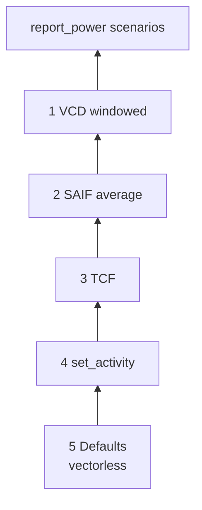
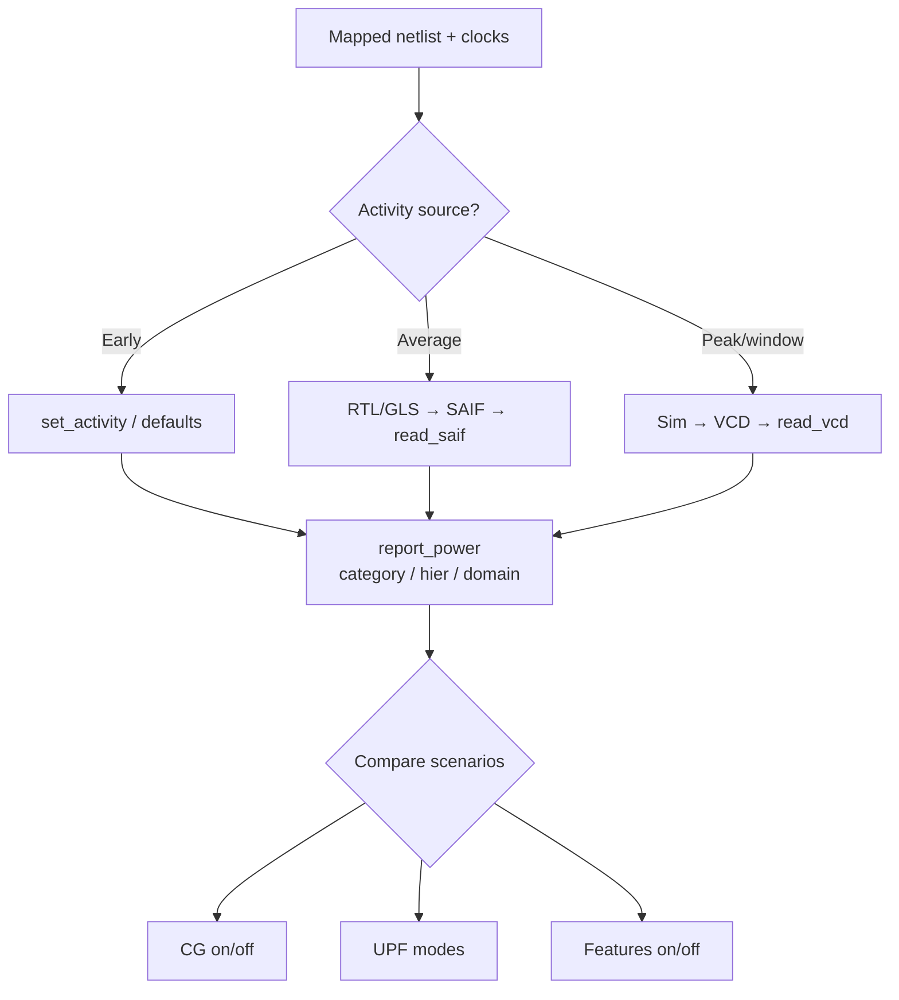

# Genus Activity & Power Analysis — Deep Reference (SAIF / TCF / VCD)

**Scope:** Activity sources, accuracy hierarchy, `set_activity`, SAIF/TCF/VCD options, power report dimensions, CG interaction, UPF modes, issues. Industry.  
**Index:** `GENUS_COMPLETE_INDEX.md`.  
**Related:** `LOW_POWER_SYNTHESIS_REFERENCE.md`, UPF guide, MMMC (`-dynamic`/`-leakage` views).

---

## Table of contents

1. [Why activity dominates power numbers](#1-why-activity-dominates-power-numbers)
2. [Power components](#2-power-components)
3. [Accuracy ladder](#3-accuracy-ladder)
4. [set_activity deep](#4-set_activity-deep)
5. [read_saif deep](#5-read_saif-deep)
6. [read_tcf deep](#6-read_tcf-deep)
7. [read_vcd deep](#7-read_vcd-deep)
8. [Writing activity out](#8-writing-activity-out)
9. [report_power deep (all dimensions)](#9-report_power-deep-all-dimensions)
10. [Power targets & opt](#10-power-targets--opt)
11. [Attributes](#11-attributes)
12. [Flows & use cases](#12-flows--use-cases)
13. [Hierarchy / name mapping](#13-hierarchy--name-mapping)
14. [Clock gating & activity](#14-clock-gating--activity)
15. [UPF / multi-rail power reports](#15-upf--multi-rail-power-reports)
16. [Issue → fix](#16-issue--fix)
17. [Command cards](#17-command-cards)
18. [Interview FAQ](#18-interview-faq)

---

## 1. Why activity dominates power numbers

Dynamic power scales with toggle rate × load × V² × f.  
**Wrong activity → wrong mW** even with perfect netlist.

---

## 2. Power components

| Category (typical report) | Meaning |
|---------------------------|---------|
| Leakage | Static |
| Internal | Cell internal switching energy |
| Switching | Net/pin capacitance energy |
| Register / logic / clock / memory / pad | Design partitions |

Pad-dominated tops: always also report **core hierarchy**.

---

## 3. Accuracy ladder



| Rank | Method | Command | Best for |
|------|--------|---------|----------|
| 1 | Windowed VCD | `read_vcd` | Peaks, modes |
| 2 | SAIF average | `read_saif` | Average power |
| 3 | TCF | `read_tcf` | Tool-chain activity |
| 4 | Asserted activity | `set_activity` | Early what-if |
| 5 | Defaults | none | Relative only |

State assumptions whenever you publish numbers.

---

## 4. set_activity deep

```text
set_activity [-pin] <pin-path> \
  -activity_type user|default \
  -duty <0..1> \
  -freq <Hz or relative> \
  -pin_types {primary_input|seq_out|flop_out|latch_out|memory_out|
              icgc_out|icgc_enable|bbox_out|comb_out|all}+ \
  [-clock related|<clock>] [-reset] [-silent]
```

| Field | Meaning |
|-------|---------|
| `user` | Apply to specific pin path |
| `default` | Defaults for pin classes without user activity |
| `duty` | Probability high / duty fraction |
| `freq` | Toggle frequency (user) or relative (default flop_out often fraction of clock) |
| `pin_types` | Which classes get default |
| `-clock related` | Tie to related clock for scaling |

```tcl
set_activity -activity_type default -pin_types primary_input -duty 0.25 -freq 5e7
set_activity -activity_type default -pin_types flop_out -duty 0.5 -freq 0.1 -clock related
set_activity top/u_core/en -duty 0.1 -freq 1e6 -activity_type user
```

---

## 5. read_saif deep

```text
read_saif [-scale <s>] [-update] [-weight <w>] [-instance <hier>]
  [-verbose] [-ignorecase] [-scale_to_sdc_frequency] <file.saif>
```

| Option | Why |
|--------|-----|
| `-instance` | Map SAIF root to design hierarchy |
| `-scale_to_sdc_frequency` | Align with SDC clocks |
| `-update` | Merge activities |
| `-weight` | Weighted merge |
| `-scale` | Global scale |

**Generate SAIF:** RTL/GLS sim with SAIF dump of nets of interest.

---

## 6. read_tcf deep

```text
read_tcf [-scale] [-update] [-weight] [-verbose] [-nocase]
  [-hinst <path>] [-tcf_instance <path>] [-scale_to_sdc_frequency] <file>
```

| `-hinst` vs `-tcf_instance` | Design path vs file path mapping |

---

## 7. read_vcd deep

```text
read_vcd [-static] [-scale] [-start_time <ps>] [-end_time <ps>]
  [-time_window <ps>] [-activity_profile]
  [-vcd_scope <s>] [-hinst <path>] [-simvision] [-write_sst2 <f>]
  [-nocase] [-scale_to_sdc_frequency] <file.vcd>
```

| Option | Why |
|--------|-----|
| `-static` | Static analysis from VCD |
| start/end | Average window |
| `-time_window` | Sliding / incremental windows |
| `-activity_profile` | Profile toggles |
| scope/hinst | Name mapping |
| SST2 | Wave database |

---

## 8. Writing activity out

```tcl
write_saif ...
write_tcf ...
```

Use to export for other tools or archive scenario.

---

## 9. report_power deep (all dimensions)

```text
report_power
  [-stims] [-frames]
  [-inst <hinst>+] [-module <mod>+] [-levels]
  [-clock_domain] [-power_domain] [-power_mode] [-power_rail]
  [-collate frames|hier|domain|all|none]
  [-by_category] [-by_hierarchy] [-by_leaf_instance]
  [-by_rail] [-by_func_type] [-by_libcell] [-by_tiles RxC]
  [-unit W|mW|uW|nW] [-format] [-header]
  [-view <analysis_view>]
  [-skip_port_switching_power]
  [-assign_to_clock memory|register|latch|pad]
```

| Dimension | Use |
|-----------|-----|
| category | Pad vs clock vs logic |
| hierarchy/module/inst | Hot blocks |
| leaf / libcell | Hot cells |
| rail / domain / mode | UPF |
| tiles | Physical hotspots |
| skip port switching | Reduce pad noise |
| view | MMMC power view |
| stims/frames | Multi-scenario |

```tcl
report_power -by_category -unit mW -header
report_power -by_hierarchy -unit mW -header
report_power -inst u_cpu -by_category -unit mW
report_power -power_domain PD_CORE -unit mW
report_power -view av_func_ss -by_category -unit mW
report_power -skip_port_switching_power -by_category -unit mW
```

---

## 10. Power targets & opt

```tcl
set_max_dynamic_power <val>
set_max_leakage_power <val>
set_db design_power_effort low|medium|high|none
set_db opt_power_effort ...
set_db opt_leakage_to_dynamic_ratio <0..1>
set_db lp_insert_clock_gating true
```

Opt without good activity optimizes the **wrong** cost.

---

## 11. Attributes

| Attr | Role |
|------|------|
| `lp_default_toggle_percentage` | Default toggle |
| `lp_power_unit` / power unit | Units |
| `power_state_dependent_leakage` | State leakage |
| `power_worst_case_vector_activity` | Multi-vector worst |
| `power_quit_on_activity_coverage_threshold` | Coverage gate |
| See `genus_attributes/power_attributes.txt` | Full list |

---

## 12. Flows & use cases



### 12.1 Early estimate

```text
defaults or set_activity → report_power -by_category
```

### 12.2 Average product scenario

```text
RTL sim SAIF → read_saif → report_power hierarchy
```

### 12.3 Peak power window

```text
VCD → read_vcd -start/end → report_power
```

### 12.4 CG effectiveness

```text
report_power categories + report_clock_gates -include_activity_info
```

### 12.5 Mode power (UPF)

```text
activity + report_power -power_mode / -power_domain
```

---

## 13. Hierarchy / name mapping

| Problem | Fix |
|---------|-----|
| SAIF scope ≠ netlist | `-instance` / sim dump hierarchy |
| Post-uniquify | SAIF on **same** netlist |
| GLS vs RTL | Prefer gate-level SAIF for gate power |

---

## 14. Clock gating & activity

| Without activity | CG savings under- or over-estimated |
| With activity | Enable rates matter |
| Report | `report_clock_gating_quality`, gates with activity |

---

## 15. UPF / multi-rail power reports

```tcl
report_power -by_rail -unit mW
report_power -power_domain PD_CORE -unit mW
report_power -power_mode SLEEP -unit mW
```

MMMC: `set_analysis_view -leakage/-dynamic` views.

---

## 16. Issue → fix

| Issue | Fix |
|-------|-----|
| Unbelievable mW | State activity source |
| Zero switching | Activity not read; clocks missing |
| Pad 90% | Report core inst |
| No CG delta | Compare clock+register only |
| Name map fail | instance/hinst options |
| Multi-stim confusion | `-stims` `-frames` |

---

## 17. Command cards

```tcl
set_activity -activity_type default -pin_types primary_input -duty 0.2 -freq 1e8
read_saif -instance chip/u_core -scale_to_sdc_frequency run.saif
read_vcd -static -hinst chip -start_time 0 -end_time 1000000 dump.vcd
report_power -by_category -unit mW -header
report_power -by_hierarchy -unit mW
report_power -inst u_core -by_category -unit mW
report_power -skip_port_switching_power -by_category -unit mW
report_clock_gates -include_activity_info
```

---

## 18. Interview FAQ

**Q: Why SAIF?** Average switching from sim.  
**Q: VCD vs SAIF?** Time-based vs summarized toggles.  
**Q: Default power OK?** Relative only.  
**Q: Pad power?** Often dominates; separate core.  
**Q: scale_to_sdc_frequency?** Align activity to constrained clocks.

---

*Activity quality = power number quality. Always document the scenario.*
