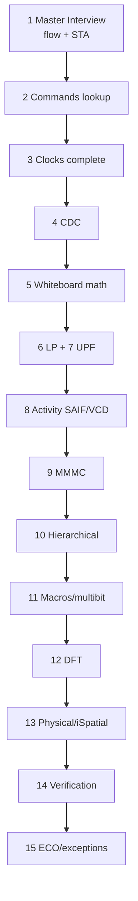

# Genus Complete Documentation Index

**Purpose:** Single map of a **full Genus digital synthesis curriculum** — industry scope, not limited to any one practice chip.  
**How to use:** Work top-to-bottom for a full skill path, or jump by topic. Every major Genus area has a dedicated **deep** guide (what/why/when/how, options, use cases, issues, command cards).

**Command truth source:** `PLAN/misc/genus_commands/`, `PLAN/misc/genus_attributes/`, `PLAN/misc/all_genus_commands.txt` (~700+ commands). Always run `help <cmd>` in your Genus version for build-specific flags.

**Depth standard:** Domain guides include TOC, object model, option tables, flows, issue playbooks, interview FAQ — same bar as clocks/CDC/UPF.

---

## 1. Master document set

| # | Document | Scope |
|---|----------|--------|
| 0 | **This index** | Full map + “no gaps” topic checklist |
| 1 | `GENUS_SYNTHESIS_MASTER_INTERVIEW_GUIDE.md` | End-to-end synth, STA math, path groups, interview Q&A |
| 2 | `GENUS_COMMANDS.md` | Problem → diagnose → fix command encyclopedia |
| 3 | `CLOCKS_COMPLETE_USER_GUIDE.md` | All clocks: root, generated, divide/multiply/edges, groups, attrs |
| 4 | `CDC_USER_GUIDE.md` | CDC theory, RTL, SDC, path clocks, lint, issues |
| 5 | `HOW_TO_WRITE_UPF_CPF.md` | UPF (primary) line-by-line + multi-voltage + CPF map |
| 6 | `LOW_POWER_SYNTHESIS_REFERENCE.md` | LP with/without UPF, CG, power reports, issues |
| 7 | `GENUS_MMMC_COMPLETE_GUIDE.md` | Multi-mode multi-corner: views, corners, libraries |
| 8 | `GENUS_DFT_SCAN_COMPLETE_GUIDE.md` | DFT setup, scan, OPCG, JTAG, ATPG handoff |
| 9 | `GENUS_HIERARCHICAL_SYNTHESIS_GUIDE.md` | Top-down, bottom-up, ILM, DB models, uniquify/ungroup |
| 10 | `GENUS_PHYSICAL_ISPATIAL_GUIDE.md` | Physical-aware / iSpatial / DEF / congestion |
| 11 | `GENUS_VERIFICATION_LEC_GLS_SDF_GUIDE.md` | LEC, GLS, SDF, check_design handoff |
| 12 | `GENUS_ECO_INCREMENTAL_EXCEPTIONS_GUIDE.md` | ECO, incremental opt, advanced exceptions |
| 13 | `GENUS_MACROS_MULTIBIT_DATAPATH_GUIDE.md` | Macros, memories, multibit, datapath |
| 14 | `GENUS_ACTIVITY_POWER_SAIF_VCD_GUIDE.md` | SAIF/TCF/VCD, set_activity, power analysis depth |
| 15 | `TIMING_WHITEBOARD_PROBLEMS.md` | Numeric STA drills |

**Lab/examples only (not a substitute for the guides above):** `cdc_lab/`, `upf/`, `scripts/run_genus_*.tcl`, short `*_PRACTICE_*.md` notes.

---

## 2. Topic → document (no intentional gaps)

| Topic | Primary doc | Also see |
|-------|-------------|----------|
| Logical synth flow | Master Interview §3–4 | Commands § flow |
| `syn_generic` / `map` / `opt` | Master Interview §4 | Physical guide |
| Libraries, dont_use, VT | Master Interview; Macros guide | MMMC guide |
| SDC basics | Master Interview §5 | Clocks, CDC, Exceptions |
| Setup/hold math | Master Interview §6–8 | Whiteboard problems |
| Path groups I2R/R2R/… | Master Interview §8 | Commands |
| `check_design` | Master Interview §9; Commands §8 | Verification guide |
| Timing lint / unconstrained | Master Interview §10 | CDC, Clocks |
| Timing closure | Master Interview §11 | ECO guide |
| `report_*` / `get_db` | Commands §12 | All guides |
| Root / generated clocks | **Clocks complete** | CDC |
| `set_clock_groups` all flags | **Clocks complete** §22 | CDC §4, §7 |
| CDC RTL + SDC | **CDC user guide** | Clocks |
| Clock gating / LP no UPF | LP reference | Clocks CG section |
| UPF multi-domain / multi-V | **How to write UPF** | LP reference |
| MMMC / analysis views | **MMMC complete** | Master Interview §13 |
| DFT / scan / JTAG / OPCG | **DFT scan complete** | Clocks §27 |
| Hierarchical / ILM / bottom-up | **Hierarchical guide** | Master Interview |
| Physical / iSpatial / DEF | **Physical iSpatial** | Master Interview |
| LEC / GLS / SDF / SPEF | **Verification guide** | Commands |
| ECO / incremental | **ECO exceptions** | Master Interview |
| Exceptions advanced | **ECO exceptions** | Master Interview §5 |
| Multibit / macros / DP | **Macros multibit** | LP |
| SAIF / VCD / activity | **Activity power** | LP reference |
| Innovus handoff | Verification + MMMC + Master §13 | (Innovus separate) |

---

## 3. Recommended full curriculum order



```text
1. Master Interview Guide (flow + STA foundation)
2. GENUS_COMMANDS (daily lookup habit)
3. CLOCKS complete
4. CDC user guide
5. Timing whiteboard (practice math)
6. LP reference (no UPF, then with UPF)
7. HOW_TO_WRITE_UPF (+ multi-V section)
8. Activity / SAIF / VCD power
9. MMMC complete
10. Hierarchical synthesis
11. Macros / multibit / datapath
12. DFT / scan
13. Physical / iSpatial
14. Verification LEC/GLS/SDF
15. ECO / advanced exceptions
```

---

## 4. “No gaps” Genus domain checklist

Use this as a self-audit. Each item is covered in the doc set above.

### 4.1 Setup & design build
- [x] Session UI (`set_db`/`get_db`), units  
- [x] `read_libs` / `set_db library` / link vs target  
- [x] `read_hdl` / elaborate / black boxes  
- [x] `check_design` full classes  
- [x] Connectivity surgery (`connect`/`disconnect`)  

### 4.2 Constraints & STA
- [x] Full SDC clock system (root/generated/groups)  
- [x] I/O environment (drive, load, delay)  
- [x] Exceptions (FP, MCP, max/min delay, case, disable)  
- [x] Path groups, derate, path_adjust  
- [x] Setup/hold, path group math  
- [x] MMMC views  

### 4.3 Synthesis engines
- [x] Logical generic/map/opt  
- [x] Physical / spatial / incremental  
- [x] Hierarchical / ILM / bottom-up  
- [x] Multibit, datapath, macros  

### 4.4 Low power
- [x] Clock gating  
- [x] Power effort / leakage  
- [x] Activity files  
- [x] UPF domains / ISO / LS / retention / PST  

### 4.5 DFT
- [x] Scan define/connect/report  
- [x] Test clocks vs functional  
- [x] ATPG/scan handoff concepts  

### 4.6 Verification & handoff
- [x] LEC / GLS / SDF  
- [x] Netlist/SDC/DB/MMMC write  
- [x] ECO / incremental  

### 4.7 Physical-aware
- [x] DEF, PLE, iSpatial, congestion reports  

---

## 5. Practice scripts (optional examples)

| Script | Illustrates |
|--------|-------------|
| `scripts/run_genus_pad_top.tcl` | Logical chip with pads |
| `scripts/run_genus_pad_top_lp.tcl` | CG LP |
| `scripts/run_genus_pad_top_upf.tcl` | UPF intent |
| `scripts/run_genus_cdc_lab.tcl` | Multi-clock CDC |

Examples use a kit design; **commands and methods are general**.

---

## 6. Document control

| Field | Value |
|-------|--------|
| Scope | Genus digital synthesis (industry) |
| Not in scope | Full Innovus PnR manual (handoff only) |
| Update rule | New Genus area → new section or new guide + this index |

---

*If a topic is not listed in §2, treat that as a documentation bug — add it to the matching guide and this index.*
