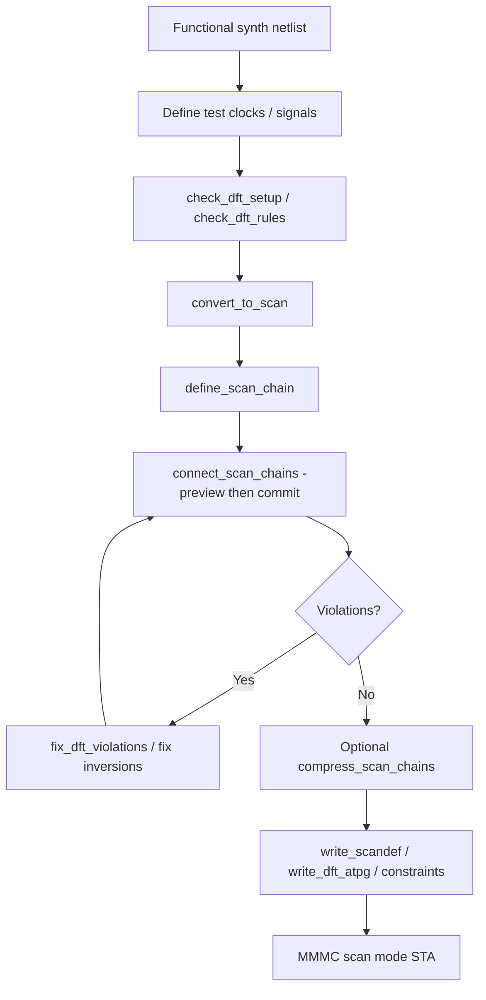

# Genus DFT & Scan Complete Guide — Deep Reference

**Scope:** Industry DFT in Genus — test vs functional clocks, scan conversion, chain define/connect, compression, OPCG, JTAG, hierarchical DFT, power-aware DFT, ATPG/PnR handoff, STA for test modes, issues.  
**Commands:** `PLAN/misc/genus_commands/*dft*`, `*scan*`. Always `help <cmd>`.  
**Index:** `GENUS_COMPLETE_INDEX.md`.  
**Related:** Clocks §27, MMMC (scan constraint mode), ECO (preserve scan), Verification.

---

## Table of contents

1. [What / why / when DFT](#1-what--why--when-dft)
2. [DFT architecture concepts](#2-dft-architecture-concepts)
3. [Functional vs test clocks](#3-functional-vs-test-clocks)
4. [End-to-end DFT flows](#4-end-to-end-dft-flows)
5. [Setup & rule checking (deep)](#5-setup--rule-checking-deep)
6. [Convert to scan (deep)](#6-convert-to-scan-deep)
7. [Define scan chains (deep)](#7-define-scan-chains-deep)
8. [Connect scan chains (deep)](#8-connect-scan-chains-deep)
9. [Compression & compressibility](#9-compression--compressibility)
10. [OPCG, lockups, multi-clock scan](#10-opcg-lockups-multi-clock-scan)
11. [JTAG / boundary / hierarchical DFT](#11-jtag--boundary--hierarchical-dft)
12. [MBIST / LBIST awareness](#12-mbist--lbist-awareness)
13. [DFT + UPF / low power](#13-dft--upf--low-power)
14. [STA & SDC for scan mode](#14-sta--sdc-for-scan-mode)
15. [Reports & metrics](#15-reports--metrics)
16. [Handoff artifacts](#16-handoff-artifacts)
17. [Issue → diagnose → fix](#17-issue--diagnose--fix)
18. [Command encyclopedia](#18-command-encyclopedia)
19. [Interview FAQ](#19-interview-faq)

---

## 1. What / why / when DFT

### 1.1 What

**Design-for-Test** structures enable manufacturing test (ATPG) to control and observe sequential state:

| Building block | Function |
|----------------|----------|
| Scan flop | Shift-SI / capture-D muxed flop |
| Scan chain | Serial shift path through flops |
| SE / shift enable | Puts flops in shift mode |
| SDI/SDO | Chain data in/out ports |
| Compression | On-chip expand/compact for fewer pins |
| Lockup latch | Safe crossing between clock domains/edges on chain |
| Test clocks | Shift and capture clocks in test |
| Boundary scan | Board-level pin access (JTAG) |

### 1.2 Why

| Need | Without DFT | With DFT |
|------|-------------|----------|
| Stuck-at / transition coverage | Poor controllability | High coverage |
| Debug fail silicon | Hard | Scan dump |
| Contract | Often mandatory | Deliver scandef + ATPG |

### 1.3 When in the project

| Phase | DFT activity |
|-------|----------------|
| Architecture | Pins, compression ratio, clock strategy |
| RTL | DFT-friendly coding; test points optional |
| After logical synth | insert/convert scan (common) |
| Or DFT-aware synth | Project-specific |
| Pre-PnR | scandef, test constraints |
| ATPG | Patterns after netlist freeze |

---

## 2. DFT architecture concepts

| Concept | Meaning |
|---------|---------|
| **Full scan** | Essentially all flops scannable |
| **Partial scan** | Subset — harder ATPG |
| **Chain balancing** | Similar lengths for shift time |
| **Shared I/O** | SDI/SDO muxed with functional pins |
| **Dedicated I/O** | Extra package pins for scan |
| **Compression** | Internal scan channels > chip pins |
| **Capture** | Functional (or test) clocks sample faults |
| **Shift** | Test clock serializes chain |

---

## 3. Functional vs test clocks

| Kind | Define with | STA |
|------|-------------|-----|
| Functional | `create_clock` | Func constraint mode |
| Test | `define_test_clock` (period often **ps**) | Scan mode; exclusive vs func |

```tcl
define_test_clock -name TCK -period 50000 [get_ports tck]
# 50000 ps = 50 ns default-style example — match project
set_compatible_test_clocks -all
```

| `set_compatible_test_clocks` | Which test clocks may be active together in ATPG |
| Func vs scan | `set_clock_groups -logically_exclusive` |

Deep clock options: `CLOCKS_COMPLETE_USER_GUIDE.md`.

---

## 4. End-to-end DFT flows

### 4.0 Flow diagram



### 4.1 Classic post-synth scan

```text
1. Functional syn_generic/map/opt (or mapped netlist)
2. Define test signals / clocks / modes (project DFT setup)
3. check_dft_setup
4. check_dft_rules [-advanced] [-verbose]
5. convert_to_scan
6. define_scan_chain -sdi ... -sdo ... -domain ...
7. connect_scan_chains [-preview] then real connect
8. report_scan_chains / report_dft_violations
9. fix_dft_violations / fix_scan_path_inversions as needed
10. Optional compress_scan_chains
11. write_scandef / write_dft_atpg / write_dft_constraints
12. STA: scan constraint mode in MMMC
```

### 4.2 Hierarchical DFT

```text
Block: abstract models / segments
Top: define_hier_test_scan_mapping, connect_dft_hier_test_cores
write_dft_abstract_model as needed
```

### 4.3 Preview before commit

```tcl
connect_scan_chains -preview
connect_scan_chains -preview_scan_element_order
```

**Why:** Inspect stitching without modifying netlist.

---

## 5. Setup & rule checking (deep)

### 5.1 `check_dft_rules` (verified)

```text
check_dft_rules
  [-dft_cfg_mode <mode>]
  [-max_list_fanin <n>] [-max_list_registers <n>] [-max_list_violations <n>]
  [-advanced] [-verbose] [<design>]
```

| Option | Why |
|--------|-----|
| `-dft_cfg_mode` | Which DFT configuration / scan mode |
| `-advanced` | Extra TDRC checks |
| `-verbose` | Detail |
| max_list_* | Cap report size (`-1` = no limit on violations in help) |

### 5.2 Related checks

| Command | Role |
|---------|------|
| `check_dft_setup` | Prerequisites before insert |
| `check_dft_pad_cfg` | Pad DFT configuration |
| `report_dft_violations` | List |
| `fix_dft_violations` | Automated/assisted fixes |
| `report_scan_setup` | Setup summary |

**When:** Before and after convert/connect until clean enough for ATPG.

---

## 6. Convert to scan (deep)

### 6.1 `convert_to_scan` (verified)

```text
convert_to_scan [-to_non_scan] [-dont_check_dft_rules] [<design>]
```

| Option | What |
|--------|------|
| (default) | Map eligible flops → scan flops |
| `-to_non_scan` | Opposite: scan flops in shift-register segments → non-scan |
| `-dont_check_dft_rules` | Skip rules during replace |

**Why:** Scan cells have SI/SE/SO pins ATPG needs.  
**When:** After functional map (typical) when flops exist as lib cells.

---

## 7. Define scan chains (deep)

### 7.1 `define_scan_chain` (verified options)

```text
define_scan_chain
  [-name <string>]
  [-sdi <port|pin>] [-sdo <port|pin>]
  [-hookup_pin_sdi/-sdo <pin>]
  [-analyze] [-create_ports]
  [-shared_output] [-shared_input] [-non_shared_output]
  [-shared_select <test_signal>] [-shift_enable <test_signal>]
  [-head/-tail/-body <scan_segment>]
  [-complete] [-domain <test_clock_domain>] [-edge <string>]
  [-max_length <int>] [-cfg_pad <test_signal>]
  [-terminal_lockup <string>] [-dont_overlay] [-internal]
```

| Option | What | When |
|--------|------|------|
| `-name` | Chain name | Always useful |
| `-sdi` / `-sdo` | Scan data in/out | Chain endpoints |
| `-hookup_pin_*` | Core-side hookup | Hierarchical / pad wrapper |
| `-create_ports` | Auto-create SDI/SDO | No ports yet |
| `-shared_input/output` | Share with functional pin | Pin-limited packages |
| `-shift_enable` | SE signal | Required for shift mode |
| `-domain` | Test clock domain | Multi-clock DFT |
| `-edge` | Edge sensitivity | Mixed edge chains |
| `-max_length` | Cap chain length | Balancing / tester limits |
| `-head/tail/body` | Attach segments | Hierarchical/fixed segments |
| `-analyze` | Analyze existing chain | ECO / debug |
| `-terminal_lockup` | Lockup at end | Domain crossing policy |
| `-internal` | Internal chain | Compression channels |

### 7.2 Segments

| Command | Role |
|---------|------|
| `define_scan_fixed_segment` | Immutable ordered segment |
| `define_scan_floating_segment` | Flexible segment |
| `define_scan_preserved_segment` | Must preserve |
| `define_scan_abstract_segment` | Hierarchical abstract |

**Why segments:** Control ordering, preserve IP, hierarchical assembly.

---

## 8. Connect scan chains (deep)

### 8.1 `connect_scan_chains` (verified)

```text
connect_scan_chains
  [-preview] [-preview_scan_element_order]
  [-elements ...] [-chains ...]
  [-auto_create_chains] [-incremental]
  [-dont_exceed_min_number_of_scan_chains]
  [-pack] [-physical] [-create_empty_chains]
  [-power_domain <pd>+] [-dft_cfg_mode <mode>]
  [-cluster_aggressively_high] [-allow_physical_balancing]
  [-zipper_stitch] [-include_opcg_segments]
  [-update_placement] [-keep_connected_shift_enable]
  [-partitions ...] [<design>]
```

| Option | What | Why |
|--------|------|-----|
| `-preview` | Dry run | Safe inspection |
| `-auto_create_chains` | Create chains as needed | Less manual define |
| `-incremental` | Add without full rebuild | ECO |
| `-pack` | Fill to max length | Fewer chains, longer shift |
| (default balance) | Balance lengths | Shift time / power |
| `-physical` | Use placement for order | Shorter scan wires |
| `-power_domain` | Limit flops by UPF domain | LP + DFT |
| `-zipper_stitch` | Zipper style stitch | Methodology |
| `-include_opcg_segments` | Include OPCG | Multi-clock |
| `-partitions` | Partition-aware | Hierarchical |

### 8.2 Related connect

| Command | Role |
|---------|------|
| `connect_serial_scan_chains` | Force serial topology |
| `update_scan_chains` | Refresh after netlist change |

---

## 9. Compression & compressibility

| Command | Role |
|---------|------|
| `analyze_scan_compressibility` | Can we compress? |
| `report_scan_compressibility` | Report |
| `compress_scan_chains` | Build compressor/decompressor logic |
| `report_scan_compression_logic` | What was inserted |
| `write_dft_compression_*` | Handoff macros/test points |

| Why compress | Fewer package pins, still high internal chain count |
| Tradeoff | Area, ATPG complexity, X-handling |

---

## 10. OPCG, lockups, multi-clock scan

| Topic | Commands / concept |
|-------|---------------------|
| OPCG scan | `convert_to_opcg_scan`, OPCG reports |
| Domain info | `report_opcg_clock_domain_info` |
| Equivalents | `report_opcg_equivalents` |
| Inversions | `fix_scan_path_inversions` |
| Lockup | Terminal lockup options; domain crossings on chain |

**Why lockups:** Scan shift between different clocks/edges without hold fail on chain.

---

## 11. JTAG / boundary / hierarchical DFT

| Command family | Role |
|----------------|------|
| `add_jtag_boundary_scan` | Insert BS cells |
| `define_jtag_boundary_scan_segment` | Segments |
| `read/write_dft_jtag_boundary_file` | Persistence |
| `write_dft_bsdl` | Board BSDL |
| `define_hier_test_scan_mapping` | Map hier chains |
| `connect_dft_hier_test_cores` | Hook hier cores |
| `read/write_dft_abstract_model` | Block abstracts for top |

**Use case:** SoC with many soft blocks + board test access.

---

## 12. MBIST / LBIST awareness

| Family | Role |
|--------|------|
| `read_dft_pmbist_*` / `write_dft_pmbist_*` | Programmable memory BIST |
| `write_dft_lbist_*` | Logic BIST macros/TB/test points |
| `define_mbist_clock` | BIST clocks |

Follow foundry/IP BIST generator manuals for architecture; Genus integrates/hooks.

---

## 13. DFT + UPF / low power

| Command / idea | Role |
|----------------|------|
| `connect_scan_chains -power_domain` | Chain within domain |
| `commit_dft_power_intent` | DFT vs power intent |
| `add_scan_power_gating` | Scan-related PG |
| Isolation on test controls | UPF must allow test access |

Test mode often forces domains on — document in UPF PST / test modes.

---

## 14. STA & SDC for scan mode

| Item | Practice |
|------|----------|
| MMMC | `create_constraint_mode -name scan -sdc_files scan.sdc` |
| Case analysis | `set_case_analysis 1 [get_ports test_mode]` for scan view |
| Exclusive clocks | Func vs scan groups |
| SE=0 for functional timing | Avoid scan mux on critical D path in func analysis |
| Capture clocks | Functional clocks may still capture in LOC/LOS styles |

```tcl
# Functional analysis
set_case_analysis 0 [get_ports test_mode]
# Scan analysis view uses scan.sdc + test_mode=1
```

---

## 15. Reports & metrics

```tcl
check_dft_setup
check_dft_rules -advanced -verbose > dft_rules.rpt
report_dft_violations > dft_vio.rpt
report_scan_setup > scan_setup.rpt
report_scan_chains > chains.rpt
report_scan_registers > scan_regs.rpt
report_scan_compressibility
report_dft_trace_back
report_dft_analyzed_test_points
```

| Metric | Meaning |
|--------|---------|
| Chain count / lengths | Shift time, balance |
| % scannable flops | Coverage potential |
| Violations | Must clear or waive with proof |

---

## 16. Handoff artifacts

| Artifact | Command | Consumer |
|----------|---------|----------|
| Scandef | `write_scandef` | Innovus scan-aware place/route |
| ATPG files | `write_dft_atpg` | ATPG tool |
| Other vendor ATPG | `write_dft_atpg_other_vendor_files` | Multi-vendor |
| Test constraints | `write_dft_constraints` | STA test mode |
| BSDL | `write_dft_bsdl` | Board test |
| Compression macro | `write_dft_compression_macro` | Integration |
| RTL DFT model | `write_dft_rtl_model` | Special flows |

---

## 17. Issue → diagnose → fix

| # | Symptom | Diagnose | Fix |
|---|---------|----------|-----|
| 1 | Flops not scannable | `report_scan_registers` | convert_to_scan; remove dont_touch/preserve |
| 2 | Chain broken | `report_scan_chains`, violations | reconnect; fix inversions |
| 3 | Hold fail on chain | Domain/edge cross | lockup; OPCG |
| 4 | Unbalanced chains | length report | rebalance connect options |
| 5 | Func timing worse | SE path | case_analysis SE=0; opt |
| 6 | Compression Xs | ATPG | mask/X-handling methodology |
| 7 | Hierarchical mismatch | abstract models | rewrite abstracts |
| 8 | Pad DFT fail | `check_dft_pad_cfg` | pad config / shared select |
| 9 | Wrong test clock | `define_test_clock` | fix period units (ps!) |
| 10 | Power domain clash | UPF + scan | domain-aware connect |

---

## 18. Command encyclopedia (quick)

| Command | One-line |
|---------|----------|
| `check_dft_setup` | Prerequisites |
| `check_dft_rules` | TDRC rules |
| `convert_to_scan` | Flops → scan flops |
| `define_scan_chain` | Declare chain |
| `connect_scan_chains` | Stitch |
| `compress_scan_chains` | Add compression |
| `report_scan_chains` | Report |
| `write_scandef` | PnR handoff |
| `write_dft_atpg` | ATPG handoff |
| `write_dft_constraints` | Test SDC-like |
| `define_test_clock` | Test clock object |
| `set_compatible_test_clocks` | Compatible TCK set |
| `fix_scan_path_inversions` | Fix inversions |
| `fix_dft_violations` | Fix violations |
| `place_dft` | DFT placement assist |

---

## 19. Interview FAQ

**Q: Why scan?** Controllability/observability for ATPG.  
**Q: SE impact on timing?** Mux on D path — analyze with SE=0 for func.  
**Q: Lockup why?** Hold between different clocks/edges on shift path.  
**Q: Compression why?** Pin count vs coverage.  
**Q: Scandef?** Physical order/connectivity for PnR.  
**Q: Func vs scan clocks?** Often logically exclusive + separate constraint modes.

---

*DFT is a full sub-flow. Pair this guide with your foundry DFT cookbook and ATPG vendor docs for pattern generation.*
