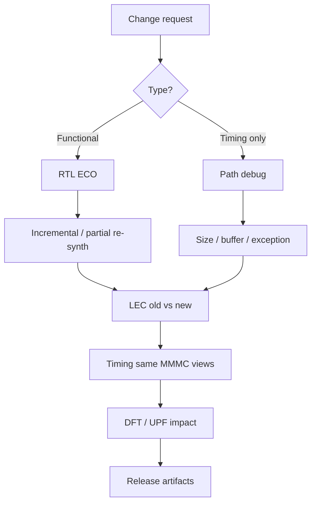

# Genus ECO, Incremental Opt & Advanced Exceptions — Deep Reference

**Scope:** ECO methodology, incremental/spatial opt, freeze controls, full exception toolkit (FP, MCP, max/min delay, path_adjust, case, disable, derate, ideal, annotated), debug, issues. Industry.  
**Index:** `GENUS_COMPLETE_INDEX.md`.  
**Related:** Clocks (groups), CDC, MMMC, Verification (LEC after ECO).

---

## Table of contents

1. [ECO what / why / when](#1-eco-what--why--when)
2. [ECO flows](#2-eco-flows)
3. [Incremental & spatial opt](#3-incremental--spatial-opt)
4. [Freeze & guide netlist](#4-freeze--guide-netlist)
5. [False path deep](#5-false-path-deep)
6. [Multicycle path deep](#6-multicycle-path-deep)
7. [Max/min delay deep](#7-maxmin-delay-deep)
8. [Path adjust](#8-path-adjust)
9. [Case analysis](#9-case-analysis)
10. [Disable timing & sense](#10-disable-timing--sense)
11. [Clock groups (pointer)](#11-clock-groups-pointer)
12. [Derates](#12-derates)
13. [Ideal & annotated](#13-ideal--annotated)
14. [Exception debug](#14-exception-debug)
15. [Use-case recipes](#15-use-case-recipes)
16. [Issue → fix](#16-issue--fix)
17. [Command cards](#17-command-cards)
18. [Interview FAQ](#18-interview-faq)

---

## 1. ECO what / why / when

| What | Late change after major freeze |
| Why | Bug/timing fix without full respins |
| When | Post-synth, post-place, post-mask ECO |
| Risk | LEC, DFT, UPF, timing, names |

---

## 2. ECO flows



### 2.1 Functional ECO

```text
1. RTL ECO diff reviewed
2. Re-synth ECO region or incremental
3. LEC old vs new
4. Timing same views
5. DFT/UPF impact review
6. Update releases
```

### 2.2 Timing-only ECO

```text
1. Identify path (report_timing)
2. Local size/buffer / path_adjust / exception if architectural
3. Preserve rest
4. LEC (should be eq if only timing cells)
5. Re-time
```

### 2.3 Manual netlist ECO

```tcl
disconnect ...
connect ...
connect -constant 0|1 ...
# then check_design + LEC
```

---

## 3. Incremental & spatial opt

```tcl
syn_opt -incremental
syn_opt -spatial
syn_opt -logical    ;# limited access
```

| Flag | When |
|------|------|
| `-incremental` | iSpatial / post-physical iterate |
| `-spatial` | Placement-guided polish |
| Full `syn_opt` | Global first-time opt |

---

## 4. Freeze & guide netlist

| Mechanism | How |
|-----------|-----|
| Preserve | `set_db <insts> .preserve true` |
| Dont touch | `set_dont_touch` |
| Dont use | `set_dont_use`, libcell `.dont_use` |
| Report | `report_dont_touch`, `check_design -preserved` |
| Write | `write_preserves` |

**Use:** Freeze IP, CDC sync chains, analog, completed partitions.

---

## 5. False path deep

```text
set_false_path [-rise|-fall] [-setup|-hold]
  -from/-rise_from/-fall_from
  -to/-rise_to/-fall_to
  -through/-rise_through/-fall_through (repeatable)
  [-comment] [-exception_name] [-reset_path]
```

| Valid | Async reset as data; static; proven non-functional |
| Invalid | Hide CDC without sync; WNS cosmetics |
| Prefer for domain-wide async | `set_clock_groups -asynchronous` |

---

## 6. Multicycle path deep

```tcl
set_multicycle_path 2 -setup -from A -to B
set_multicycle_path 1 -hold  -from A -to B
```

| Setup N | Capture N cycles later |
| Hold | Usually adjust so hold checks correct edge |
| Only | **Related** clocks |
| Draw | Edges 0, T, 2T on whiteboard |

---

## 7. Max/min delay deep

```text
set_max_delay <t> -from ... -to ... [-through ...]
  [-ignore_clock_latency] [-combinational_from_to]
  [-exception_name] [-reset_path]
```

(same structure for `set_min_delay`)

| Use | Point budgets; quasi-static; non-clocked interfaces |
| `-ignore_clock_latency` | Pure datapath bound |
| Conflict | Can dominate clocked checks if tighter |

---

## 8. Path adjust

```tcl
path_adjust / set_path_adjust -delay <ps> -from ... -to ... [-setup|-hold] [-name]
```

| Use | Local ps margin |
| Abuse | Fake chip closure |

---

## 9. Case analysis

```tcl
set_case_analysis 0|1 [get_ports sel]
report_case_analysis
```

| Use | Modes, mux selects, test_mode, constants for analysis |
| MMMC | Prefer separate constraint modes for major modes |

---

## 10. Disable timing & sense

```tcl
set_disable_timing -from pin -to pin
set_clock_sense / set_sense [-stop_propagation] [-positive|-negative] pins
```

| Disable | Kill false arcs in models |
| Sense | Clock unateness / stop propagation |

---

## 11. Clock groups pointer

Full flag manual: **`CLOCKS_COMPLETE_USER_GUIDE.md` §22**.  
CDC usage: **`CDC_USER_GUIDE.md`**.

---

## 12. Derates

```tcl
set_timing_derate -early|-late -cell_delay|-net_delay ...
report_timing_derate
report_timing -user_derate ...
```

| Setup | Late data, early clock |
| Hold | Early data, late clock |
| AOCV | Library-set based (MMMC guide) |

---

## 13. Ideal & annotated

```tcl
set_ideal_network / reset_ideal_network
set_ideal_latency / set_ideal_transition
set_annotated_delay / set_annotated_transition
reset_annotated_*
```

| Ideal | Early clocks/resets |
| Annotated | What-if / imported |

---

## 14. Exception debug

```tcl
report_timing -exception_data -max_paths 20
report_timing -path_exceptions all|applied|ignored
check_timing   ;# exceptions with no effect, etc.
```

---

## 15. Use-case recipes

| Scenario | Recipe |
|----------|--------|
| Async domains | clock_groups async + RTL CDC |
| Scan mode | case_analysis + exclusive clocks + scan mode SDC |
| Multi-cycle bus | MCP setup+hold + doc |
| ECO 1 buffer | manual/opt local + LEC |
| Frozen CPU | preserve + interface SDC |
| Quasi-static bus | max_delay + enable sync + doc |

---

## 16. Issue → fix

| Issue | Fix |
|-------|-----|
| Exception no effect | Object names; collections empty |
| Hold after MCP setup | Hold MCP |
| Opt won’t touch | preserve blocking |
| LEC fail ECO | Limit edit region |
| Exception explosion | Budget + owners |

---

## 17. Command cards

```tcl
set_false_path -from [get_ports rst_n]
set_multicycle_path 2 -setup -from A -to B
set_multicycle_path 1 -hold -from A -to B
set_max_delay 2.0 -from [get_ports s*] -to [get_ports d*]
path_adjust -delay 50 -setup -from ... -to ...
set_case_analysis 0 [get_ports test_mode]
set_db [get_db insts u_sync*] .preserve true
syn_opt -incremental
report_timing -exception_data -max_paths 10
```

---

## 18. Interview FAQ

**Q: MCP hold why?** Correct edge after expanding setup.  
**Q: FP vs async groups?** Groups for domains; FP for points.  
**Q: ECO golden?** LEC + timing + DFT + UPF.  
**Q: path_adjust OK?** Only with accountability.

---

*Exceptions are architecture in SDC form — every line needs owner and reason.*
