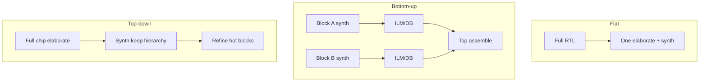
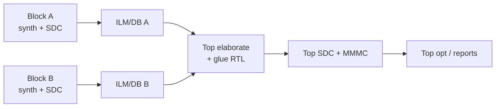

# Genus Hierarchical Synthesis Complete Guide — Deep Reference

**Scope:** Industry hierarchical synthesis — flat vs top-down vs bottom-up, ILM/DB/blackbox models, interface contracts, uniquify/ungroup, boundary optimization, UPF/DFT hierarchy, issues.  
**Index:** `GENUS_COMPLETE_INDEX.md`.  
**Commands:** `generate_ilm`, `read_ilm`, `read_db`, `write_db`, `ungroup`, `uniquify`, `report_hierarchy`, …

---

## Table of contents

1. [What / why hierarchical](#1-what--why-hierarchical)
2. [Methodology comparison](#2-methodology-comparison)
3. [Model types for blocks](#3-model-types-for-blocks)
4. [Bottom-up flow (step-by-step)](#4-bottom-up-flow-step-by-step)
5. [Top-down flow (step-by-step)](#5-top-down-flow-step-by-step)
6. [Hybrid flows](#6-hybrid-flows)
7. [Interface SDC contracts](#7-interface-sdc-contracts)
8. [ILM deep dive](#8-ilm-deep-dive)
9. [DB / netlist / liberty models](#9-db--netlist--liberty-models)
10. [Ungroup / uniquify / preserve](#10-ungroup--uniquify--preserve)
11. [Boundary optimization](#11-boundary-optimization)
12. [MMMC hierarchical](#12-mmmc-hierarchical)
13. [UPF hierarchical](#13-upf-hierarchical)
14. [DFT hierarchical](#14-dft-hierarchical)
15. [LEC hierarchical](#15-lec-hierarchical)
16. [Issue → fix](#16-issue--fix)
17. [Command cards](#17-command-cards)
18. [Interview FAQ](#18-interview-faq)

---

## 1. What / why hierarchical

### 1.1 What

Synthesize and close timing **by partitions**, then assemble the chip, instead of only one flat compile of the entire netlist.

### 1.2 Why

| Driver | Benefit |
|--------|---------|
| Capacity | Parallel block compiles |
| Ownership | Team/block deliverables |
| Runtime | Overnight block farms |
| IP | Soft IP with frozen pin timing |
| ECO | Localize change |
| Physical | Floorplan partitions |

### 1.3 When flat is enough

Small blocks, single owner, runtime acceptable, no hard IP timing models needed.

---

## 2. Methodology comparison



| Method | Flow idea | Pros | Cons |
|--------|-----------|------|------|
| **Flat** | Full RTL → one synth | Best global boolean opt | Capacity/runtime limits |
| **Bottom-up** | Block synth → model → top | Parallel; contracts | Interface budget errors |
| **Top-down** | Top first, push constraints | Global visibility | Harder parallelization |
| **Hybrid** | Mix | Practical SoCs | Process complexity |

---

## 3. Model types for blocks

| Model | Contains | Timing at top | Use |
|-------|----------|---------------|-----|
| **Full netlist** | All gates | Accurate if linked | Final merge |
| **ILM** | Interface logic model | Good boundary accuracy | Bottom-up timing |
| **DB** | Tool database | Continue in Genus/Innovus | Same-vendor |
| **Liberty** | Arc models | As characterized | Hard macros, memories |
| **Black box** | Ports only | None / incomplete | Early shell only |

```tcl
generate_ilm
read_ilm ...
read_ilm_from_files ...
read_db block.db
write_db -design block block.db
```

---

## 4. Bottom-up flow (step-by-step)



```text
FOR each block B:
  1. read_hdl B
  2. elaborate B_top
  3. Libraries / MMMC for block
  4. read_sdc B.sdc          # interface budgets
  5. check_design hard zeros
  6. syn_generic → syn_map → syn_opt
  7. report_timing / report_qor
  8. write_hdl, write_sdc, write_db
  9. generate_ilm (or export lib abstract per flow)

TOP:
  1. read_hdl top glue RTL
  2. read_ilm / read_db / read libs for blocks
  3. elaborate chip_top
  4. read_sdc top.sdc
  5. check_design -unresolved
  6. syn_* (top glue and/or chip opt)
  7. full-chip timing + LEC strategy
  8. write chip deliverables
```

### 4.1 Parallelism

Blocks compile independently if SDC contracts stable — CI/farm friendly.

### 4.2 Failure mode

Block meets **internal** timing but top fails on **interface** → budgets inconsistent (most common hierarchical bug).

---

## 5. Top-down flow (step-by-step)

```text
1. Full RTL elaborate at chip top
2. Chip SDC + MMMC
3. Keep hierarchy (control auto-ungroup)
4. syn_generic/map/opt with hierarchy preserved where needed
5. Identify hot blocks via path groups / hierarchy power/timing
6. Optional: extract block, refine bottom-up, re-import
```

**When:** Early architecture; small number of soft blocks.

---

## 6. Hybrid flows

| Pattern | Description |
|---------|-------------|
| Hard IP bottom-up | Memories, PHYs as .lib |
| Soft CPU bottom-up ILM | CPU team delivers ILM |
| Glue top-down | Bus fabric synth at top |
| Critical path ungroup | Flatten only hot cones |

---

## 7. Interface SDC contracts

### 7.1 What block SDC must define

| Constraint | Role |
|------------|------|
| Clocks on block clock ports | Local domain definition |
| `set_input_delay` | Time already used outside before data arrives |
| `set_output_delay` | Time needed outside after data leaves |
| Driving cell / input transition | External driver model |
| Output load | External load model |
| Uncertainty | Margin |
| False/MCP | Only real block-architectural exceptions |

### 7.2 Budget math (conceptual)

```text
Period ≥ input_delay + path_inside_block + output_delay + unc + clock effects
```

Top owns **chip** period; block owns **slice** allocated to block.

### 7.3 Alignment rule

Block `set_output_delay` + top path after block + top uncertainty must be **consistent** with chip SDC. Document budget owner.

### 7.4 ILM SDC

```tcl
create_constraint_mode -name func \
  -sdc_files [list top.sdc] \
  -ilm_sdc_files [list block_ilm.sdc]
```

(When flow supports `-ilm_sdc_files`.)

---

## 8. ILM deep dive

### 8.1 What ILM is

**Interface Logic Model:** abstracts internal logic while preserving **interface timing behavior** enough for top-level STA/opt.

### 8.2 Why ILM vs full netlist

| ILM | Full netlist |
|-----|----------------|
| Smaller top capacity | Maximum accuracy |
| Hides IP | Exposes all gates |
| Fast top iterations | Slow |

### 8.3 How (typical)

```tcl
# In block session after opt
generate_ilm
# copies / writes model per tool flow

# In top session
read_ilm ...
# or read_ilm_from_files
```

Follow Genus version cookbook for exact `generate_ilm` options (`help generate_ilm`).

### 8.4 When to regenerate ILM

| Trigger | Action |
|---------|--------|
| Block netlist ECO | Regenerate ILM |
| Budget change | Resynth block + ILM |
| Lib corner change | Rebuild for that view |

### 8.5 Issues

| Issue | Fix |
|-------|-----|
| Top optimistic | ILM too abstract / stale |
| Top pessimistic | Over-margin in block SDC |
| Port mismatch | RTL/ILM port list drift |

---

## 9. DB / netlist / liberty models

| Model | Commands | Continue in |
|-------|----------|-------------|
| DB | `write_db`, `read_db`, `-common` | Genus/Innovus |
| Netlist | `write_hdl`, `read_hdl`/`read_netlist` | Any |
| Liberty | `set_db library` | STA arcs |

**Black box:** only ports — `check_design -unresolved` until filled.

---

## 10. Ungroup / uniquify / preserve

### 10.1 `ungroup`

| What | Remove hierarchy boundary; flatten instance |
| Why | Cross-boundary boolean opt, area, timing |
| Risk | Harder ECO/LEC; name explosion |

```tcl
ungroup [get_db hinsts u_alu*]
report_ungroup_modules
report_auto_ungroup_hierarchies
```

### 10.2 `uniquify`

| What | Make unique module copy per instance context |
| Why | Different constraints/opt per instance of same RTL |
| When | Shared soft IP instantiated many times with different budgets |

```tcl
uniquify
```

### 10.3 Preserve

```tcl
set_db [get_db hinsts u_ip_core] .preserve true
set_dont_touch [get_db insts u_ip_core/*]
report_dont_touch
check_design -preserved
write_preserves
```

| When | Frozen IP, CDC sync boxes, analog wrappers |

---

## 11. Boundary optimization

| What | Constant prop, sweep, merge across hierarchy |
| Control | `boundary_optimize_*` attrs (see attributes dump) |
| Report | `report_boundary_opt` |
| Conflict | Hierarchical LEC / IP pinlist freeze → limit boundary opt |

---

## 12. MMMC hierarchical

| Topic | Guidance |
|-------|----------|
| Block views | Block may use reduced views |
| Top views | Must include corners that stress interfaces |
| ILM per corner | May need multi-corner ILM generation (flow-specific) |
| constraint_mode | `-ilm_sdc_files` for block contracts |

See `GENUS_MMMC_COMPLETE_GUIDE.md`.

---

## 13. UPF hierarchical

| Topic | Guidance |
|-------|----------|
| Domains | Often align with block boundaries |
| `write_top_power_intent` | Assemble top UPF |
| Isolation | At block/domain crossings |
| Retention | Per domain strategy |

See `HOW_TO_WRITE_UPF_CPF.md`.

---

## 14. DFT hierarchical

Abstract scan segments, hier mapping, `connect_dft_hier_test_cores` — **DFT guide**.

---

## 15. LEC hierarchical

```text
1. LEC each block RTL vs block gates
2. LEC top with ILMs or full netlist
3. Don’t expect same instance names after ungroup
```

---

## 16. Issue → fix

| # | Symptom | Fix |
|---|---------|-----|
| 1 | Top interface WNS, block clean | Realign I/O budgets; rebuild ILM |
| 2 | Unresolved at top | Missing model/lib |
| 3 | Opt can’t touch path | ungroup or loosen preserve |
| 4 | Shared module conflict | uniquify |
| 5 | LEC name chaos | hierarchical LEC; limit ungroup |
| 6 | Stale ILM | regenerate after ECO |
| 7 | Over-ungroup area | preserve non-critical hierarchy |

---

## 17. Command cards

### Bottom-up block

```tcl
elaborate $BLOCK
read_sdc block.sdc
syn_generic; syn_map; syn_opt
write_hdl > block.v
write_sdc > block_out.sdc
write_db -design $BLOCK block.db
generate_ilm
```

### Top assemble

```tcl
read_ilm ...
elaborate $TOP
read_sdc top.sdc
check_design -unresolved
syn_opt
report_timing -max_paths 50
```

### Hierarchy surgery

```tcl
report_hierarchy
uniquify
ungroup [get_db hinsts <crit>]
report_boundary_opt
```

---

## 18. Interview FAQ

**Q: Bottom-up vs top-down?** Parallel contracts vs global visibility.  
**Q: What is ILM?** Interface timing abstraction of a block.  
**Q: Why uniquify?** Independent opt of shared RTL instances.  
**Q: Why interface fails at top?** Budget mismatch — #1 hierarchical failure.  
**Q: Black box risk?** No timing → false QoR.

---

*Hierarchical success is 50% methodology/contracts, 50% tool. Fix budgets before blaming Genus.*
