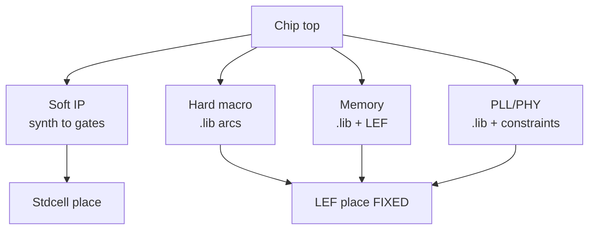

# Genus Macros, Memories, Multibit & Datapath — Deep Reference

**Scope:** Hard/soft macros, SRAM/memories, liberty/LEF/sim, dont_use policies, multibit flops, datapath inference, sequential opts. Industry.  
**Index:** `GENUS_COMPLETE_INDEX.md`.

---

## Table of contents

1. [Macros & IP types](#1-macros--ip-types)
2. [Integrating macros in Genus](#2-integrating-macros-in-genus)
3. [Memories (SRAM compilers)](#3-memories-sram-compilers)
4. [Constraints around macros](#4-constraints-around-macros)
5. [Dont_use / cell selection policy](#5-dont_use--cell-selection-policy)
6. [Multibit cells deep](#6-multibit-cells-deep)
7. [Datapath optimization deep](#7-datapath-optimization-deep)
8. [Sequential optimizations](#8-sequential-optimizations)
9. [Physical considerations](#9-physical-considerations)
10. [Verification](#10-verification)
11. [Issue → fix](#11-issue--fix)
12. [Command cards](#12-command-cards)
13. [Interview FAQ](#13-interview-faq)

---

## 1. Macros & IP types



| Type | Model in Genus | Physical |
|------|----------------|----------|
| Soft RTL IP | Synthesized gates | Stdcell |
| Soft encrypted | Same if readable | Stdcell |
| Hard digital macro | Liberty arcs | LEF/GDS |
| Analog / mixed | Liberty abstract or BBox | LEF |
| Memory | Compiler liberty | LEF + GDS |
| PLL / PHY | Liberty + constraints | LEF |

---

## 2. Integrating macros in Genus

```tcl
set_db library [list $STD $IO $MACRO_SS $MEM_SS]
# optional separate link_library / target_library attrs
read_hdl ...
elaborate $TOP
check_design -unresolved
check_design -lib_lef_consistency   ;# when LEFs loaded
```

| Need for STA | Liberty |
| Need for PnR | LEF |
| Need for GLS | Verilog/VHDL sim model |
| Need for LEC | Model or blackbox policy |

### 2.1 Black box early

Ports only — timing incomplete. Replace before tapeout.

---

## 3. Memories (SRAM compilers)

| Deliverable | Use |
|-------------|-----|
| `.lib` per corner | MMMC library_sets |
| `.lef` | Place |
| `.v` behavioral | GLS |
| BIST pins | DFT/MBIST |
| Power pins | UPF rails |

**MMMC:** include memory libs in each relevant library_set (SS/FF/…).

---

## 4. Constraints around macros

| Constraint | Guidance |
|------------|----------|
| Clocks | create_clock on macro CK if root inside; else propagated |
| Input/output delay | Hierarchical block budgets |
| False path | Only datasheet-legal |
| Max transition/cap | Honor macro limits |
| Dont_touch | Freeze macro instance |
| Case analysis | Modes inside macro if modeled |

---

## 5. Dont_use / cell selection policy

```tcl
set_dont_use [get_lib_cells */*HVT*]
set_db [get_db lib_cells *DEL*] .dont_use true
# allow LVT only where needed — project policy
```

| Goal | Policy example |
|------|----------------|
| Leakage | Prefer HVT/RVT; LVT on critical |
| Clock quality | Specific CK buffers only |
| Yield | Ban weak drives |

---

## 6. Multibit cells deep

### 6.1 What / why

| What | 2-bit / 4-bit flop packs |
| Why | Area, clock pin cap, power |
| Risk | Pin access, hold, scan stitching, ECO |

### 6.2 Commands / reports

```tcl
report_multibit_inferencing
merge_to_multibit_cells
identify_multibit_cell_abstract_scan_segments
```

Attrs: search `multibit` in `PLAN/misc/genus_attributes`.

### 6.3 When to enable / disable

| Enable | Timing stable; area/power goal; scan flow supports |
| Disable | Early ECO; strict hold; tool quality issues |

### 6.4 DFT

Multibit needs scan segment identification — DFT guide.

---

## 7. Datapath optimization deep

### 7.1 What

Infers + / * / comparators → CSA, booth, parallel-prefix, etc.

### 7.2 Controls

| Lever | Notes |
|-------|-------|
| `syn_generic` effort | Affects DP exploration |
| `dpopt_*` attributes | Fine control (attributes dump) |
| `report_dp` | What was built |
| RTL pipelining | Still best for deep timing |

### 7.3 Use cases

| Goal | Approach |
|------|----------|
| Timing | Higher effort; pipeline RTL |
| Area | Lower effort / force simple resources |
| Power | Activity-aware + simpler arithmetic |

---

## 8. Sequential optimizations

| Opt | Risk |
|-----|------|
| Constant prop through flops | Functional if intentional |
| Retiming | LEC; IO timing change |
| Delete unloaded seq | DFT loss |
| ICG | See LP guide |

---

## 9. Physical considerations

| Topic | Notes |
|-------|-------|
| Macro placement | DEF FIXED |
| Halo/blockage | Congestion |
| Memory well | UPF rails |
| Physical synth | PLE with macros placed |

---

## 10. Verification

| Check | How |
|-------|-----|
| Unresolved | check_design |
| LEC | Models for hard macros |
| GLS | Vendor sim models |
| Timing | Liberty arcs only inside hard macro |

---

## 11. Issue → fix

| Issue | Fix |
|-------|-----|
| Unresolved RAM | Add lib + correct instance type |
| No arcs | Wrong liberty corner/view |
| Place fail | LEF |
| Multibit hold | Disable multibit or fix CTS |
| DP too slow | Pipeline RTL |
| LEC multibit | Mapping rules |

---

## 12. Command cards

```tcl
set_db library [list $STD $MEM $MACRO]
check_design -unresolved
report_dp
report_multibit_inferencing
report_sequential
set_dont_use [get_lib_cells */BAN_ME*]
set_db [get_db insts u_ram*] .preserve true
```

---

## 13. Interview FAQ

**Q: Soft vs hard macro?** Synth vs liberty/LEF.  
**Q: Why multibit?** Area/power; scan/hold tradeoffs.  
**Q: Memory in MMMC?** Lib per corner in library_sets.  
**Q: DP vs RTL pipe?** Tool maps ops; architecture still king.

---

*In real SoCs, macros and memories dominate QoR — treat their models as first-class inputs.*
