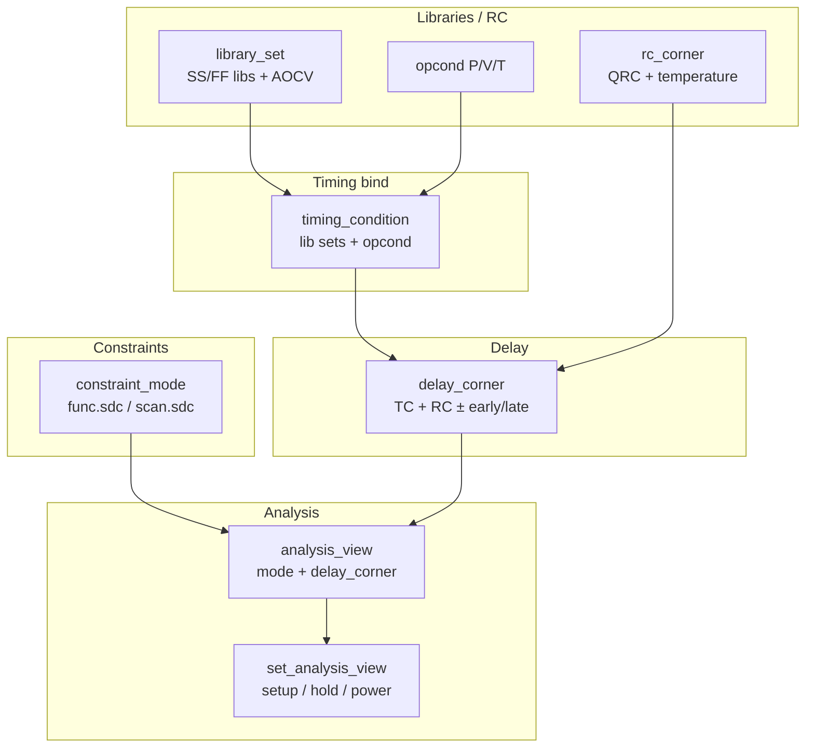
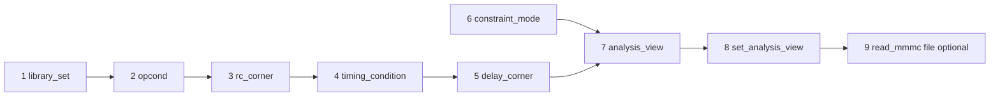

# Genus MMMC Complete Guide — Deep Reference

**Scope:** Industry Multi-Mode Multi-Corner (MMMC) for Cadence Genus — full object model, every major command with options, use cases, flows, issues, reporting. Not limited to any one design.  
**Command truth:** `PLAN/misc/genus_commands/` (`create_library_set`, `create_rc_corner`, `create_delay_corner`, `create_timing_condition`, `create_opcond`, `create_constraint_mode`, `create_analysis_view`, `set_analysis_view`, `read_mmmc`, `write_mmmc`, …). Always `help <cmd>` in your build.  
**Index:** `GENUS_COMPLETE_INDEX.md`.  
**Related:** Clocks, CDC, UPF, Activity power, Verification guides.

---

## Table of contents

1. [What / why / when MMMC](#1-what--why--when-mmmc)
2. [Object model (mental picture)](#2-object-model-mental-picture)
3. [Build order (how to author MMMC)](#3-build-order-how-to-author-mmmc)
4. [Library sets — deep](#4-library-sets--deep)
5. [RC corners — deep](#5-rc-corners--deep)
6. [Opcond & timing conditions — deep](#6-opcond--timing-conditions--deep)
7. [Delay corners — deep](#7-delay-corners--deep)
8. [Constraint modes — deep](#8-constraint-modes--deep)
9. [Analysis views & set_analysis_view — deep](#9-analysis-views--set_analysis_view--deep)
10. [read_mmmc / write_mmmc](#10-read_mmmc--write_mmmc)
11. [View matrices & methodology recipes](#11-view-matrices--methodology-recipes)
12. [Reporting & debug under MMMC](#12-reporting--debug-under-mmmc)
13. [Optimization behavior multi-view](#13-optimization-behavior-multi-view)
14. [AOCV / SOCV / SI / IR-drop hooks](#14-aocv--socv--si--ir-drop-hooks)
15. [UPF + MMMC](#15-upf--mmmc)
16. [Single-corner vs reduced vs full MMMC](#16-single-corner-vs-reduced-vs-full-mmmc)
17. [Issue → diagnose → fix](#17-issue--diagnose--fix)
18. [Worked MMMC file template](#18-worked-mmmc-file-template)
19. [Command cards](#19-command-cards)
20. [Interview FAQ](#20-interview-faq)

---

## 1. What / why / when MMMC

### 1.1 What

MMMC is the **structured way** Genus (and Innovus) associate:

| Dimension | Examples |
|-----------|----------|
| **Process / voltage / temperature** | SS cold, FF hot, TT |
| **RC extraction** | rcworst, cbest, typical |
| **Operating mode** | func, scan, sleep, mbist |
| **Analysis intent** | setup, hold, leakage, dynamic power, DRV |

Each **analysis view** = one **constraint mode** + one **delay corner** (plus optional power modes / latency files).

### 1.2 Why

| Driver | Without MMMC | With MMMC |
|--------|--------------|-----------|
| Setup closure | One slow lib only | Multiple setup views |
| Hold closure | Often ignored in synth | Fast/min views active |
| Modes | One SDC muddle | Separate SDCs per mode |
| Cell choice | Biased to one corner | Multi-view cost (when enabled) |
| Handoff | Ad-hoc lib lists | Reproducible `write_mmmc` |

### 1.3 When

| Situation | Recommendation |
|-----------|----------------|
| Tiny block, day-1 RTL | Single library OK |
| Block delivery to SoC | At least SS setup + FF hold views |
| Chip-level synth | Reduced multi-view |
| Signoff path | Full matrix often in **Innovus/Tempus**; Genus may use subset |
| Multi-voltage / UPF | Library sets per rail + power modes on views |

### 1.4 Genus vs Innovus

| | Genus | Innovus |
|--|-------|---------|
| Goal | Build netlist under multi-view costs | Place/CTS/route under full MMMC |
| View count | Often **smaller** (runtime) | Larger signoff set |
| Same objects | Yes (library_set, rc, delay, mode, view) | Yes |

Valid: **single-corner Genus → multi-corner Innovus**, or multi-view Genus throughout.

---

## 2. Object model (mental picture)



```text
                    ┌─────────────────────┐
                    │  constraint_mode    │  ← SDC file(s): func / scan / …
                    │  (func.sdc)         │
                    └──────────┬──────────┘
                               │
┌──────────────┐    ┌──────────▼──────────┐    ┌──────────────┐
│ library_set  │───►│  timing_condition   │    │  rc_corner   │
│ (SS libs)    │    │  (optional MMMC-2)  │    │  (QRC+temp)  │
└──────────────┘    └──────────┬──────────┘    └──────┬───────┘
                               │                      │
                               └──────────┬───────────┘
                                          ▼
                               ┌─────────────────────┐
                               │   delay_corner      │
                               └──────────┬──────────┘
                                          │
                                          ▼
                               ┌─────────────────────┐
                               │  analysis_view      │
                               │  mode + delay_corner│
                               └──────────┬──────────┘
                                          │
                    set_analysis_view -setup {…} -hold {…}
```

| Object | One-line meaning |
|--------|------------------|
| `library_set` | Bundle of liberty (+ AOCV/SOCV/SI) files |
| `rc_corner` | Interconnect RC model + temperature |
| `opcond` | Named P/V/T operating condition |
| `timing_condition` | library_sets + opcond (MMMC-2 style) |
| `delay_corner` | How delay is calculated (libs/TC + RC, early/late) |
| `constraint_mode` | Which SDC applies |
| `analysis_view` | One analysis “world” |
| Active views | Subset used for setup/hold/power/DRV |

---

## 3. Build order (how to author MMMC)

**Always build bottom-up:**



```text
1. create_library_set          (all corners you need)
2. create_opcond               (if using named opconds)
3. create_rc_corner            (all RC corners)
4. create_timing_condition     (if MMMC-2 / Stylus style)
5. create_delay_corner         (bind libs/TC + RC; early/late if needed)
6. create_constraint_mode      (each SDC mode)
7. create_analysis_view        (each mode × delay_corner pair you care about)
8. set_analysis_view           (activate setup/hold/leakage/dynamic/…)
9. Optionally wrap steps 1–8 in a file and read_mmmc that file
```

**Why this order:** Views need modes + delay corners; delay corners need libs and RC; modes need SDC paths.

---

## 4. Library sets — deep

### 4.1 Command (verified)

```text
create_library_set -name <string>
  [-timing <lib>+]
  [-target_timing <lib>+]
  [-link_timing <lib>+]
  [-aocv <file>+]
  [-socv <file>+]
  [-si <file>+]
  [-library_side_file <file>]
```

| Option | What | Why / when |
|--------|------|------------|
| `-name` | Handle for later objects | Required |
| `-timing` | Primary liberty list | Stdcell + IO + memory for this PVT |
| `-target_timing` | Mapping target libs | When target ≠ full timing list |
| `-link_timing` | Link-only (resolve instances) | Macros already mapped |
| `-aocv` | Advanced OCV tables | Signoff-style derates |
| `-socv` | Statistical OCV | Advanced flows |
| `-si` | Signal-integrity libs | Noise-aware delay |
| `-library_side_file` | Side file for macros | Memory/compiler side data |

### 4.2 What to put in one set

| Include | Example |
|---------|---------|
| Stdcell for PVT | `*ssgnp*m40c*.lib` |
| Matching IO | IO SS with compatible voltage |
| Memories at that corner | SRAM SS |
| AOCV if methodology requires | `*.aocv` |

**Do not** mix SS and FF in one library_set for a single delay corner.

### 4.3 Use cases

| Use case | Sets |
|----------|------|
| Minimal | `ls_ss`, `ls_ff` |
| Multi-Vt | Still one set per PVT listing all VT libs allowed |
| Multi-voltage | Separate sets per voltage island if libs differ |
| Update later | `update_library_set` |

```tcl
create_library_set -name ls_ss -timing [list $SS_STD $SS_IO $SS_MEM]
create_library_set -name ls_ff -timing [list $FF_STD $FF_IO $FF_MEM]
create_library_set -name ls_ss_aocv -timing [list $SS_STD] -aocv [list $AOCV_SS]
```

---

## 5. RC corners — deep

### 5.1 Command (verified)

```text
create_rc_corner -name <string>
  [-temperature <float>]
  [-qrc_tech <file>]
  [-cap_table <file>]
  [-pre_route_res <float>] [-pre_route_cap <float>]
  [-post_route_res <triplet>+] [-post_route_cap <triplet>+]
  [-post_route_cross_cap <triplet>+]
  [-pre_route_clock_res/cap ...]
  [-post_route_clock_res/cap/cross_cap ...]
  [-via_variation_file <file>]
```

| Option | What | Why |
|--------|------|-----|
| `-qrc_tech` | QRC technology file | Foundry RC model |
| `-temperature` | Temp for RC | Matches corner story |
| `-cap_table` | Cap table alternative/supplement | Older or side flows |
| `pre_route_*` | Scale factors before detailed route | Synth / pre-route STA |
| `post_route_*` | Post-route scale triplets | After route (more PnR) |
| `*_clock_*` | Separate factors for clock nets | Clock tree RC differs |
| `cross_cap` | Coupling cap factors | SI-ish RC |

### 5.2 Typical RC names (foundry-dependent)

| Name | Intent |
|------|--------|
| rcworst / Cworst | Setup-pessimistic wires |
| cbest / rcbest | Hold-pessimistic (fast) wires |
| typical | Mid |
| rcworst_CCworst | Coupled worst |

### 5.3 Use cases

| Stage | RC choice |
|-------|-----------|
| Genus logical | Often one setup RC + one hold RC |
| Pre-route | pre_route factors matter |
| Post-route | SPEF may replace QRC estimate (Innovus/Tempus) |

```tcl
create_rc_corner -name rc_worst \
  -qrc_tech $QRC_RCWORST -temperature -40 \
  -pre_route_cap 1.0 -pre_route_res 1.0
create_rc_corner -name rc_best \
  -qrc_tech $QRC_CBEST -temperature 125 \
  -pre_route_cap 1.0 -pre_route_res 1.0
```

---

## 6. Opcond & timing conditions — deep

### 6.1 `create_opcond`

```text
create_opcond -name <string>
  [-process <float>] [-voltage <float>] [-temperature <float>]
  [-tree_type <string>]
```

| What | Named P/V/T operating condition |
| Why | Attach numeric PVT to timing_condition |
| When | MMMC-2 flows, voltage scaling, documentation |

```tcl
create_opcond -name opc_ss -process 1.0 -voltage 0.72 -temperature -40
create_opcond -name opc_ff -process 1.0 -voltage 0.88 -temperature 125
```

### 6.2 `create_timing_condition`

```text
create_timing_condition -name <string>
  -library_sets <library_set>+
  [-opcond <string>] [-opcond_library <string>]
```

| What | Binds library_set(s) to an opcond |
| Why | Cleaner than stuffing everything into delay_corner alone |
| When | Stylus / MMMC-2 style (PLAN uses this path) |

```tcl
create_timing_condition -name tc_ss -library_sets {ls_ss} -opcond opc_ss
create_timing_condition -name tc_ff -library_sets {ls_ff} -opcond opc_ff
```

---

## 7. Delay corners — deep

### 7.1 Command (verified, rich)

```text
create_delay_corner -name <string>
  [-timing_condition <PD@TC|rail@TC>]
  [-early_timing_condition ...] [-late_timing_condition ...]
  [-pg_net_voltages <net@voltage>]
  [-rc_corner <rc>] [-early_rc_corner <rc>] [-late_rc_corner <rc>]
  [-temperature_files ...] [-irdrop_files/data ...]
  [-si_enabled {true|false}]
  [-early/late_estimated_worst_irdrop_factor <float>]
```

| Option | What | Why / when |
|--------|------|------------|
| `-timing_condition` | Nominal TC for delay | Standard binding |
| `-early_timing_condition` | Early (hold-ish) libs/TC | Split early/late |
| `-late_timing_condition` | Late (setup-ish) libs/TC | Split early/late |
| `-rc_corner` | Single RC | Simple corners |
| `-early_rc_corner` / `-late_rc_corner` | Different RC for early/late | Advanced pessimism control |
| `-pg_net_voltages` | Per-rail voltage | UPF multi-rail |
| `-si_enabled` | SI delay on/off | Noise-aware |
| IR-drop files/factors | Voltage drop impact | Advanced power-aware delay |

### 7.2 Simple vs advanced delay corner

**Simple (common in Genus synth):**

```tcl
create_delay_corner -name dc_ss -timing_condition tc_ss -rc_corner rc_worst
create_delay_corner -name dc_ff -timing_condition tc_ff -rc_corner rc_best
```

Some builds still accept `-library_set` instead of `-timing_condition` — check `help create_delay_corner`.

**Advanced:** early/late TC and RC independently for setup/hold asymmetry.

### 7.3 Setup vs hold mapping

| Analysis | Typical delay corner |
|----------|----------------------|
| Setup | Slow cell (SS) + worst RC + cold/hot per foundry |
| Hold | Fast cell (FF) + best RC + appropriate temp |

---

## 8. Constraint modes — deep

### 8.1 Command (verified)

```text
create_constraint_mode -name <string>
  -sdc_files <file>+
  [-ilm_sdc_files <file>+]
  [-tcl_variables <string>]
```

| Option | What | Why |
|--------|------|-----|
| `-name` | Mode handle (`func`, `scan`) | Referenced by views |
| `-sdc_files` | SDC list for this mode | Different clocks/exceptions |
| `-ilm_sdc_files` | SDC for ILM hierarchical | Bottom-up blocks |
| `-tcl_variables` | Vars expanded in SDC | Parameterized SDC |

### 8.2 What changes between modes

| Mode | Typical SDC content |
|------|---------------------|
| **func** | Functional clocks, I/O, FP, MCP |
| **scan** | Scan clocks, exclusive vs func, case_analysis SE/test_mode |
| **sleep** | Subset clocks, UPF-related |
| **mbist** | BIST clocks and exceptions |

**Same netlist**, different constraint worlds.

```tcl
create_constraint_mode -name func -sdc_files [list constraints/func.sdc]
create_constraint_mode -name scan -sdc_files [list constraints/scan.sdc]
```

---

## 9. Analysis views & set_analysis_view — deep

### 9.1 `create_analysis_view` (verified)

```text
create_analysis_view -name <string>
  -constraint_mode <mode>
  -delay_corner <dc>
  [-power_modes <string>+]
  [-latency_file <string>]
```

| Option | What | Why |
|--------|------|-----|
| `-constraint_mode` | Which SDC world | Required |
| `-delay_corner` | Which delay world | Required |
| `-power_modes` | UPF power modes for this view | Multi-rail / sleep analysis |
| `-latency_file` | Latency annotations | Clock latency import |

```tcl
create_analysis_view -name av_func_ss \
  -constraint_mode func -delay_corner dc_ss
create_analysis_view -name av_func_ff \
  -constraint_mode func -delay_corner dc_ff
create_analysis_view -name av_scan_ss \
  -constraint_mode scan -delay_corner dc_ss
```

### 9.2 `set_analysis_view` (verified)

```text
set_analysis_view
  [-setup <view>+]
  [-hold <view>+]
  [-leakage <view>+]
  [-dynamic <view>+]
  [-inactive <view>+]
  [-drv <view>+]
```

| Slot | What it drives |
|------|----------------|
| **`-setup`** | Setup timing opt & reports |
| **`-hold`** | Hold timing opt & reports |
| **`-leakage`** | Leakage power analysis view |
| **`-dynamic`** | Dynamic power analysis view |
| **`-inactive`** | Views kept for SDC pass-through only |
| **`-drv`** | DRV-related (help notes SDC pass in some builds — confirm) |

```tcl
set_analysis_view \
  -setup   {av_func_ss av_scan_ss} \
  -hold    {av_func_ff} \
  -leakage {av_func_ss} \
  -dynamic {av_func_ss}
```

### 9.3 First set_analysis_view and library load

Per Genus `read_mmmc` behavior: libraries associated with the **first** `set_analysis_view` are loaded early for synthesis. Order of views in the MMMC file matters for initial link.

---

## 10. read_mmmc / write_mmmc

### 10.1 `read_mmmc`

```text
read_mmmc [-design <string>] <mmmc_file>
```

| What | Parse MMMC Tcl; populate objects; load libs from first active view |
| When | Start of flow after or with design setup |
| Design | `-design` if multi-top |

### 10.2 `write_mmmc`

```text
write_mmmc [-dir <dir>] [-prefix <p>] [-design] [-library]
  [-skip_library_domains] [-skip_sdc_update ...] [-no_sdc <modes>]
  [-with_target_link] [<design>]
```

| Option | Why |
|--------|-----|
| `-dir` / `-prefix` | Control output location/names |
| `-design` / `-library` | Split design vs lib portions |
| `-no_sdc` | Skip writing SDC for listed modes |
| `-with_target_link` | Keep target/link separation in libsets |

**Use:** Snapshot MMMC for Innovus handoff or regression.

---

## 11. View matrices & methodology recipes

### 11.1 Minimal (always know this)

| View | Mode | Delay | Active |
|------|------|-------|--------|
| av_func_ss | func | SS+rcworst | setup |
| av_func_ff | func | FF+rcbest | hold |

### 11.2 Standard SoC reduced set

| View | Role |
|------|------|
| func_ss_rcw | Setup primary |
| func_ss_rcw2 | Optional second RC |
| func_ff_rcb | Hold primary |
| scan_ss_rcw | Scan setup |

### 11.3 Multi-mode multi-RC full (signoff-oriented)

Cartesian product (example):

```text
modes × {SS, FF} × {rcworst, cbest, typical}
```

Runtime grows fast — use full set in signoff tool; subset in Genus.

### 11.4 Recipe: single-corner Genus → MMMC Innovus

```text
Genus: set_db library {ss libs only}; write_hdl/sdc
Innovus: read_mmmc full matrix; read netlist; set_analysis_view full
```

### 11.5 Recipe: multi-view Genus synth

```text
read_mmmc reduced.mmmc
# first set_analysis_view loads libs
elaborate / read netlist as flow requires
syn_generic / map / opt
report_qor -view av_func_ss
report_timing -views av_func_ff ...
write_mmmc; write_hdl; write_sdc
```

---

## 12. Reporting & debug under MMMC

```tcl
report_analysis_views
report_qor -view av_func_ss
report_timing -views av_func_ss -max_paths 50
report_timing -views av_func_ff -max_paths 50   ;# hold analysis context
report_constraint -view av_func_ss
report_power -view av_func_ss
```

| Question | Command |
|----------|---------|
| Which views exist? | `report_analysis_views` |
| Setup WNS on SS? | `report_qor -view av_func_ss` |
| Hold on FF? | timing with hold view active / hold report flow |
| Wrong SDC in scan? | Check constraint_mode of that view |

---

## 13. Optimization behavior multi-view

| Active setup views | Opt tries to close setup on all of them |
| Active hold views | Opt inserts delay / avoids over-thin cells |
| Conflict | Cell helps SS setup may hurt FF hold — multi-view cost balances |
| Runtime | More views → slower opt |

**Attrs:** effort levels still apply; view set is the MMMC control.

---

## 14. AOCV / SOCV / SI / IR-drop hooks

| Feature | Where in MMMC |
|---------|----------------|
| AOCV | `create_library_set -aocv` |
| SOCV | `-socv` |
| SI libs | `-si` |
| SI on delay corner | `create_delay_corner -si_enabled true` |
| IR-drop | `-irdrop_files`, `-irdrop_data`, estimated factors on delay_corner |
| PG voltages | `-pg_net_voltages` for multi-rail |

Use when project STA cookbook requires them — not day-1 RTL.

---

## 15. UPF + MMMC

| Topic | How |
|-------|-----|
| Power modes on view | `create_analysis_view -power_modes {RUN SLEEP}` |
| Per-domain libs | timing_condition with PD@TC syntax on delay_corner |
| PG voltages | `-pg_net_voltages VDD@0.72` |
| Analysis | Separate views for sleep vs run if SDC/UPF differ |

See `HOW_TO_WRITE_UPF_CPF.md` + this guide together.

---

## 16. Single-corner vs reduced vs full MMMC

| Approach | Genus | Pros | Cons |
|----------|-------|------|------|
| Single SS | One lib | Fast | Weak hold foresight |
| Reduced multi-view | 2–6 views | Balanced | Not full signoff |
| Full matrix | Many views | Thorough | Slow; often PnR/signoff |

---

## 17. Issue → diagnose → fix

| # | Symptom | Diagnose | Fix |
|---|---------|----------|-----|
| 1 | No libs loaded | First `set_analysis_view` wrong | Fix view order / lib paths |
| 2 | Hold not seen | No hold views | Add FF view to `-hold` |
| 3 | Scan pollutes func | One SDC mode | Split constraint modes |
| 4 | Wrong cell VT | dont_use / lib set | Fix library_set contents |
| 5 | View name error | typo | `report_analysis_views` |
| 6 | RC ignored | No rc_corner on DC | Attach rc_corner |
| 7 | Runtime explosion | Too many views | Reduce Genus views |
| 8 | Voltage island wrong delay | Single lib for multi-V | PD@TC / multi lib sets |
| 9 | write_mmmc empty | Path/permissions | Check file |
| 10 | write_mmmc incomplete | flags | Use `-dir`/`-prefix`; include libs |
| 11 | Setup green hold red | Expected asymmetry | Hold buffers later / multi-view opt |
| 12 | I/O wrong corner | IO lib missing in set | Add IO liberty to set |

---

## 18. Worked MMMC file template

```tcl
# design.mmmc.tcl — generic template
# Paths: set env or Tcl vars before source

create_library_set -name ls_ss -timing [list $SS_STD $SS_IO]
create_library_set -name ls_ff -timing [list $FF_STD $FF_IO]

create_opcond -name opc_ss -voltage 0.72 -temperature -40
create_opcond -name opc_ff -voltage 0.88 -temperature 125

create_rc_corner -name rcw -qrc_tech $QRC_RCWORST -temperature -40 \
  -pre_route_cap 1.0 -pre_route_res 1.0
create_rc_corner -name rcb -qrc_tech $QRC_CBEST -temperature 125 \
  -pre_route_cap 1.0 -pre_route_res 1.0

create_timing_condition -name tc_ss -library_sets {ls_ss} -opcond opc_ss
create_timing_condition -name tc_ff -library_sets {ls_ff} -opcond opc_ff

create_delay_corner -name dc_ss -timing_condition tc_ss -rc_corner rcw
create_delay_corner -name dc_ff -timing_condition tc_ff -rc_corner rcb

create_constraint_mode -name func -sdc_files [list $FUNC_SDC]
create_constraint_mode -name scan -sdc_files [list $SCAN_SDC]

create_analysis_view -name av_func_ss -constraint_mode func -delay_corner dc_ss
create_analysis_view -name av_func_ff -constraint_mode func -delay_corner dc_ff
create_analysis_view -name av_scan_ss -constraint_mode scan -delay_corner dc_ss

set_analysis_view \
  -setup {av_func_ss av_scan_ss} \
  -hold  {av_func_ff}
```

```tcl
read_mmmc design.mmmc.tcl
report_analysis_views
```

---

## 19. Command cards

### Author

```tcl
create_library_set -name ls_ss -timing [list ...]
create_rc_corner -name rcw -qrc_tech ... -temperature ...
create_opcond -name opc_ss -voltage ... -temperature ...
create_timing_condition -name tc_ss -library_sets {ls_ss} -opcond opc_ss
create_delay_corner -name dc_ss -timing_condition tc_ss -rc_corner rcw
create_constraint_mode -name func -sdc_files [list func.sdc]
create_analysis_view -name av_func_ss -constraint_mode func -delay_corner dc_ss
set_analysis_view -setup {av_func_ss} -hold {av_func_ff}
```

### Operate

```tcl
read_mmmc design.mmmc.tcl
report_analysis_views
report_qor -view av_func_ss
report_timing -views av_func_ss -max_paths 50
write_mmmc -dir out -prefix chip
```

---

## 20. Interview FAQ

**Q: What is an analysis view?**  
Pair of constraint mode (SDC) + delay corner (libs/RC).

**Q: Why separate setup and hold views?**  
Different PVT/RC extremes.

**Q: library_set vs delay_corner?**  
Set = files; delay_corner = how delay is computed including RC.

**Q: Can Genus use fewer views than signoff?**  
Yes — common methodology.

**Q: What does set_analysis_view -inactive do?**  
Keeps views for SDC association without full active analysis (per help).

**Q: Where do AOCV files attach?**  
Typically `create_library_set -aocv`.

---

*MMMC is the analysis OS of Genus/Innovus. Master objects and build order; scale view count to stage runtime.*
