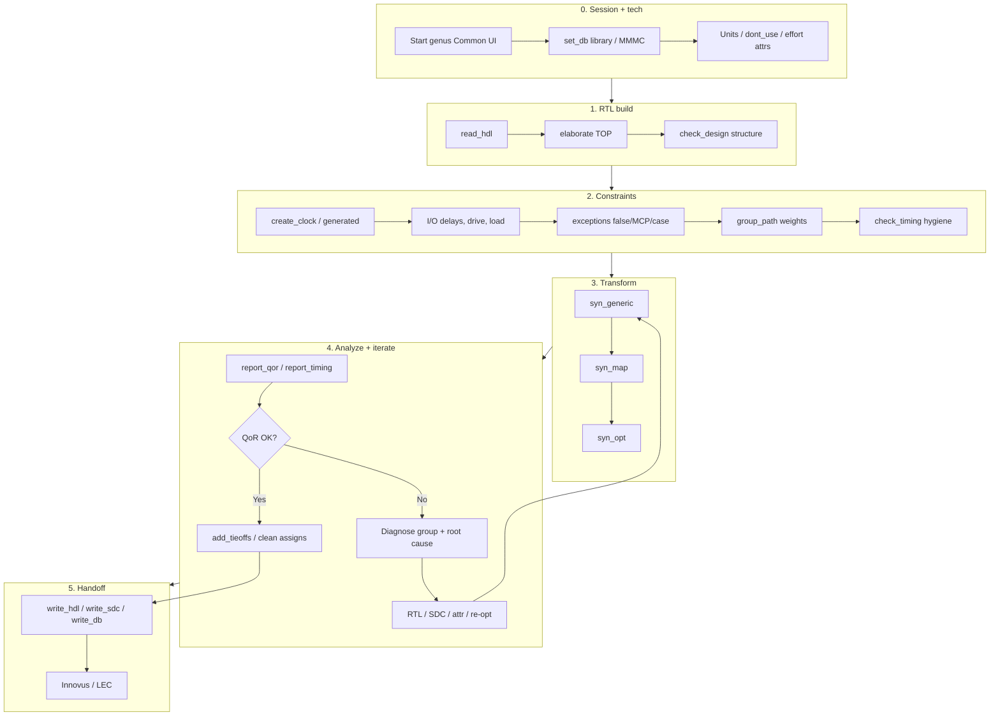
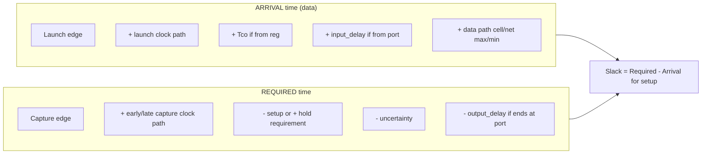
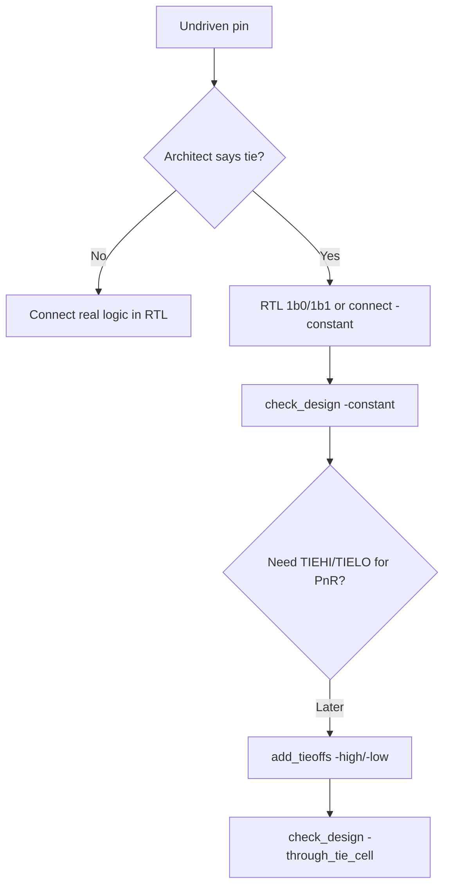
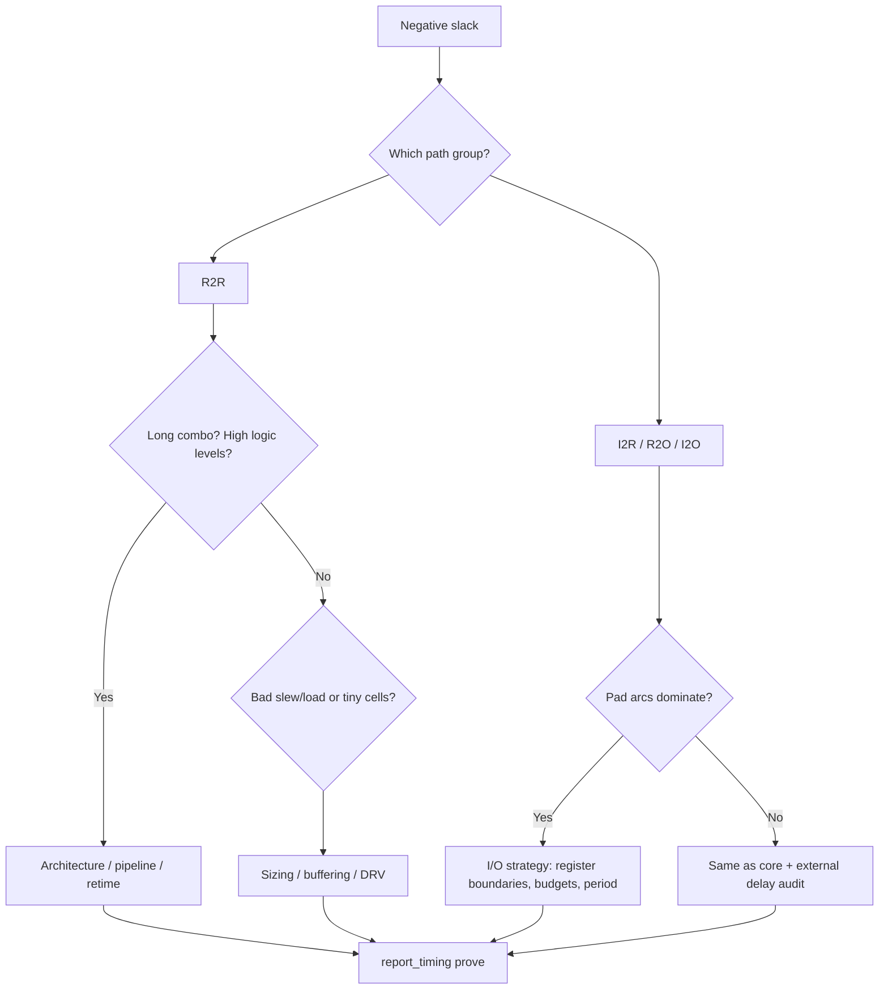

# Genus Synthesis Master Guide — 10+ Year Interview Depth

**Audience:** Senior RTL-to-GDS / synthesis / STA engineers (industry scope).  
**Tool focus:** Cadence Genus Common UI (`set_db`). Commands from `PLAN/misc/genus_commands/` and `genus_attributes/`.  
**Full curriculum (no domain gaps):** **`GENUS_COMPLETE_INDEX.md`**

**Related guides:**

| File | Role |
|------|------|
| `GENUS_COMPLETE_INDEX.md` | **Master index of all Genus docs** |
| `GENUS_COMMANDS.md` | Problem → command encyclopedia |
| `CLOCKS_COMPLETE_USER_GUIDE.md` | Clocks / generated / groups |
| `CDC_USER_GUIDE.md` | CDC complete |
| `LOW_POWER_SYNTHESIS_REFERENCE.md` | LP + UPF overview |
| `HOW_TO_WRITE_UPF_CPF.md` | UPF authoring |
| `GENUS_MMMC_COMPLETE_GUIDE.md` | MMMC |
| `GENUS_DFT_SCAN_COMPLETE_GUIDE.md` | DFT / scan |
| `GENUS_HIERARCHICAL_SYNTHESIS_GUIDE.md` | Hierarchical / ILM |
| `GENUS_PHYSICAL_ISPATIAL_GUIDE.md` | Physical / iSpatial |
| `GENUS_VERIFICATION_LEC_GLS_SDF_GUIDE.md` | LEC / GLS / SDF |
| `GENUS_ECO_INCREMENTAL_EXCEPTIONS_GUIDE.md` | ECO / exceptions |
| `GENUS_MACROS_MULTIBIT_DATAPATH_GUIDE.md` | Macros / multibit |
| `GENUS_ACTIVITY_POWER_SAIF_VCD_GUIDE.md` | SAIF / VCD power |
| `TIMING_WHITEBOARD_PROBLEMS.md` | STA drills |

> **Honesty bar:** Where Genus help dumps are empty (e.g. `check_timing`, sparse `create_clock` usage text), behavior is described from industry STA/SDC semantics and observed Genus practice — not invented flags. Prefer `help <cmd>` in your live session before using a flag in production scripts.

---

## Table of contents

1. [How to use this document](#1-how-to-use-this-document)
2. [Mental model of synthesis](#2-mental-model-of-synthesis)
3. [End-to-end Genus flow (stage map)](#3-end-to-end-genus-flow-stage-map)
4. [Stage-by-stage: commands + backend behavior](#4-stage-by-stage-commands--backend-behavior)
5. [SDC command encyclopedia by stage](#5-sdc-command-encyclopedia-by-stage)
6. [Timing math: setup, hold, path groups](#6-timing-math-setup-hold-path-groups)
7. [Where input_delay / output_delay land in the equations](#7-where-input_delay--output_delay-land-in-the-equations)
8. [Path groups: R2R, R2O, I2R, I2O (and defaults)](#8-path-groups-r2r-r2o-i2r-i2o-and-defaults)
9. [`check_design` deep playbook](#9-check_design-deep-playbook)
10. [Timing lint, unconstrained paths, constraint hygiene](#10-timing-lint-unconstrained-paths-constraint-hygiene)
11. [Timing closure: diagnose → fix → prove](#11-timing-closure-diagnose--fix--prove)
12. [Important report / DB / hygiene commands](#12-important-report--db--hygiene-commands)
13. [Handoff to Innovus / LEC / DFT notes](#13-handoff-to-innovus--lec--dft-notes)
14. [Hard interview questions + answers](#14-hard-interview-questions--answers)
15. [Quick cheat sheets](#15-quick-cheat-sheets)
16. [Appendix: verified command index](#16-appendix-verified-command-index)

---

## 1. How to use this document

| Goal | Sections |
|------|----------|
| Walk a full synth script with intent | §3–§4 |
| Defend SDC choices in interview | §5–§8 |
| Debug structure vs timing | §9–§11 |
| Live tool fluency (`get_db`, reports) | §12 |
| Senior bar questions | §14 |

**Practice loop (lab):**

```text
read RTL → elaborate → SDC → check_design → check_timing mindset
→ syn_generic → syn_map → syn_opt
→ report_qor / report_timing by group → fix → write outputs
```

---

## 2. Mental model of synthesis

### 2.1 What synthesis *is*

Synthesis is a **constrained multi-objective transformation**:

```text
RTL + liberty + constraints
        ↓
  Boolean + sequential structure
        ↓
  Technology-mapped netlist (cells from library)
        ↓
  Timing/area/power optimized gate netlist (+ optional physical guidance)
```

It is **not** “compile to random gates.” Every optimization step is driven by a **cost function** over:

- **Timing** (setup primarily at synth; hold mostly later in PnR unless hold-aware opt is on)
- **Area**
- **Power** (if power intent / SAIF / effort enabled)
- **DRC-like design rules** from liberty (max transition, max capacitance, max fanout when enforced)
- **Preserve / don’t-touch / DFT / hierarchy** policies

### 2.2 Three abstraction layers of the netlist

| Layer | Typical after | Independence from liberty |
|-------|---------------|---------------------------|
| **GTECH / generic** | `syn_generic` | Technology-independent boolean + sequential structure (tool generic cells) |
| **Mapped** | `syn_map` | Real `lib_cell` instances from target library |
| **Optimized mapped** | `syn_opt` | Same library space, restructured / sized / buffered for QoR |

**Interview soundbite:**  
`syn_generic` builds an optimized **technology-independent** implementation of the RTL under constraints.  
`syn_map` **binds** that structure onto **library cells** using timing/area models from liberty.  
`syn_opt` **improves** the mapped netlist (sizing, buffering, restructuring, sometimes spatial) under the same cost model.

### 2.3 What is *not* synthesis’s job

| Topic | Usually owned by |
|-------|------------------|
| Legal placement / detailed route | Innovus |
| Full CTS / real clock tree skew | Innovus (Genus may idealize clocks) |
| Full multi-corner signoff STA | Tempus / Innovus timing signoff views |
| Pad ring fillers / power pads | Floorplan / IO placement (not RTL “synth”) |
| Physical-only cells without liberty timing | Careful link; often physical-only flags |

---

## 3. End-to-end Genus flow (stage map)



### 3.1 Canonical command skeleton (logical synth)

```tcl
# --- 0. Libraries (single-corner example; MMMC is §4) ---
set_db library [list \
  /path/to/stdcell_ss.lib \
  /path/to/io_ss.lib \
]

# Optional common attrs (examples — confirm with get_db / help in session)
# set_db interconnect_mode {wireload}   ;# or ple with physical
# set_db use_tiehilo_for_const {none}

# --- 1. RTL ---
read_hdl -sv [list core1.v core2.v pad_top.sv]
elaborate pad_top
# init_design sometimes used in scripted flows after elaborate — follow your flow

check_design -unresolved
check_design -multiple_driver
check_design -undriven

# --- 2. SDC ---
read_sdc design.sdc
# or inline create_clock / set_input_delay / ...

# Environment models
set_input_transition 0.1 [all_inputs]
set_load 0.05 [all_outputs]
# or set_driving_cell -lib_cell BUFX4D1BWP16P90 -pin Z [all_inputs]

# --- 3. Pre-synth gates ---
check_design -all > reports/check_design_pre.rpt
# check_timing   ;# run; help may be empty in some builds — still useful

# --- 4. Synthesis ---
syn_generic
syn_map
syn_opt

# --- 5. QoR ---
report_qor > reports/qor.rpt
report_timing -max_paths 20 -nworst 1 > reports/timing_setup.rpt
report_timing -max_paths 20 -nworst 1 -group reg2reg > reports/r2r.rpt
# hold often: report_timing with min analysis if views support it

check_design -all > reports/check_design_post.rpt

# --- 6. Physical-ish cleanup ---
add_tieoffs -high TIEHBWP16P90 -low TIELBWP16P90 -max_fanout 8 pad_top
# remove_assigns_without_opt -design pad_top   ;# if assigns remain

# --- 7. Write ---
write_hdl > outputs/pad_top.v
write_sdc > outputs/pad_top.sdc
write_db -design pad_top outputs/pad_top.db
# write_db -common ...   ;# common DB for Genus+Innovus when applicable
```

---

## 4. Stage-by-stage: commands + backend behavior

### 4.0 Session / database

| Command | Verified usage gist | Backend idea |
|---------|---------------------|--------------|
| `set_db` | `set_db [-quiet\|-verbose] <obj\|shorthand> .<attr> <value>` | Mutate attribute store on objects (root, design, inst, pin, net, …) |
| `get_db` | `get_db [-if …] [-expr …] [-unique] [-depth …] <start> [.<attr>]` | Query object graph + attributes; **no** inventing `-count` — use `llength` |
| `read_libs` | loads liberty files (alt to `set_db library`) | Parse NLDM/CCS tables, pin caps, timing arcs, function strings |
| `set_db library {…}` | target mapping libraries | Primary technology binding for map |
| `set_db target_library` / `link_library` | mapping vs linking semantics | Target = map candidates; link = resolve instances |

**Object navigation pattern (senior fluency):**

```tcl
llength [get_db insts *]
llength [get_db ports *]
get_db [get_db pins *u_core/clk] .net
get_db [get_db insts *u_pad_clk*] .base_cell.name
```

### 4.1 `read_hdl`

**What it does:** Parses HDL into an **unelaborated** intermediate representation (modules, parameters, interfaces — language-dependent). Does **not** yet fully build the design instance hierarchy for timing.

**Critical details:**

- Order and `define` / `include` paths matter.
- SystemVerilog vs Verilog flags matter (`read_hdl -sv` when needed).
- Macros / generate blocks expand at elaborate time with parameter context.
- Black boxes: module declared but not read → later **unresolved** at elaborate/check.

**Failure modes:** syntax errors, missing files, language mismatch, encrypted IP not supported in mode.

### 4.2 `elaborate`

**What it does:** Instantiates hierarchy, resolves parameters/generates, binds module definitions, builds **design database** (hinsts, hpins, nets at RTL/generic pre-map).

**Backend concepts:**

- Hierarchy tree of `hinst` / leaf candidates
- Port connection graph
- Inference of latches/flops from RTL semantics (tool-dependent quality)
- Unresolved references if module body or liberty cell missing

**Chip vs core:**

| Elaborate top | Result |
|---------------|--------|
| `top` (core) | No pad cells |
| `pad_top` | IO cells from **IO liberty** linked as leaf cells + core under it |

**Post-elaborate checks (hard first):**

```tcl
check_design -unresolved
check_design -multiple_driver
check_design -undriven
check_design -combo_loops
```

### 4.3 Constraint application (`read_sdc` / interactive SDC)

**What it does:** Builds the **constraint graph**: clocks, external delays, exceptions, DRCs, path groups. Timing analysis and synthesis cost functions **read this graph**.

```tcl
read_sdc [-stop_on_errors] [-view <analysis_view>] [-echo] [-verbose] file.sdc
```

**Backend:** SDC objects attach to pins/ports/clocks; exceptions ordered by specificity/priority; invalid object names often silently no-op or warn — **silent wrong constraints are senior-level landmines**.

### 4.4 `syn_generic` — technology-independent synthesis

```text
Usage: syn_generic [-physical] [-create_floorplan] [-estimate_flop_bits] [<design>+]
```

**What it builds:**

- A netlist of **generic** (technology-independent) gates + sequential elements that implement RTL function
- Constant propagation, dead-code elimination, resource sharing / datapath structuring (tool heuristics)
- Timing-aware boolean optimization using **wireload or early wire models** and **constraint-defined clocks**
- Not yet committed to a specific foundry cell family (though cost models may already use liberty timing for guidance depending on flow)

**What it is *not*:**

- Not a pure “lib-independent for all time” artifact if you already set libraries for delay estimation — but the **cell types** are still generic until map
- Not physical legalization (unless `-physical` / floorplan-aware modes)

**Flags (from help):**

| Flag | Intent |
|------|--------|
| `-physical` | Consider physical domain |
| `-create_floorplan` | No DEF: create square FP density 0.7 |
| `-estimate_flop_bits` | Stop after enough opt for sequential bit estimate (DFT planning) |

**Interview depth:** Generic synthesis solves a **boolean multi-level optimization** problem with sequential mapping (FSM encoding choices may already have happened in RTL or early synth). Datapath operators may be inferred (adders, mults) and costed.

### 4.5 `syn_map` — technology mapping

```text
Usage: syn_map [-physical] [<design>+]
```

**What it does:**

- Replaces generic logic with **real `lib_cell` instances** from `library` / target library sets
- Chooses cells by matching boolean function + drive strength + timing arcs
- Uses liberty **NLDM/CCS** tables: delay = f(input_slew, output_load)
- Applies `dont_use` / `dont_touch` / process corners from active libraries/views

**Backend loop (conceptual):**

```text
for each generic cone:
  enumerate covering library cells / complex cells
  estimate delay under current slew/load
  pick cover minimizing weighted cost (timing, area, power)
update slews/loads, iterate
```

**Mapped netlist properties:**

- Every leaf is a liberty cell (or unresolved / black box)
- Timing graph can use real pin-to-pin arcs
- Scan / multi-bit / ICG cells may appear if enabled

### 4.6 `syn_opt` — post-map optimization

```text
Usage: syn_opt [-logical] [-spatial] [-incremental] [<design>+]
```

**What it does (conceptual engines):**

| Mechanism | Purpose |
|-----------|---------|
| Gate sizing | Upsize critical, downsize non-critical |
| Buffering / inv pairs | Fix load/slew, long nets (model-dependent) |
| Restructuring | Boolean rewrite if better timing/area |
| Pin swapping | Equivalent pins for better arc |
| Area recovery | Downsize when slack exists |
| TNS/WNS trade | Global vs critical path focus (`opt_tns` attr family) |
| `-spatial` | Quick placement guided opt (iSpatial-ish) |
| `-incremental` | Incremental for iSpatial flow |
| `-logical` | Innovus-based logic opt (limited access per help) |

**Hold:** Traditional logic synth focuses on **setup**. Hold fixing is dominated by CTS + PnR buffering. Do not claim “syn_opt closed hold” unless your flow explicitly runs hold-aware opt with min libraries.

### 4.7 Reports that close the loop

| Command | Role |
|---------|------|
| `report_qor` | WNS/TNS-ish summary, area, path group view, optional power |
| `report_timing` | Path-level arrival/required/slack, exceptions, groups |
| `report_gates` / `report_area` | Cell composition |
| `report_constraint` | Constraint violation view |
| `report_port -delay/-driver/-load` | External model audit |
| `report_delay_calculation` | Cell/net delay math for an arc |
| `report_slew_calculation` | Slew propagation insight |

### 4.8 Cleanup commands (structure for handoff)

| Command | Backend |
|---------|---------|
| `add_tieoffs` | Replace logical `1'b0`/`1'b1` with TIEHI/TIELO cells |
| `set_remove_assign_options` / `add_assign_buffer_options` | Configure assign removal policy |
| `remove_assigns_without_opt` | Replace assigns with buffers/inverters without full opt |
| `set_db remove_assigns true` | Attr path to remove assigns (replace with buf/inv) |
| `delete_unloaded_undriven` | Disconnect/delete dead constant-connected hierarchy junk |

### 4.9 Write-out

| Command | Output |
|---------|--------|
| `write_hdl` / `write_netlist` | Verilog (mapped or `-generic`) |
| `write_sdc` | Constraints for downstream |
| `write_db` | Internal DB; `-common` for Genus+Innovus suitable common DB |
| `write_design` | Snapshot bundle (`-base_name`) |

---

## 5. SDC command encyclopedia by stage

### 5.1 Stage matrix (when to apply)

| Command | After elaborate | Before generic | During opt iter | Before handoff |
|---------|-----------------|----------------|-----------------|----------------|
| `create_clock` | ✓ | ✓ required | rarely change | write_sdc |
| `create_generated_clock` | ✓ | ✓ | | |
| `set_clock_latency` | ✓ | ✓ | | |
| `set_clock_uncertainty` | ✓ | ✓ | tighten/loosen | |
| `set_clock_transition` | ✓ | ✓ | | |
| `set_input_delay` | ✓ | ✓ | fix I/O budgets | |
| `set_output_delay` | ✓ | ✓ | fix I/O budgets | |
| `set_input_transition` | ✓ | ✓ | | |
| `set_driving_cell` | ✓ | ✓ | | |
| `set_load` | ✓ | ✓ | | |
| `set_max_transition` / `cap` / `fanout` | ✓ | ✓ | | |
| `set_false_path` | ✓ | ✓ | careful | |
| `set_multicycle_path` | ✓ | ✓ | | |
| `set_max_delay` / `set_min_delay` | ✓ | ✓ | | |
| `set_case_analysis` | ✓ | ✓ | mode | |
| `set_disable_timing` | ✓ | rare | | |
| `set_clock_groups` | ✓ | ✓ | | |
| `group_path` | ✓ | ✓ | weight tuning | |
| `set_timing_derate` | ✓ | ✓ | | |
| `set_path_adjust` / `path_adjust` | advanced | | ECO slack pad | |
| `set_ideal_network` | clocks early | | | |

### 5.2 Clock creation (semantics)

Even when Genus help text is thin, SDC meaning is standard:

```tcl
create_clock -name CLK -period 2.0 [get_ports pad_clk]
# 500 MHz → period 2.0 ns if units ns

create_generated_clock -name GCLK -source [get_ports pad_clk] \
  -divide_by 2 [get_pins u_core/u_div/Q]
```

**Backend:** Defines **idealized** periodic edges (until real CTS latency replaces ideal network). Synthesis treats clock pins as **start/end sequential boundaries**.

### 5.3 Uncertainty, latency, transition

```tcl
set_clock_uncertainty -setup 0.05 [get_clocks CLK]
set_clock_uncertainty -hold  0.03 [get_clocks CLK]
set_clock_latency -source 0.2 [get_clocks CLK]   ;# board/PLL
set_clock_latency -max 0.15 [get_clocks CLK]     ;# network early model
set_clock_transition 0.05 [get_clocks CLK]
```

| Constraint | Effect on setup | Effect on hold |
|------------|-----------------|----------------|
| Setup uncertainty | **Shrinks** required window (harder setup) | — |
| Hold uncertainty | — | **Harder hold** |
| Network latency max/min | Skews launch vs capture budgets | Same, opposite edge sense |
| Clock transition | Affects clock pin slew → sequential arc | Same |

### 5.4 I/O modeling: drive, transition, load

```tcl
# Simple slew model
set_input_transition -max 0.15 [all_inputs]
set_input_transition -min 0.05 [all_inputs]

# Cell-accurate driver (preferred when lib cell known)
set_driving_cell -lib_cell BUFX4D1BWP16P90 -pin Z [remove_from_collection [all_inputs] [get_ports pad_clk]]

# External load on outputs
set_load -max 0.05 [all_outputs]
set_load -min 0.01 [all_outputs]
```

**Audit (verified):**

```tcl
report_port -driver [all_inputs]
report_port -load   [all_outputs]
report_port -delay  [all_inputs]
report_port -delay  [all_outputs]
```

**Backend:**

- Input transition / driving cell → **launch slew** into first stage → delay tables
- Output load → last stage **C_load** → delay + transition out of chip

**Pad reality (your lab):** IO pad pin caps can be **~pF-scale** in liberty; `set_load` **adds** external load on top. That alone can dominate I2O.

### 5.5 Input / output delay

```tcl
set_input_delay  -max 0.4 -clock CLK [remove_from_collection [all_inputs] [get_ports pad_clk]]
set_input_delay  -min 0.1 -clock CLK [remove_from_collection [all_inputs] [get_ports pad_clk]]
set_output_delay -max 0.4 -clock CLK [all_outputs]
set_output_delay -min 0.1 -clock CLK [all_outputs]
```

Flags from Genus help (shared input/output delay helper): `-clock`, `-max/-min`, `-rise/-fall`, `-add_delay`, `-network_latency_included`, `-source_latency_included`, `-reference_pin`, `-group_path`, …

### 5.6 Exceptions

```tcl
set_false_path -from [get_ports async_rst_n]          ;# if truly async reset path
set_false_path -from [get_clocks CLK_A] -to [get_clocks CLK_B]  ;# only if CDC handled elsewhere

set_multicycle_path 2 -setup -from [get_cells u_slow*] -to [get_cells u_slow*]
set_multicycle_path 1 -hold  -from [get_cells u_slow*] -to [get_cells u_slow*]

set_max_delay 1.5 -from [get_ports src*] -to [get_ports dst*]
set_min_delay 0.2 -from [get_ports src*] -to [get_ports dst*]

set_case_analysis 0 [get_ports test_mode]
```

**Senior rule:** Every exception must have a **named architectural reason**. False paths are the #1 way senior candidates fail “integrity” interviews.

### 5.7 Path groups / weights

```tcl
group_path -name reg2reg -from [all_registers] -to [all_registers]
group_path -name in2reg  -from [all_inputs]    -to [all_registers]
group_path -name reg2out -from [all_registers] -to [all_outputs]
group_path -name in2out  -from [all_inputs]    -to [all_outputs]
# -weight, -critical_range, -priority per help
```

**Backend:** Cost groups partition TNS/WNS reporting and bias optimizer attention. **Grouping does not create slack** — it changes **visibility and optimization priority**.

### 5.8 Derates / path adjust

```tcl
set_timing_derate -early 0.95 -cell_delay [get_lib_cells *]
set_timing_derate -late  1.05 -cell_delay [get_lib_cells *]

# path_adjust: delay adjust in picoseconds (Genus help)
path_adjust -from ... -to ... -delay <ps> -setup
```

---

## 6. Timing math: setup, hold, path groups

### 6.1 Definitions

| Symbol | Meaning |
|--------|---------|
| \(T_{clk}\) | Clock period |
| \(T_{launch}\) | Launch edge time |
| \(T_{capture}\) | Capture edge time (setup: usually +1 cycle) |
| \(T_{cp_{LL}}\) | Launch clock path delay (late for setup data) |
| \(T_{cp_{EC}}\) | Capture clock path delay (early for setup) |
| \(T_{co}\) | Clock-to-Q |
| \(T_{dp}\) | Combinational data path |
| \(T_{su}\) | Setup time of capture flop |
| \(T_{h}\) | Hold time of capture flop |
| \(T_{su_{unc}}\) | Setup uncertainty |
| \(T_{h_{unc}}\) | Hold uncertainty |

### 6.2 Setup (single-cycle, edge-aligned, idealized)

**Internal R2R (max / late data, early clock capture):**

\[
\begin{aligned}
T_{arrival} &= T_{launch} + T_{cp_{LL}} + T_{co} + T_{dp}^{max} \\
T_{required} &= T_{capture} + T_{cp_{EC}} - T_{su} - T_{su_{unc}} \\
Slack_{setup} &= T_{required} - T_{arrival}
\end{aligned}
\]

With \(T_{capture} - T_{launch} = T_{clk}\):

\[
Slack_{setup} \approx T_{clk} - T_{co} - T_{dp}^{max} - T_{su} - T_{su_{unc}} - (T_{cp_{LL}} - T_{cp_{EC}})
\]

The last term is **skew** (setup: late launch − early capture hurts).

### 6.3 Hold (same edge, min data, late capture clock)

\[
\begin{aligned}
T_{arrival}^{min} &= T_{launch} + T_{cp_{EL}} + T_{co}^{min} + T_{dp}^{min} \\
T_{required}^{hold} &= T_{launch} + T_{cp_{LC}} + T_{h} + T_{h_{unc}} \\
Slack_{hold} &= T_{arrival}^{min} - T_{required}^{hold}
\end{aligned}
\]

Hold fails when data is **too fast** relative to capture clock / hold requirement.

**Synth vs PnR:** At Genus with **ideal clocks**, hold often looks better than reality. Real hold is after CTS + route + min corner.

### 6.4 Delay calculation (liberty)

Cell delay (NLDM conceptual):

\[
T_{cell} = f(S_{in}, C_{load}) \quad \text{table lookup + interpolation}
\]

Net delay (wireload or SPEF/PLE):

\[
T_{net} \approx f(R_{net}, C_{net}, \text{topology})
\]

Slew out of a stage becomes \(S_{in}\) of the next.

**Genus commands to inspect:**

```tcl
report_delay_calculation -from pinA -to pinB
report_slew_calculation ...
report_net_delay_calculation ...
report_cell_delay_calculation ...
```

---

## 7. Where `input_delay` / `output_delay` land in the equations

This is one of the **highest-yield interview topics**. Many engineers mis-state which side of the slack equation is modified.

### 7.1 Correct placement (standard STA formulation)

| Constraint | Affects | Path groups |
|------------|---------|-------------|
| **`set_input_delay`** | Adds to **data arrival** at paths **starting at that input** | **I2R**, **I2O** (and any path from that port) |
| **`set_output_delay`** | Subtracts from **data required time** at paths **ending at that output** (common formulation) | **R2O**, **I2O** |

**Not:** “input_delay adds to required time” in the standard data-path equation.  
**Not:** “output_delay is always added to arrival” — that is an **equivalent rewrite**, not the usual report view.

### 7.2 I2R (input → register)

```text
External world launches data "input_delay" after clock edge.
On-chip path: port → combo → D pin.
```

\[
\begin{aligned}
T_{arrival} &= T_{launch} + T_{input\_delay}^{max} + T_{dp}^{port \rightarrow D, max} \\
T_{required} &= T_{capture} + T_{cp_{EC}} - T_{su} - T_{su_{unc}} \\
Slack &= T_{required} - T_{arrival}
\end{aligned}
\]

**Interpretation:** Larger `set_input_delay -max` → **worse setup** (data arrives later).

Min input delay is used for **hold** on input paths (small external delay + fast on-chip path).

### 7.3 R2O (register → output)

```text
On-chip: Q → combo → output port.
External capture device needs data "output_delay" before its clock edge
(or SDC models remaining external budget as output_delay).
```

**Common required-time form:**

\[
\begin{aligned}
T_{arrival} &= T_{launch} + T_{cp_{LL}} + T_{co} + T_{dp}^{Q \rightarrow port, max} \\
T_{required} &= T_{capture} - T_{output\_delay}^{max} - T_{su_{unc}} \quad (+ \text{latency terms}) \\
Slack &= T_{required} - T_{arrival}
\end{aligned}
\]

**Equivalent dual form (same slack):**

\[
T_{arrival}' = T_{arrival} + T_{output\_delay}^{max}, \quad
T_{required}' = T_{capture}, \quad
Slack = T_{required}' - T_{arrival}'
\]

So:

- Reports usually show **output_delay reducing required time**
- Some engineers mentally **add output_delay to arrival** — mathematically equivalent if consistent

### 7.4 I2O (input → output, pure combo through chip)

**Both** external delays apply:

\[
\begin{aligned}
T_{arrival} &= T_{launch} + T_{input\_delay}^{max} + T_{dp}^{in \rightarrow out, max} \\
T_{required} &= T_{capture} - T_{output\_delay}^{max} - T_{su_{unc}} \\
Slack &= T_{required} - T_{arrival}
\end{aligned}
\]

**Pad-heavy chips:** \(T_{dp}\) includes **input pad + core + output pad**. Pad arcs alone can be nanoseconds → I2O fails while R2R is clean (exactly your practice chip pattern).

### 7.5 R2R

**No** `input_delay` / `output_delay` on pure internal reg-reg paths (unless path includes a port, which then is not pure R2R).

### 7.6 Memory aid



| If path **starts** at… | Include in arrival |
|------------------------|--------------------|
| Register | launch clk + \(T_{co}\) + dp |
| Input port | **input_delay** + dp |

| If path **ends** at… | Include in required |
|----------------------|---------------------|
| Register | capture clk − setup − unc |
| Output port | capture − **output_delay** − unc |

---

## 8. Path groups: R2R, R2O, I2R, I2O (and defaults)

### 8.1 Definitions

| Group | Start | End | Typical failure meaning |
|-------|-------|-----|-------------------------|
| **R2R** / reg2reg | Flop/latch Q (or clocked seq) | Flop D | Core logic depth / period too aggressive |
| **R2O** / reg2out | Seq | Output port | Output budget + last mile combo + load |
| **I2R** / in2reg | Input port | Seq | Input budget + first mile + pad |
| **I2O** / in2out | Input port | Output port | Full feedthrough; often pad-dominated |

### 8.2 Why group reports matter

A single chip WNS can be **−3.5 ns I2O** while R2R is **+0.9 ns**. Without groups, juniors “optimize core” forever and never fix the real class.

```tcl
report_qor
report_timing -max_paths 20 -group <cost_group>
# or -from / -to collections
report_timing -from [all_inputs] -to [all_outputs] -max_paths 10
report_timing -from [all_registers] -to [all_registers] -max_paths 10
```

### 8.3 Default cost groups

Tools auto-create groups for clocks / external delays. Explicit `group_path` improves optimizer **weights** and human triage. It does **not** rewrite physics.

### 8.4 Optimization weight strategy (senior)

| Situation | Strategy |
|-----------|----------|
| I2O fails, R2R green | Do **not** only upsize core; fix I/O budget, pipeline I/O, register outputs, relax period, false_path only if architecturally feedthrough is invalid |
| R2R fails | Architecture: pipeline, multibit, retime; tool: map/opt effort, path groups weight on reg2reg |
| R2O fails | Register before pad, reduce output_delay requirement, downsize load model if wrong |
| I2R fails | Register after pad, reduce input_delay, fix driving cell |

---

## 9. `check_design` deep playbook

### 9.1 Command (verified)

```text
check_design [-undriven] [-unloaded] [-unloaded_comb] [-multiple_driver]
  [-unresolved] [-constant] [-through_tie_cell] [-feedthrough]
  [-cross_hier] [-assigns] [-all] [-collection] [-preserved]
  [-physical_only] [-logical_only] [-lib_lef_consistency]
  [-threshold_fanout <n>] [-combo_loops] [-status] [<design>]
```

### 9.2 Issue → meaning → resolve

| Check | Severity | Meaning | Resolve |
|-------|----------|---------|---------|
| `-unresolved` | **Hard** | Missing module/lib cell | `read_hdl`, fix name, load correct liberty |
| `-multiple_driver` | **Hard** | Two drivers one net | RTL single driver; resolve bus/tri-state intent |
| `-undriven` | **Hard** (if real) | Floating pin | Connect RTL, or intentional `connect -constant 0/1`, or tie later |
| `-unloaded` | Medium | Dead seq/ports | Remove dead RTL; or accept DFT-only |
| `-unloaded_comb` | Soft mid-flow | Dead combo | Often cleared by map/opt |
| `-assigns` | Medium–Hard handoff | Verilog assigns remain | `remove_assigns_without_opt` / `set_db remove_assigns` + opt |
| `-constant` | Context | Tied 0/1 | OK for pad ties; else review |
| `-through_tie_cell` | Info | Const via TIE cell | Expected after `add_tieoffs` |
| `-combo_loops` | **Hard** | Combinational cycle | Break loop; latch intent; async careful |
| `-feedthrough` | Review | Empty shell modules | Expected or fill |
| `-lib_lef_consistency` | Physical prep | Liberty vs LEF mismatch | Align physical libs |
| `-logical_only` | PnR risk | No physical | Provide LEF or don’t place |

### 9.3 Intentional constants and tie cells



```tcl
connect -constant 0 [get_db pins <pin>]
get_constant [get_db pins <pin>]
add_tieoffs -high TIEHBWP16P90 -low TIELBWP16P90 -max_fanout 8 pad_top
```

### 9.4 Assigns removal (verified)

```tcl
get_remove_assign_options -all
set_remove_assign_options -buffer_or_inverter <cell> -include_local_constant_assign -design pad_top
# synonym: add_assign_buffer_options ...
remove_assigns_without_opt -design pad_top -verbose
# and/or:
set_db remove_assigns true
check_design -assigns
```

---

## 10. Timing lint, unconstrained paths, constraint hygiene

### 10.1 What “timing lint” means in interviews

A **constraint quality** pass **before** you trust WNS:

1. Every clocked sequential has a clock  
2. No unexpected unconstrained endpoints  
3. No missing I/O delays on functional ports  
4. No wrong false paths  
5. Generated clocks correct  
6. Case analysis mode matches intent  
7. Units consistent (`report_units`)

```tcl
report_units
report_clocks
report_port -delay [all_inputs]
report_port -delay [all_outputs]
report_timing -unconstrained -max_paths 50
report_constraint
# check_timing  ;# use in session even if help dump empty
```

### 10.2 Unconstrained paths

**Meaning:** No valid start/end timing check (missing clock, disabled arc, incomplete I/O delay, false path over-application).

**Danger:** Optimizer may **ignore** real critical logic → chip fails in STA later.

### 10.3 Latch / loop / async

- Combo loops: `check_design -combo_loops`
- Async resets: often `set_false_path` to/from reset **with recovery/removal analysis elsewhere** — know the difference
- CDC: `set_clock_groups -asynchronous` **or** formal/sync structure — not silent false_path everywhere

---

## 11. Timing closure: diagnose → fix → prove

### 11.1 Diagnosis hierarchy (always in this order)



### 11.2 Setup fix catalog

| Lever | When valid | Risk |
|-------|------------|------|
| Increase period | Spec allows | Product frequency |
| Pipeline / cut path | Arch allows | Latency, area |
| Register I/O (break I2O) | Pad chip | I/O protocol |
| Multicycle | True multi-cycle arch | Silent MCP lies |
| False path | Proven non-functional | Tapeout killer if wrong |
| Upsize / map effort / syn_opt | Real cell delay | Power/area |
| Reduce external delay budgets | Spec allows | System timing fail |
| Fix driving_cell / transition | Wrong env model | False optimism |
| `path_adjust` | Temporary margin account | Hides truth if abused |
| Physical synth / better wire model | Congestion/wire dominated | Runtime |

### 11.3 Hold fix catalog (mostly post-synth)

| Lever | Stage |
|-------|-------|
| Delay buffers on min paths | PnR hold opt |
| Cell downsize on min path | Careful vs setup |
| Useful skew (CTS) | CTS |
| Min corner libraries | Signoff |
| Don’t over-optimism at synth ideal clock | Methodology |

### 11.4 Prove the fix

```tcl
report_timing -max_paths 5 -nworst 1 -path_type full_clock
report_timing -from <start> -to <end>
report_qor
# compare path group TNS before/after — not only chip WNS
```

### 11.5 Practice chip pattern (real lab lesson)

| Group | Typical result | Lesson |
|-------|----------------|--------|
| R2R | MET | Core depth OK at period |
| I2O | Large WNS | Pad in + pad out + env + combo |
| Path grouping | Explains | Does not fix alone |

**Real fixes:** longer period, pipeline/register at core boundary, realistic I/O SDC, or accept I2O as multi-cycle/false only with protocol proof.

---

## 12. Important report / DB / hygiene commands

### 12.1 Must-know reports

| Command | Usage gist | Use for |
|---------|------------|---------|
| `report_timing` | `-from/-to/-through`, `-group`, `-max_paths`, `-nworst`, `-path_type full\|summary\|full_clock\|endpoint`, `-unconstrained`, `-nets`, `-hpins`, derate columns | Debug slack |
| `report_qor` | `[-levels_of_logic] [-power] [-view]` | Dashboard |
| `report_port` | `-delay \| -driver \| -load <ports>` | **External model audit** |
| `report_clocks` | clock inventory | Lint |
| `report_constraint` | constraint vios | DRV / SDC |
| `report_gates` | gate composition | Area/map quality |
| `report_area` | area | QoR |
| `report_power` | power | If activity/intent |
| `report_nets` | `-min_fanout`, `-hierarchical`, `-sort` | Fanout storms |
| `report_hierarchy` | hier | Ungroup decisions |
| `report_sequential` | flops/latches | DFT/retime |
| `report_units` | time/cap units | Avoid 1000× errors |
| `report_analysis_views` | MMMC views | Multi-corner |
| `report_delay_calculation` | `-from` `-to` | Arc math |
| `report_timing_summary` | summary | Quick |
| `report_case_analysis` | case values | Modes |
| `report_dont_touch` / preserve | freeze inventory | Why opt stuck |
| `report_messages` | tool msgs | Silent fails |

### 12.2 `report_port` deep (often underrated)

```tcl
report_port -delay  [all_inputs]    ;# external delays
report_port -driver [all_inputs]    ;# driving cell + slew
report_port -load   [all_outputs]   ;# pin cap + wire + fanout_load
```

**Interview use:** “Show me you validate environment before trusting I/O timing.”

### 12.3 `get_db` / `set_db` patterns

```tcl
# Libraries
get_db lib_cells *TIE*
set_db [get_db lib_cells *CK*] .dont_use true

# Design inventory
llength [get_db insts -if {.is_sequential == true}]
llength [get_db nets -if {.num_loads > 50}]

# Timing-related attrs exist on root/design — discover with:
# get_db * .attr_name   or attribute dumps in PLAN/misc/genus_attributes

# Preserve
set_db [get_db insts u_analog*] .preserve true

# Assigns
set_db remove_assigns true

# Tie policy
set_db use_tiehilo_for_const {none}
set_db ignore_preserve_in_tiecell_insertion {false}

# Interconnect model
set_db interconnect_mode {wireload}   ;# or ple
```

**Rules:**

- Prefer attributes documented in your Genus attribute dump  
- Never invent `get_db -count`  
- Use `llength [get_db …]`

### 12.4 Connectivity surgery

```tcl
connect -constant 0 <pins>
disconnect <pins>
all_connected <obj>
delete_unloaded_undriven pad_top
```

### 12.5 Synthesis transforms (again, compact)

| Cmd | One-line backend |
|-----|------------------|
| `syn_generic` | RTL → optimized generic gates |
| `syn_map` | Generic → liberty cells |
| `syn_opt` | Mapped QoR improvement |
| `add_tieoffs` | Const → TIE cells |
| `remove_assigns_without_opt` | Assign → buffer/inv |

---

## 13. Handoff to Innovus / LEC / DFT notes

### 13.1 Deliverables

| File | Command | Consumer |
|------|---------|----------|
| Gate netlist | `write_hdl` | Innovus, LEC |
| SDC | `write_sdc` | Innovus STA |
| DB | `write_db` / `-common` | Same-vendor continue |
| Reports | `report_*` redirects | Reviews |

### 13.2 Consistency checklist

- [ ] No unresolved / multi-driver  
- [ ] Assigns removed or accepted by flow  
- [ ] Ties are cells if required  
- [ ] SDC clocks match port names in netlist  
- [ ] Units match  
- [ ] IO liberty cells have LEF for place  
- [ ] Scan / DFT constraints if scan inserted  

### 13.3 MMMC sketch (when not single library)

```tcl
# Conceptual — use create_library_set / create_rc_corner /
# create_delay_corner / create_constraint_mode / create_analysis_view
# set_analysis_view -setup {...} -hold {...}
# read_sdc -view <view> ...
# report_qor -view <view>
```

Commands exist in Genus dumps: `create_library_set`, `create_rc_corner`, `create_delay_corner`, `create_analysis_view`, `set_analysis_view`, `read_mmmc`, `report_analysis_views`.

**Senior point:** Synthesis may run **reduced view set**; signoff runs **full**. Single-corner Genus + multi-corner Innovus is a valid methodology if budgets include margin.

---

## 14. Hard interview questions + answers

> These are intentionally **senior**. Answers are model solutions; interviewers may probe variants.

---

### Q1. WNS is −3.5 ns and TNS is huge, but the longest **R2R** path has positive slack. What is going on, and what do you do in the first 15 minutes?

**Answer:**  
Chip WNS is dominated by a **non-R2R** group — typically **I2O** or **R2O/I2R** with large external/pad delay. First 15 minutes:

1. `report_qor` / path group breakdown  
2. `report_timing -max_paths 5` without filter — note start/end points  
3. Split: `-from [all_registers] -to [all_registers]` vs `-from [all_inputs] -to [all_outputs]`  
4. `report_port -delay/-driver/-load` on those ports  
5. Inspect pad cell arcs if top is `pad_top`  
6. **Do not** burn a day upsizing ALUs if startpoint is `pad_addr*` and endpoint is `pad_flag*`

Fixes depend on architecture: register I/O, relax I/O SDC, period, pipeline, or intentional exceptions with protocol proof.

---

### Q2. Derive setup slack for an I2O path and show where `input_delay` and `output_delay` appear. Someone claims “input_delay is added to required time.” Refute or restate correctly.

**Answer:**  
Standard form:

\[
T_{arr} = T_{launch} + T_{i\_del}^{max} + T_{dp}^{max}
\]
\[
T_{req} = T_{capture} - T_{o\_del}^{max} - T_{unc}
\]
\[
Slack = T_{req} - T_{arr}
\]

`input_delay` is on the **arrival** side. `output_delay` reduces **required** time (or is dual-added to arrival). Saying “input_delay adds to required time” is **wrong** in standard STA bookkeeping.

---

### Q3. You set `set_false_path -from [all_inputs] -to [all_outputs]` to green the chip. Is the design closed?

**Answer:**  
**No.** You deleted the timing check for all feedthrough paths. If any functional combo path from inputs to outputs exists in the same cycle, you **masked** real failures. Green QoR with wrong exceptions is worse than red QoR. Exceptions need architectural proof (e.g. pure static config pins sampled asynchronously with documented timing).

---

### Q4. Explain the difference between `set_input_transition` and `set_driving_cell`. When does each make I/O timing optimistic or pessimistic?

**Answer:**  

- **`set_input_transition`:** Forces a **fixed slew** at the port — ignores actual driver strength vs load of first stage.  
- **`set_driving_cell`:** Models an external cell; tool computes out slew from that cell’s table under the **actual load** of the net driven (first receiver + net model).

Optimistic transition (too fast) → **optimistic** cell delays on first stages → false green.  
Pessimistic transition → false red / oversizing.  
Wrong driving cell vs real SoC neighbor → systematic I/O error.

---

### Q5. After `syn_generic`, can you run LEC against RTL? After `syn_map`? What netlist should you write for LEC?

**Answer:**  
LEC compares **function**. Generic and mapped should both be equivalent to RTL if synthesis is correct, but:

- LEC typically uses **mapped** (or tool-recommended) gate netlist with `write_hdl -lec` style options when available  
- Name changes, hierarchical ungroup, scan insertion, and optimize_constants can complicate compare → use goldens and correct LEC setup  
- `write_hdl -generic` is structural generic, not RTL  

Senior answer: always LEC **RTL golden vs final gate** (and intermediate checkpoints if debugging).

---

### Q6. Why might `check_design -constant` show hundreds of constants on a pad top, and why might closing that number to zero be wrong?

**Answer:**  
Pad control pins (`IE`, `PE`, `PS`, …) are **intentionally tied** to 0/1. Zero constants would mean either ties became TIE cells (`-through_tie_cell`) or you **removed intentional ties** (breaking pad function). Goal is **correct intent**, not zero constants.

---

### Q7. Hold is MET in Genus with ideal clocks but fails post-CTS at min corner. Explain the physics.

**Answer:**  
Genus often analyzes with **ideal or simplified clock network** → little skew, optimistic hold. After CTS:

- Capture clock may arrive **later** than launch on short paths (or data too fast)  
- Min corner: fast cells, low V, cold → small \(T_{dp}\)  
- Real RC on data path may still be short near flops  

Hold buffering and useful skew are **physical** responses. Synth MET hold ≠ signoff hold.

---

### Q8. Write the multicycle setup/hold pair for a path that is architecturally 2 cycles for setup. Why is hold multiplier usually 1?

**Answer:**  

```tcl
set_multicycle_path 2 -setup -from A -to B
set_multicycle_path 1 -hold  -from A -to B
```

Default hold check after expanding setup multicycle would be **too loose/tight incorrectly** if not adjusted; industry default practice: setup N cycles, hold **N−1** edge relationship often expressed as hold multiplier 1 relative to default expanded edges. (Be ready to draw edges on a whiteboard.)

Whiteboard:

```text
Launch edge 0, default capture T, MCP setup 2 → capture 2T
Default hold would reference wrong edge without hold MCP
```

---

### Q9. `syn_map` picks a slow high-Vt cell on the critical path even though low-Vt exists. List five real reasons.

**Answer (any solid five):**  

1. Low-Vt marked `dont_use`  
2. Low-Vt not in active library set / view  
3. Power cost weighted high  
4. Leakage / multi-Vt constraints  
5. Area recovery after timing thought closed (stale)  
6. Preserve / size-only limits  
7. Logical equivalence / function pin mismatch  
8. Max capacitance / density rules  
9. Physical proximity constraints in physical synth  
10. Bug in path not actually critical in cost group weight  

---

### Q10. Explain wireload vs PLE/interconnect_mode and how a wrong model flips architecture decisions.

**Answer:**  
`interconnect_mode` wireload uses statistical WLM — poor for deep nanometer. PLE / physical uses placement-aware RC. Wrong WLM can:

- Hide real long-wire critical paths → under-pipeline  
- Over-predict delay → over-pipeline / miss schedule  

Senior methodology: logical synth with margin, physical-aware synth or early place, signoff SPEF.

---

### Q11. You have multi-driven nets on a bus only when `TEST_MODE=1`. How do you constrain and verify?

**Answer:**  

- Ensure bus is **not** multi-driven in a single mode (mux/enable correctly)  
- `set_case_analysis` for modes when analyzing  
- Separate constraint modes / views for test vs functional  
- Never rely on “multi-driver OK because test” without isolation  

`check_design -multiple_driver` should be clean per elaborated mode intent.

---

### Q12. Derive how increasing `set_output_delay -max` by 100 ps changes R2O slack (ideal single cycle).

**Answer:**  
\(T_{req}\) decreases by 100 ps → **setup slack worsens by 100 ps** (all else equal). Hold uses min output delay; max output delay is setup-side.

---

### Q13. What does `path_adjust -delay` do differently from changing the clock period?

**Answer:**  
`path_adjust` (Genus: delay in **ps**) locally tweaks path constraint for analysis/opt — a **surgical margin** on selected paths. Period change affects **all** paths on that clock. Path_adjust can hide systemic issues if used as fake closure.

---

### Q14. Pad input liberty delay is 0.7 ns, pad output 1.4 ns, period 2.0 ns, input_delay 0, output_delay 0, core combo 0.5 ns. Is I2O closeable without architectural change?

**Answer:**  
Rough \(T_{dp} \approx 0.7+0.5+1.4 = 2.6 > 2.0\) → **not closeable** even with zero external SDC delays and zero uncertainty. Tool upsizing cannot remove fundamental pad arc budget. Need faster I/O cells, different I/O strategy, register slices, or slower clock / MCP with protocol.

---

### Q15. Difference between `set_max_delay` and a short period on a path group?

**Answer:**  
`set_max_delay` applies a **path-specific** maximum delay check (point-to-point), independent of (or in addition to) clocked setup. Period is **clock-based** and applies to all sequential paths of that clock. Use max_delay for non-clocked interfaces or special budgets; misuse creates conflicting requirements.

---

### Q16. How do you prove a path is limited by slew (DRV) vs pure logic depth?

**Answer:**  

1. Full timing path: look at transition column growth  
2. `report_delay_calculation` on worst stages  
3. `report_constraint` for max_transition / max_cap  
4. Upsize/buffer experiment: if slack jumps with DRV fix, was DRV-limited  
5. Logic levels histogram: many levels with good slew → depth problem  

---

### Q17. Why can `report_timing` and `report_qor` WNS disagree slightly?

**Answer:**  
Different path set limits, views, cost groups, nworst aggregation, TNS vs WNS definitions, floating point, active view mismatch, or excluding certain path types. Always align `-view`, same corner, and same group.

---

### Q18. Scan insertion added setup failures on functional paths. Mechanism?

**Answer:**  
Scan mux on D path adds **combo delay** and load; lockup latches; different clocking in test; `set_case_analysis` for SE may re-enable arcs. Functional analysis with SE=0 should mux out scan path — if SE floating or wrong case, tool times through scan mux.

---

### Q19. Explain `boundary_optimize_constant_hpins` class of opts vs hierarchical preserve for IP.

**Answer:**  
Constant propagation through hierarchy can **delete** logic inside blocks and change interfaces — good for QoR, bad for hierarchical LEC / reused IP with fixed pinlist. Preserve / disable boundary constant opt keeps hierarchical contracts.

---

### Q20. You must close timing at 10+ years level on a new node with CCS libs, AOCV, and MMMC. Outline a methodology, not a button.

**Answer outline:**  

1. Constraint quality freeze + peer review  
2. Single-mode logical synth for structure  
3. Physical-aware synth or early floorplan PLE  
4. Multi-view opt with setup/hold views  
5. AOCV/SOCV derates aligned to signoff  
6. Don’t over-fix hold pre-CTS  
7. Continuous LEC  
8. Path group dashboards in CI  
9. Exception budget (count + owner)  
10. Signoff STA correlation plan (Genus vs Tempus)  

---

### Q21. Show equivalent slack with output_delay on required vs arrival.

**Answer:**  
Let \(A\) be on-chip arrival, \(P\) capture edge, \(O\) output_delay.

Form 1: \(S = (P - O) - A\)  
Form 2: \(S = P - (A + O)\)  

Equal. Tool reports usually Form 1.

---

### Q22. When is `set_clock_groups -asynchronous` preferred over `set_false_path` between clocks?

**Answer:**  
`-asynchronous` documents **domain relationship** and applies systematic treatment of paths between groups (and interacts with CDC methodology). Scattershot false paths are error-prone and incomplete (missing reverse paths, data vs clock sense). Prefer structured clock groups + CDC methodology.

---

### Q23. What is the risk of `set_ideal_network` on a high-fanout reset after synthesis?

**Answer:**  
Ideal nets **ignore real delay/load** on that network → optimistic timing and under-buffering. Post-PnR the reset tree is real. Ideal is for early clocks/resets only with later removal.

---

### Q24. Map vs opt: critical path uses complex AOI that is slow for this arc; a NAND-NOR decompose is faster. Which stage should fix it and how?

**Answer:**  
Both can: mapping may pick complex cell by area; **opt restructuring** can decompose. Force via dont_use on that AOI, size_only, or higher map/restruct effort. Prove with `report_timing` stage list and cell names before/after.

---

### Q25. Give a netlist handoff checklist that has saved you from a respins-level miss.

**Answer (sample):**  

1. `check_design -unresolved/-multiple_driver/-combo_loops` clean  
2. LEC RTL vs gate pass  
3. No unconstrained functional endpoints  
4. Exception list reviewed  
5. Tie cells present  
6. SDC port names match netlist  
7. Version of liberty/LEF tagged  
8. Path group QoR archived  
9. DFT mode constraints delivered  
10. Known I2O waivers documented with owners  

---

## 15. Quick cheat sheets

### 15.1 Setup vs hold one-liner

| | Setup | Hold |
|--|-------|------|
| Fear | Data too **slow** | Data too **fast** |
| Corner bias | Max delay, slow | Min delay, fast |
| Clock skew | Late launch / early capture hurts | Late capture / early launch hurts |
| Uncertainty | Setup unc hurts setup | Hold unc hurts hold |

### 15.2 External delay one-liner

| Constraint | Side | Setup effect if increased |
|------------|------|---------------------------|
| `input_delay -max` | Arrival ↑ | Slack ↓ |
| `output_delay -max` | Required ↓ | Slack ↓ |

### 15.3 Stage one-liner

| Stage | Netlist nature |
|-------|----------------|
| elaborate | Hierarchical RTL structure in DB |
| syn_generic | Tech-independent gates |
| syn_map | Liberty cells |
| syn_opt | QoR-improved liberty cells |

### 15.4 Debug order one-liner

```text
Structure (check_design) → Constraint lint → Path group → Path detail → Arc math → Fix class → Prove
```

---

## 16. Appendix: verified command index

Primary reference tree:

```text
/mnt/data2/hemanth/PLAN/misc/genus_commands/<command>.txt
/mnt/data2/hemanth/PLAN/misc/genus_attributes/
/mnt/data2/hemanth/PLAN/misc/all_genus_commands.txt
```

| Area | Commands (non-exhaustive) |
|------|---------------------------|
| Build | `read_hdl`, `elaborate`, `read_libs`, `read_sdc`, `read_mmmc`, `read_db` |
| Synth | `syn_generic`, `syn_map`, `syn_opt` |
| Structure | `check_design`, `connect`, `disconnect`, `delete_unloaded_undriven`, `add_tieoffs`, `remove_assigns_without_opt` |
| Timing SDC | `create_clock`, `set_input_delay`, `set_output_delay`, `set_load`, `set_driving_cell`, `set_input_transition`, `set_clock_uncertainty`, `set_false_path`, `set_multicycle_path`, `set_max_delay`, `set_min_delay`, `set_case_analysis`, `group_path`, `set_timing_derate`, `set_path_adjust` |
| Report | `report_timing`, `report_qor`, `report_port`, `report_clocks`, `report_constraint`, `report_gates`, `report_nets`, `report_delay_calculation`, `report_units` |
| DB | `get_db`, `set_db` |
| Write | `write_hdl`, `write_sdc`, `write_db`, `write_design` |

---

## Document control

| Field | Value |
|-------|--------|
| Path | `manual_asic/practice/docs/GENUS_SYNTHESIS_MASTER_INTERVIEW_GUIDE.md` |
| Intent | Interview + on-the-job depth for Genus synthesis / STA |
| Command truth source | `PLAN/misc` Genus extract |
| Lab correlation | practice `pad_top` I2O vs R2R lessons |

**Suggested study plan (1 week intensive):**

| Day | Focus |
|-----|--------|
| 1 | §2–§4 flow + run lab skeleton |
| 2 | §6–§8 timing math + whiteboard path groups |
| 3 | §5 SDC + §10 lint on real design |
| 4 | §9 check_design + assigns/ties |
| 5 | §11 closure scenarios |
| 6 | §12 command drills in Genus |
| 7 | §14 Q&A aloud without notes |

---

*End of master guide.*
