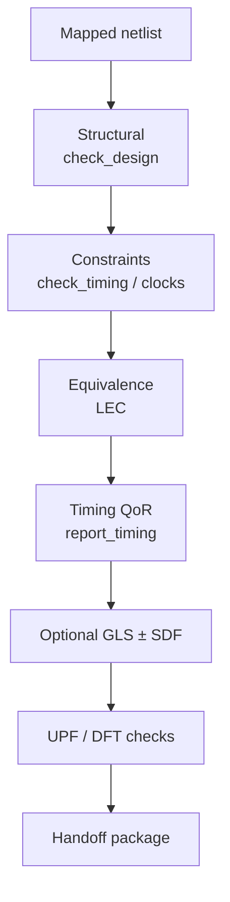
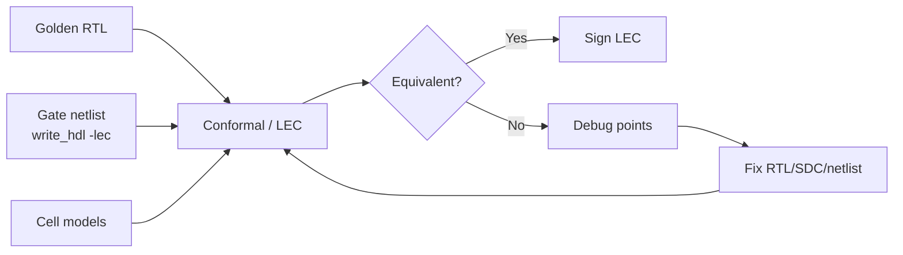

# Genus Verification Complete Guide — LEC, GLS, SDF, Handoff QA (Deep)

**Scope:** Full verification around Genus netlists — structural QA, LEC, GLS, SDF, timing/power/DFT/UPF checks, deliverable packages, issues. Industry.  
**Index:** `GENUS_COMPLETE_INDEX.md`.

---

## Table of contents

1. [Verification pillars](#1-verification-pillars)
2. [Structural QA — check_design deep](#2-structural-qa--check_design-deep)
3. [Timing constraint QA](#3-timing-constraint-qa)
4. [Logical Equivalence (LEC)](#4-logical-equivalence-lec)
5. [Gate-Level Simulation (GLS)](#5-gate-level-simulation-gls)
6. [SDF read/write](#6-sdf-readwrite)
7. [Power & UPF verification](#7-power--upf-verification)
8. [DFT verification hooks](#8-dft-verification-hooks)
9. [Deliverable packages](#9-deliverable-packages)
10. [Regression checklist](#10-regression-checklist)
11. [Issue → fix encyclopedia](#11-issue--fix-encyclopedia)
12. [Command cards](#12-command-cards)
13. [Interview FAQ](#13-interview-faq)

---

## 1. Verification pillars



| Pillar | Question | Primary commands / tools |
|--------|----------|---------------------------|
| Structural | Is netlist legal? | `check_design` |
| Constraints | Are clocks/SDC sane? | `check_timing`, `report_clocks` |
| Equivalence | RTL ≡ gates? | LEC / Conformal; `write_hdl -lec` |
| Functional | TB pass on gates? | Simulator ± SDF |
| Timing | WNS/TNS acceptable? | `report_qor`, `report_timing` |
| Power intent | UPF consistent? | `check_power_intent` |
| DFT | Scan rules OK? | `check_dft_rules` |

All pillars required for tapeout-quality; synth green alone is insufficient.

---

## 2. Structural QA — check_design deep

### 2.1 Command shape

```text
check_design [-undriven] [-unloaded] [-unloaded_comb] [-multiple_driver]
  [-unresolved] [-constant] [-through_tie_cell] [-feedthrough]
  [-cross_hier] [-assigns] [-all] [-collection] [-preserved]
  [-physical_only] [-logical_only] [-lib_lef_consistency]
  [-combo_loops] [-status] [<design>]
```

### 2.2 Severity table

| Flag | Must clear? | Notes |
|------|-------------|-------|
| `-unresolved` | **Yes** | Missing module/lib |
| `-multiple_driver` | **Yes** | RTL/connectivity |
| `-undriven` | **Yes** if real | Or intentional constant |
| `-combo_loops` | **Yes** unless intentional latch loop | |
| `-assigns` | **Yes** for many PnR | remove_assigns |
| `-unloaded` seq | Review | Dead or DFT |
| `-unloaded_comb` | Soft | Often opt/cleanup |
| `-constant` | Context | Pad ties OK |
| `-lib_lef_consistency` | Before physical | Match LEF |
| `-logical_only` | Before place | Need LEF |

### 2.3 Cleanup

```tcl
remove_assigns_without_opt -design $TOP -verbose
delete_unloaded_undriven $TOP
add_tieoffs -high $TIEH -low $TIEL -max_fanout 8 $TOP
check_design -all > check_final.rpt
```

---

## 3. Timing constraint QA

```tcl
report_units
report_clocks
report_clocks -generated
report_clock_groups
check_timing
report_timing -unconstrained -max_paths 100
report_port -delay [all_inputs]
report_port -delay [all_outputs]
report_qor
```

| Lint theme | Meaning |
|------------|---------|
| No clock waveform | Missing create_clock |
| Unconstrained endpoints | Missing I/O delay or clock |
| Cross-domain storms | Missing async groups |

See Clocks + CDC guides.

---

## 4. Logical Equivalence (LEC)

### 4.1 What / why / when

| What | Formal compare golden RTL vs gate netlist |
| Why | Catch accidental logic change |
| When | Post-map, post-opt, post-ECO, pre-tapeout |

### 4.2 Genus preparation

```tcl
write_hdl -lec > design_for_lec.v
write_hdl > design_gates.v
# Optional: write_hdl -generic for intermediate
```

Genus may create **`fv/`** verification directory with map dofiles (`fv_map*.do`) — use with Conformal.

### 4.3 Generic LEC flow



```text
1. Same language defines / includes as synth
2. Read golden RTL
3. Read gate netlist + cell libs for LEC
4. Map ports and key points (flops)
5. Run hierarchical or flat compare
6. Debug non-eq points (constant prop, DFT, names)
7. Fix and re-run
```

### 4.4 Common non-equivalence causes

| Cause | Handling |
|-------|----------|
| `ifdef` mismatch | Match synth defines |
| Dead code removed | Expected if unreachable |
| Scan insertion | Compare pre-DFT or same SE mode |
| Multibit merge | Mapping rules |
| Black boxes | Provide models |
| Hierarchy ungroup | Hierarchical LEC |
| Async reset modeling | LEC setup options |

### 4.5 Hierarchical LEC

Block LEC first → top with ILMs. See Hierarchical guide.

---

## 5. Gate-Level Simulation (GLS)

### 5.1 Types

| Type | Delays | Use |
|------|--------|-----|
| Zero-delay | None | X/connectivity |
| Unit-delay | 1 unit | Rough order |
| SDF-annotated | Real | Timing-sensitive bugs |

### 5.2 Ingredients

| Ingredient | Source |
|------------|--------|
| Netlist | `write_hdl` |
| Stdcell/IO/macro Verilog | Vendor |
| TB | Same as RTL ideally |
| SDF | `write_sdf` (early) or PnR SDF |
| Timescale | Match SDF |

### 5.3 GLS procedure

```text
1. Compile cell sims + netlist + TB
2. Optional: $sdf_annotate("design.sdf", top)
3. Run vectors
4. Compare to RTL golden results
5. Debug X and mismatches
```

### 5.4 X-propagation

| Source of X | Fix |
|-------------|-----|
| Unreset flops | Reset strategy |
| Undriven | check_design |
| Timing violation in sim | SDF path; STA |
| Missing UDP/model | Vendor sim model |

---

## 6. SDF read/write

```tcl
write_sdf [options] > design.sdf
read_sdf [options] file.sdf
```

| Use write | Export Genus delays for GLS or debug |
| Use read | Annotate back / analysis |
| Corners | Per-view SDF if multi-corner |
| Signoff | Usually Tempus/PnR SPEF-based, not Genus-only |

Confirm options with `help write_sdf` / `help read_sdf`.

---

## 7. Power & UPF verification

```tcl
check_power_intent -detail
check_power_structure -post_synthesis -isolation -level_shifter -retention
report_power_intent -summary
report_power_intent_instances -isolation_only -detail
report_power -by_category -unit mW
```

With activity: see Activity/SAIF guide.

---

## 8. DFT verification hooks

```tcl
check_dft_rules -advanced
report_dft_violations
report_scan_chains
```

---

## 9. Deliverable packages

### 9.1 Minimum PnR package

| File | Command |
|------|---------|
| Netlist | `write_hdl` |
| SDC | `write_sdc` |
| MMMC | `write_mmmc` |
| UPF | `write_power_intent -1801` |
| DB optional | `write_db -common` |

### 9.2 Verification package

| File | Command |
|------|---------|
| LEC netlist | `write_hdl -lec` |
| check_design rpt | redirect |
| qor/timing rpts | redirect |
| SDF optional | `write_sdf` |
| scandef | `write_scandef` |

### 9.3 Consistency checks

- [ ] Top name matches  
- [ ] Ports match SDC  
- [ ] Units match  
- [ ] Every cell in lib+LEF  
- [ ] LEC clean  
- [ ] Hard check_design clean  

---

## 10. Regression checklist

```text
 elaborates + read_sdc
 check_design hard = 0
 check_timing reviewed
 report_qor archived
 LEC pass
 (optional) GLS smoke
 write_* artifacts versioned
```

---

## 11. Issue → fix encyclopedia

| # | Issue | Fix |
|---|-------|-----|
| 1 | Unresolved | libs/RTL |
| 2 | Assigns | remove_assigns |
| 3 | LEC fail DFT | mode match |
| 4 | LEC fail defines | match +define |
| 5 | GLS all X | reset + models |
| 6 | SDF timescale | align units |
| 7 | PnR missing LEF | deliver LEF |
| 8 | Port rename | fix write/SDC |
| 9 | Power intent fail | UPF fix |
| 10 | Scan broken | DFT guide |

---

## 12. Command cards

```tcl
check_design -all > check.rpt
check_timing > ct.rpt
report_qor > qor.rpt
report_timing -max_paths 100 > timing.rpt
write_hdl -lec > lec.v
write_hdl > gates.v
write_sdc > design.sdc
write_db -design $TOP $TOP.db
write_sdf > design.sdf
write_mmmc -dir out -prefix chip
write_power_intent -1801 -base_name out/pi -overwrite
```

---

## 13. Interview FAQ

**Q: LEC vs GLS?** Formal vs vector-based.  
**Q: When SDF GLS?** Timing-sensitive bugs.  
**Q: Is Genus SDF signoff?** Usually no.  
**Q: Handoff minimum?** Netlist+SDC+libs/LEF+MMMC+UPF as applicable.

---

*Verification is a chain: structure → equivalence → constraints → vectors → signoff tools.*
