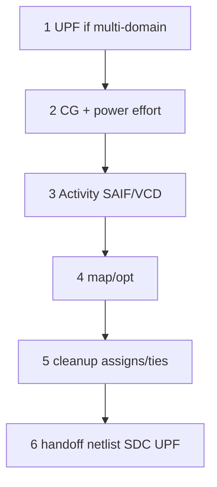
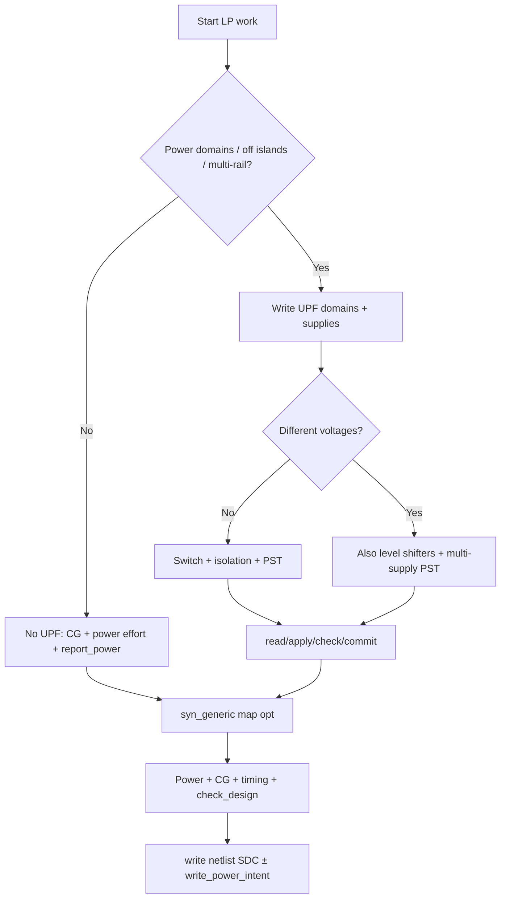

# Low-Power Synthesis Reference (Genus) — brush-up guide

**Audience:** Industry LP / UPF engineers (any design). Examples may mention a practice chip; methods are general.  
**Tool:** Cadence Genus Common UI. Commands from `PLAN/misc/genus_commands/`.  
**Curriculum index:** `GENUS_COMPLETE_INDEX.md`.  
**Also:** `HOW_TO_WRITE_UPF_CPF.md`, `GENUS_ACTIVITY_POWER_SAIF_VCD_GUIDE.md`.

---

## Table of contents

1. [When do you need low-power synthesis?](#1-when-do-you-need-low-power-synthesis)
2. [LP without UPF/CPF](#2-lp-without-upfcpf)
3. [LP with UPF/CPF (power intent)](#3-lp-with-upfcpf-power-intent)
4. [UPF format (IEEE 1801) — structure & examples](#4-upf-format-ieee-1801--structure--examples)
5. [CPF format — structure & examples](#5-cpf-format--structure--examples)
6. [UPF vs CPF](#6-upf-vs-cpf)
7. [End-to-end flows (step order)](#7-end-to-end-flows-step-order)
8. [Command encyclopedia (usage)](#8-command-encyclopedia-usage)
9. [Power reporting cookbook](#9-power-reporting-cookbook)
10. [Issue → diagnose → fix playbook](#10-issue--diagnose--fix-playbook)
11. [Expected issues & solutions](#11-expected-issues--solutions)
12. [check_design in LP/UPF context](#12-check_design-in-lpupf-context)
13. [Lab scripts & file map](#13-lab-scripts--file-map)
14. [Interview cheat sheet](#14-interview-cheat-sheet)
15. [Quick decision tree](#15-quick-decision-tree)

---

## 1. When do you need low-power synthesis?

### 1.1 Two different goals (do not mix them)

| Goal | Need UPF/CPF? | Typical knobs |
|------|---------------|---------------|
| **Reduce dynamic/leakage on one rail** | **No** | Clock gating, multi-Vt, power effort, activity files |
| **Architected power domains / modes** | **Yes** | UPF/CPF: domains, switches, ISO, LS, retention, PST |

### 1.2 When UPF/CPF **is** required

- Power **gating** (region OFF while rest ON) — even at **same voltage**
- **Multi-voltage / multi-rail** (core vs IO vs SRAM)
- **Isolation** between on/off regions
- **Level shifters** between voltages
- **Retention** (SRPG) across power-down
- Shared **power state table** for synth / PnR / sim / CLP

### 1.3 When UPF/CPF is **not** required

- Single always-on supply for whole chip
- Only clock gating / SAIF-based power opt / multi-Vt leakage
- Pad-dominated power learning (report `u_core` only)

### 1.4 Multi-domain vs multi-voltage

```text
Multi-DOMAIN  = different power regions (on/off and/or rails)
Multi-VOLTAGE = different voltage levels between regions

Multi-voltage  ⇒ almost always multi-domain + UPF + level shifters
Multi-domain   ⇒ UPF even at ONE voltage (power gating)
```

---

## 2. LP without UPF/CPF

### 2.1 Techniques

| Technique | Genus lever | Effect |
|-----------|-------------|--------|
| Integrated clock gating (ICG) | `set_db lp_insert_clock_gating true` | Cut clock/register dynamic |
| Discrete CG if no ICG | `set_db lp_insert_discrete_clock_gating_logic true` | Fallback |
| Power-aware map/opt | `set_db design_power_effort …` / `opt_power_effort …` | Cell choice / sizing bias |
| Leakage vs dynamic balance | `set_db opt_leakage_to_dynamic_ratio …` | Trade |
| Activity | `set_activity`, `read_saif`, `read_tcf`, `read_vcd` | Realistic power |
| Targets | `set_max_dynamic_power`, `set_max_leakage_power` | Hard goals (if used) |

### 2.2 Minimal sequence

```tcl
# After elaborate + SDC (top e.g. pad_top)
set_db lp_insert_clock_gating true
set_db design_power_effort low      ;# none|low|medium|high — confirm in session
set_db opt_power_effort low

# Optional activity
# set_activity -activity_type default -pin_types primary_input -duty 0.2 -freq 2e7
# read_saif -instance pad_top design.saif

syn_generic
syn_map
syn_opt

report_power -by_category -unit mW -header
report_power -inst u_core -by_category -unit mW
report_power -by_hierarchy -unit mW
report_clock_gates -detail -fanout_summary -include_activity_info
report_clock_gating_quality
report_qor
```

### 2.3 How to judge success

| Metric | Expectation |
|--------|-------------|
| Gated sinks / CG count | ↑ vs baseline without CG |
| `u_core` clock + register power | Often ↓ |
| Chip total with pads | May barely move (pads ~90%) |
| Timing WNS/TNS | Must stay acceptable |

### 2.4 Practice script

```bash
bash scripts/run_syn_lp.sh -batch
LP_CG=0 bash scripts/run_syn_lp.sh -batch   # baseline
```

Docs: `LOW_POWER_PRACTICE_NO_UPF.md`

---

## 3. LP with UPF/CPF (power intent)

### 3.1 What intent adds

```text
Supplies → Domains → Switches → Isolation / LS / Retention → PST / modes
```

Tools then:

1. **Understand** which instances are on which rail  
2. **Insert** ISO / LS / SRPG (`commit_power_intent`)  
3. **Check** rules (`check_power_intent`, `check_power_structure`)  
4. **Hand off** updated intent (`write_power_intent`)

### 3.2 Genus power-intent sequence (PLAN-aligned)

```tcl
elaborate pad_top

read_power_intent -1801 -module pad_top -verbose design.upf
# or: read_power_intent -cpf -module pad_top -verbose design.cpf

apply_power_intent -design pad_top -summary
check_power_intent -design pad_top -detail > check_pi.rpt

report_power_intent -summary
report_power_intent -power_domain_only
report_power_intent -isolation_rule_only
report_power_intent -power_states

commit_power_intent -design pad_top

report_power_intent_instances -summary
report_power_intent_instances -isolation_only -detail

# then SDC + syn_generic / syn_map / syn_opt (+ CG as usual)
write_power_intent -1801 -base_name out/pi -overwrite
```

### 3.3 Practice hierarchy (this lab)

```text
pad_top                 → PD_TOP   (always on, pads)
  └── u_core (top)      → PD_CORE  (switchable VDD_CORE)
```

Files:

- `upf/pad_top_practice.upf`
- `upf/pad_top_practice.cpf`

```bash
DO_COMMIT_PI=0 bash scripts/run_syn_upf.sh -batch   # intent only first
bash scripts/run_syn_upf.sh -batch
POWER_INTENT_FORMAT=cpf bash scripts/run_syn_upf.sh -batch
```

---

## 4. UPF format (IEEE 1801) — structure & examples

### 4.1 Typical file skeleton

```text
upf_version 2.0

# 1 Supplies
create_supply_net / create_supply_port / connect_supply_net

# 2 Domains
create_power_domain ... -include_scope | -elements {hinst}
set_domain_supply_net PD -primary_power_net ... -primary_ground_net ...

# 3 Switches (power gating)
create_power_switch ... -on_state / -off_state
create_logic_port / create_logic_net   ;# control

# 4 Isolation
set_isolation ... -domain -applies_to -clamp_value
set_isolation_control ... -isolation_signal -isolation_sense -location

# 5 Level shifters (multi-voltage only)
# set_level_shifter ...

# 6 Retention (optional)
# set_retention / set_retention_control ...

# 7 States / PST
add_power_state / add_port_state / create_pst / add_pst_state

# 8 Port attributes (related supplies)
set_port_attributes -ports {...} -driver_supply -receiver_supply
```

### 4.2 Annotated mini example (same-voltage power gate)

```tcl
upf_version 2.0

create_supply_net VDD
create_supply_net VSS
create_supply_net VDD_CORE
create_supply_port VDD
create_supply_port VSS
connect_supply_net VDD -ports VDD
connect_supply_net VSS -ports VSS

create_power_domain PD_TOP -include_scope
set_domain_supply_net PD_TOP -primary_power_net VDD -primary_ground_net VSS

create_power_domain PD_CORE -elements {u_core}
set_domain_supply_net PD_CORE -primary_power_net VDD_CORE -primary_ground_net VSS

create_power_switch sw_core \
  -domain PD_CORE \
  -input_supply_port  {vin VDD} \
  -output_supply_port {vout VDD_CORE} \
  -control_port       {ssctrl sw_core_ctrl} \
  -on_state  {full_on  vin {ssctrl}} \
  -off_state {full_off {~ssctrl}}

create_logic_port -direction in sw_core_ctrl

set_isolation iso_core_out \
  -domain PD_CORE -applies_to outputs -clamp_value 0 \
  -isolation_power_net VDD -isolation_ground_net VSS

set_isolation_control iso_core_out \
  -domain PD_CORE -isolation_signal sw_core_ctrl \
  -isolation_sense low -location self

add_port_state VDD      -state {ON 0.72}
add_port_state VSS      -state {ON 0.00}
add_port_state VDD_CORE -state {ON 0.72} -state {OFF off}
create_pst pst_practice -supplies {VDD VSS VDD_CORE}
add_pst_state RUN   -pst pst_practice -state {ON ON ON}
add_pst_state SLEEP -pst pst_practice -state {ON ON OFF}
```

Full lab file: `practice/upf/pad_top_practice.upf`

### 4.3 Common UPF constructs (meaning)

| Construct | Meaning |
|-----------|---------|
| `create_power_domain … -include_scope` | Default domain for top scope |
| `-elements {u_core}` | Map hierarchical instance to domain |
| `set_domain_supply_net` | Primary power/ground of domain |
| `create_power_switch` | Header/footer abstract switch |
| `set_isolation` | Clamp strategy when source domain off |
| `-location self \| parent` | ISO inside OFF domain vs AO parent |
| `-isolation_sense low \| high` | Active level of control |
| `set_level_shifter` | Voltage crossing (multi-V) |
| `set_retention` | Keep state when powered down |
| `create_pst` / `add_pst_state` | Legal supply combinations |

### 4.4 Genus flags for UPF

```tcl
read_power_intent -1801 -module <top> -verbose file.upf
write_power_intent -1801 -base_name out/name -overwrite
```

---

## 5. CPF format — structure & examples

### 5.1 Typical skeleton

```text
set_design <top>

create_power_domain -name PD -default | -instances {...}
create_power_nets / create_ground_nets
create_power_switch ...
update_power_domain -primary_power_net -primary_ground_net

create_isolation_rule -from -to -isolation_condition ...
create_level_shifter_rule ...   ;# multi-V
create_state_retention_rule ...

create_nominal_condition -name -voltage
create_power_mode -name -domain_conditions {...}
```

### 5.2 Mini CPF example

```tcl
set_design pad_top

create_power_domain -name PD_TOP  -default
create_power_domain -name PD_CORE -instances {u_core}

create_power_nets  -nets {VDD VDD_CORE}
create_ground_nets -nets {VSS}

create_power_switch -name sw_core \
  -domain PD_CORE \
  -output_power_net VDD_CORE \
  -input_power_net VDD \
  -enable_condition_pin sw_core_ctrl

update_power_domain -name PD_TOP  -primary_power_net VDD      -primary_ground_net VSS
update_power_domain -name PD_CORE -primary_power_net VDD_CORE -primary_ground_net VSS

create_isolation_rule -name iso_core_out \
  -from PD_CORE -to PD_TOP \
  -isolation_condition {!sw_core_ctrl} \
  -isolation_output low \
  -isolation_power_net VDD -isolation_ground_net VSS

create_nominal_condition -name nom_on  -voltage 0.72
create_nominal_condition -name nom_off -voltage 0.0
create_power_mode -name RUN   -domain_conditions {PD_TOP@nom_on PD_CORE@nom_on}
create_power_mode -name SLEEP -domain_conditions {PD_TOP@nom_on PD_CORE@nom_off}
```

Full lab file: `practice/upf/pad_top_practice.cpf`

### 5.3 Genus flags for CPF

```tcl
read_power_intent -cpf -module <top> -verbose file.cpf
write_power_intent -cpf -base_name out/name -overwrite
```

---

## 6. UPF vs CPF

| Topic | UPF (1801) | CPF |
|-------|------------|-----|
| Standard | IEEE, multi-vendor | Cadence-origin, legacy |
| Prefer for new work | **Yes** | Only if flow mandates |
| Genus read | `-1801` | `-cpf` |
| Same job? | Domains, ISO, LS, retention, modes | Same ideas, different syntax |
| Interviews | Talk UPF first | Mention CPF as legacy |

---

## 7. End-to-end flows (step order)

### 7.1 Flow A — No UPF/CPF (clock-gating LP)


### 7.2 Flow B — With UPF/CPF


### 7.3 Combined “full LP” mental model



```text
1) Power intent (if multi-domain)     ← UPF
2) Clock gating + power effort        ← no UPF needed for this part
3) Activity (SAIF/VCD) for accurate power
4) Map/opt for timing + power
5) Cleanup assigns / ties
6) Handoff netlist + SDC + UPF out + reports
```

---

## 8. Command encyclopedia (usage)

### 8.1 Power intent

| Command | Usage gist | When |
|---------|------------|------|
| `read_power_intent` | `[-1801\|-cpf] [-module top] [-verbose] file` | After elaborate |
| `apply_power_intent` | `[-design d] [-module m] [-summary]` | After read |
| `check_power_intent` | `[-isolation\|-level_shifter\|-retention\|-always_on] [-detail]` | After apply |
| `commit_power_intent` | `[-design d]` | Insert ISO/LS/SRPG |
| `reset_power_intent` | (see help) | Clear intent |
| `report_power_intent` | `[-power_domain_only\|-isolation_rule_only\|-level_shifter_rule_only\|-state_retention_only\|-power_states\|-summary\|-detail]` | Debug intent |
| `report_power_intent_instances` | `[-isolation_only\|-level_shifter_only\|-state_retention_only\|-summary\|-detail]` | After commit |
| `write_power_intent` | `[-1801\|-cpf] [-base_name path] [-overwrite] [-design d]` | Handoff |
| `write_top_power_intent` | top-level write (see help) | Hierarchical |
| `check_power_structure` | `[-pre_synthesis\|-post_synthesis\|-isolation\|-level_shifter\|-retention\|-all] [-detail]` | CLP-style checks (license) |
| `update_power_domain` | modify domain attrs | Advanced |
| `modify_power_domain_attr` | domain attributes | Advanced |

### 8.2 Clock gating

| Command | Usage gist |
|---------|------------|
| `set_db lp_insert_clock_gating true` | Enable ICG insertion |
| `set_db lp_insert_discrete_clock_gating_logic true` | No ICG in lib |
| `report_clock_gates` | `[-detail] [-fanout_summary] [-tree_view] [-include_activity_info] [-get_sinks gated\|ungated\|…]` |
| `report_clock_gating_quality` | Quality metrics |
| `report_clock_gate_decloning` | Declone status |
| `merge_clock_gate` / `split_clock_gate` / `share_clock_gate` | Tree edit |
| `declone_clock_gate` / `delete_clock_gate` / `update_clock_gate` | Maintain CG |
| `set_clock_gating_check` / `set_disable_clock_gating_check` | Timing checks on CG |
| `add_clock_gates_test_connection` | DFT connect |
| `rebalance_clock_gating` | Rebalance tree |

### 8.3 Activity & power analysis

| Command | Usage gist |
|---------|------------|
| `set_activity` | `-duty -freq [-activity_type user\|default] [-pin_types …] [-clock …]` |
| `read_saif` | `[-instance path] [-scale_to_sdc_frequency] file.saif` |
| `read_tcf` | `[-hinst path] file.tcf` |
| `read_vcd` | `[-static] [-hinst] [-start_time] [-end_time] file.vcd` |
| `write_saif` / `write_tcf` | Export activity |
| `report_power` | See [§9](#9-power-reporting-cookbook) |
| `set_max_dynamic_power` / `set_max_leakage_power` | Targets |
| `report_test_power` | Test-mode power |

### 8.4 Key attributes (`set_db` / `get_db`)

| Attribute | Role |
|-----------|------|
| `lp_insert_clock_gating` | Insert ICG during synth |
| `lp_insert_discrete_clock_gating_logic` | Discrete CG |
| `design_power_effort` | Power effort at design level |
| `opt_power_effort` | Effort in opt |
| `opt_leakage_to_dynamic_ratio` | Leakage vs dynamic weight |
| `lp_default_toggle_percentage` | Default vectorless toggle |
| `lp_power_unit` | Power unit (e.g. nW) |
| `leakage_scale_factor` | Scale leakage |

```tcl
get_db lp_insert_clock_gating
get_db design_power_effort
get_db opt_power_effort
```

Always confirm legal enum values in your Genus build (`help` / `get_db`).

### 8.5 Synthesis stages (unchanged)

```tcl
syn_generic
syn_map
syn_opt
```

### 8.6 Netlist hygiene after LP

```tcl
check_design -assigns
remove_assigns_without_opt -design pad_top -verbose
delete_unloaded_undriven pad_top
add_tieoffs -high TIEHBWP16P90 -low TIELBWP16P90 -max_fanout 8 pad_top
check_design -all
```

---

## 9. Power reporting cookbook

```tcl
# Category (memory/register/logic/clock/pad/…)
report_power -by_category -unit mW -header

# Module / hierarchy
report_power -by_hierarchy -unit mW -header
report_power -module top -levels all -unit mW
report_power -inst u_core -by_category -unit mW
report_power -inst u_core -by_hierarchy -unit mW

# Hot spots
report_power -by_leaf_instance -unit mW -header
report_power -by_libcell -unit mW -header
report_power -by_func_type -unit mW

# Domains / rails (after UPF)
report_power -power_domain <pd> -unit mW
report_power -by_rail -unit mW

# Reduce pad noise in totals
report_power -by_category -skip_port_switching_power -unit mW

# Clock domain
report_power -clock_domain [get_db clock_domains *] -unit mW
```

**Reading a category table**

| Column | Meaning |
|--------|---------|
| Leakage | Static |
| Internal | Cell internal / short-circuit when switching |
| Switching | Net/pin \(C V^2 f\)-like |
| Row% | Share of total |

**Pad-top lesson:** chip total often **~90% pad**; use **`u_core`** for LP A/B.

**Activity quality**

| Source | Quality |
|--------|---------|
| Default frame `stim#0/frame#0` | Relative only |
| `set_activity` | Better if realistic |
| SAIF / TCF / VCD | Best for that workload |

---

## 10. Issue → diagnose → fix playbook

| # | Symptom | Diagnose | Fix |
|---|---------|----------|-----|
| 1 | Chip power huge, CG did nothing | `report_power -by_category` | Expect pads; compare `u_core` |
| 2 | No clock gates | `report_clock_gates`; `get_db lp_insert_clock_gating` | Enable before map; check ICG in lib |
| 3 | Many ungated flops | `report_clock_gates -get_sinks ungated` | Enable quality, RTL enables, min bit width attrs |
| 4 | CG hurts timing | `report_timing` through CG | Resize CG, rebalance, exempt critical enables |
| 5 | Power numbers nonsense | Check SAIF/VCD applied? | `read_saif`/`read_vcd` + re-report |
| 6 | `read_power_intent` fails | Path, `-module` name, format flag | Match top; use `-1801` vs `-cpf` correctly |
| 7 | Domain empty / wrong | `report_power_intent -power_domain_only` | Fix `-elements {u_core}` instance path |
| 8 | `check_power_intent` ISO errors | `-isolation -detail` | Fix control sense, location, supplies |
| 9 | `commit_power_intent` fails | Log + ISO cells in lib | Load ISO lib; map strategy; or intent-only lab |
| 10 | No ISO instances after commit | `report_power_intent_instances` | Rules not matching boundaries; location; commit not run |
| 11 | Missing level shifters | Multi-V without LS rules | `set_level_shifter` + LS libs |
| 12 | Floating when domain off | Missing ISO | Add `set_isolation` + control |
| 13 | Corruption after power-up | Need retention or reload | `set_retention` or boot sequence |
| 14 | Assigns after LP/UPF | `check_design -assigns` | `remove_assigns_without_opt` |
| 15 | Unloaded comb after CG | `check_design -unloaded_comb` | `delete_unloaded_undriven` / opt |
| 16 | Constants 350 on pad_top | `check_design -constant` | **OK** (pad ties) |
| 17 | Logical-only cells | `check_design -logical_only` | Load LEF; or ignore if no LEF in synth session |
| 18 | UPF control port undriven in GLS | New `sw_core_ctrl` | Drive in TB / tie for synth-only; real PMU later |
| 19 | CPF vs UPF mismatch | Two files diverge | Prefer single golden UPF |
| 20 | `check_power_structure` fails license | CLP license | Skip or use `check_power_intent` only |
| 21 | Hold fails after ISO insert | Extra delay on path | Opt / size ISO / location parent vs self |
| 22 | Setup fails after CG | Enable path / CG latency | `set_clock_gating_check`; timing fix |
| 23 | Power intent ignored in synth | Forgot apply/commit | Re-run intent sequence before map |
| 24 | Wrong PST state analysis | `report_power_intent -power_states` | Fix `add_pst_state` / voltages |
| 25 | Multi-drive after commit | ISO connect bug | `check_design -multiple_driver`; fix UPF |

---

## 11. Expected issues & solutions

### 11.1 Expected (usually OK)

| Observation | Why | Action |
|-------------|-----|--------|
| Constant leaf pins ~350 | Pad `1'b0`/`1'b1` ties | Leave; optional `add_tieoffs` |
| Chip power pad-dominated | Large IO cells | Optimize/report **core** |
| Vectorless power absolute value off | Default activity | Use SAIF for claims |
| `commit_power_intent` fails without ISO lib | No ISO cells | Intent learning still valid; add ISO lib for full commit |
| Extra logic port for switch/ISO control | UPF `create_logic_port` | Expected |

### 11.2 Must fix before handoff

| Issue | Solution |
|-------|----------|
| Assigns > 0 | `remove_assigns_without_opt` |
| Unresolved / multidriven / undriven | RTL / connect / libs |
| Intent domain wrong instance | Fix UPF `-elements` path |
| Timing red after LP | Timing closure (not disable CG blindly) |

### 11.3 `commit_power_intent` failure checklist

1. Isolation/LS **lib cells** present and not `dont_use`  
2. Isolation **control** exists and sense matches OFF state  
3. Domain **boundary** nets correctly domain-crossed  
4. Try `check_power_intent -isolation -detail`  
5. Temporary: `DO_COMMIT_PI=0` and continue learning reports  

### 11.4 Clock gating not inserting

1. `get_db lp_insert_clock_gating` → must be true **before** map  
2. Library has ICG (or enable discrete CG)  
3. Flops have usable enables (tool can infer)  
4. `report_clock_gates -get_sinks ungated` for leftovers  
5. Preserve / dont_touch blocking  

### 11.5 Power report interpretation pitfalls

| Pitfall | Reality |
|---------|---------|
| “LP failed, total mW same” | Pads mask core savings |
| “Leakage 0 means perfect” | Corner/activity may hide leakage |
| Comparing runs without same SDC/activity | Invalid A/B |
| Forgetting units (W vs mW) | Use `-unit mW` |

---

## 12. check_design in LP/UPF context

Example summary after LP:

```text
Assigns                    5     → remove
Unloaded Combinational     7     → review / delete_unloaded_undriven
Constant Leaf            350     → OK pads
Constant hierarchical    152     → usually OK
Logical only              47     → LEF session dependent
Unresolved/undriven/MD     0     → good
```

**Target handoff:** assigns 0; hard zeros on unresolved/MD/undriven; constants non-zero OK for pad_top.

```tcl
check_design -assigns
check_design -unloaded_comb
check_design -constant
check_design -all > check_all.rpt
```

---

## 13. Lab scripts & file map

| Path | Role |
|------|------|
| `scripts/run_genus_pad_top.tcl` | Logical synth |
| `scripts/run_syn.sh` | Logical launcher |
| `scripts/run_genus_pad_top_lp.tcl` | LP **without** UPF |
| `scripts/run_syn_lp.sh` | LP launcher (`LP_CG=0` baseline) |
| `scripts/run_genus_pad_top_upf.tcl` | **With** UPF/CPF |
| `scripts/run_syn_upf.sh` | UPF launcher |
| `upf/pad_top_practice.upf` | Golden learning UPF |
| `upf/pad_top_practice.cpf` | CPF twin |
| `sdc/pad_top_func.sdc` | Lab SDC |
| `outputs/practice1.sdc` | Your closed-run SDC (if present) |
| `docs/LOW_POWER_PRACTICE_NO_UPF.md` | Short no-UPF lab |
| `docs/UPF_CPF_PRACTICE.md` | Short UPF lab |
| **This file** | Full brush-up reference |
| `PLAN/misc/genus_commands/` | Authoritative help dumps |
| `PLAN/procs/synthesis_utils.tcl` | `syn_apply_power_intent` pattern |

### Reports directories

| Run | Dir |
|-----|-----|
| LP no UPF | `reports/genus_pad_top_lp/` |
| UPF | `reports/genus_pad_top_upf/` |

---

## 14. Interview cheat sheet

**Q: When UPF?**  
When power is **architected** into domains/modes (gating, multi-rail, ISO, LS, retention)—not for plain clock-gating only.

**Q: Same voltage power gate — UPF?**  
**Yes.** Isolation + domains still required.

**Q: UPF vs CPF?**  
UPF = IEEE standard; CPF = legacy Cadence.

**Q: Order in Genus?**  
`elaborate` → `read_power_intent` → `apply` → `check` → `commit` → SDC → `syn_*`.

**Q: How prove CG worked?**  
`report_clock_gates`, gated vs ungated sinks, core dynamic power A/B.

**Q: Why total power unchanged?**  
I/O pads dominate; show **core** power delta.

**Q: commit fails?**  
Missing ISO/LS library cells or bad isolation control—not always “bad UPF.”

**Q: Activity?**  
Default vectorless is relative; SAIF/VCD for accuracy.

---

## 15. Quick decision tree



---

## Appendix A — One-page command card

```tcl
# --- No UPF LP ---
set_db lp_insert_clock_gating true
set_db design_power_effort low
set_db opt_power_effort low
syn_generic; syn_map; syn_opt
report_power -inst u_core -by_category -unit mW
report_clock_gates -detail -fanout_summary
report_clock_gating_quality

# --- UPF ---
read_power_intent -1801 -module pad_top -verbose file.upf
apply_power_intent -summary
check_power_intent -detail
commit_power_intent
report_power_intent -power_domain_only
report_power_intent_instances -isolation_only -detail
write_power_intent -1801 -base_name out/pi -overwrite

# --- Activity ---
read_saif -instance pad_top file.saif
# read_vcd -static -hinst pad_top file.vcd
set_activity -activity_type default -pin_types flop_out -duty 0.5 -freq 0.1 -clock related

# --- Cleanup ---
remove_assigns_without_opt -design pad_top -verbose
add_tieoffs -high TIEHBWP16P90 -low TIELBWP16P90 -max_fanout 8 pad_top
check_design -all
```

---

## Appendix B — Related docs

| Doc | Scope |
|-----|--------|
| `GENUS_SYNTHESIS_MASTER_INTERVIEW_GUIDE.md` | Full synth + timing |
| `GENUS_COMMANDS.md` | Problem → command (general) |
| `LOW_POWER_PRACTICE_NO_UPF.md` | No-UPF lab |
| `UPF_CPF_PRACTICE.md` | UPF lab |
| **`LOW_POWER_SYNTHESIS_REFERENCE.md`** | **This file — full LP brush-up** |
| `HOW_TO_WRITE_UPF_CPF.md` | **Line-by-line UPF writing guide** (+ multi-V §9) |
| `../upf/pad_top_multivoltage_EXAMPLE.upf` | Multi-voltage UPF teaching example |

---

*Keep this file as the single LP synthesis notebook. Update the Issue table (§10) when you hit new failures in Genus.*
