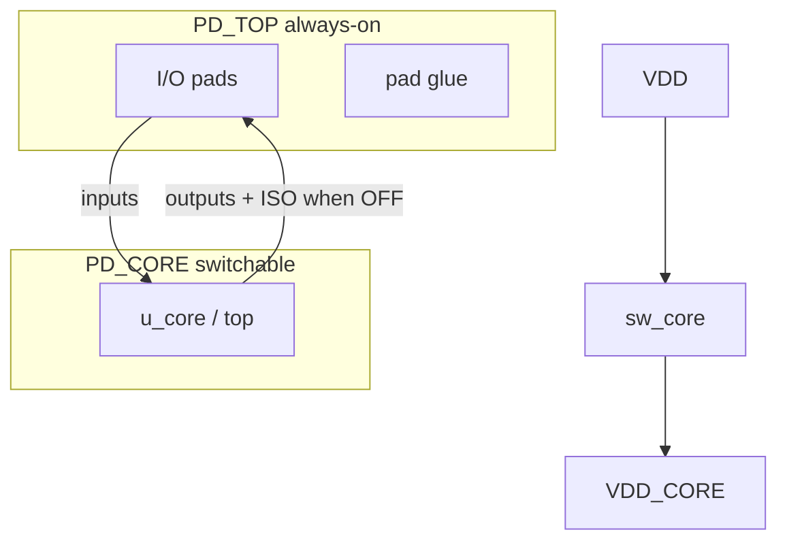

# UPF / CPF practice — `pad_top` (Genus)

Prefer **UPF (IEEE 1801)**. CPF is provided only to compare syntax.

---

## Concepts (this lab)

```text
pad_top                    domain PD_TOP   (always ON — pads + shell)
  └── u_core (module top)  domain PD_CORE  (switchable via VDD_CORE)
```

| Object | Role |
|--------|------|
| `VDD` / `VSS` | Always-on supplies |
| `VDD_CORE` | Gated core rail |
| `sw_core` | Abstract power switch |
| `sw_core_ctrl` | Logic control (UPF `create_logic_port`) |
| Isolation | Clamp core outputs when core OFF |
| PST `RUN` / `SLEEP` | ON vs core rail OFF |

Same voltage on both rails → **no level shifters** in this lab.



---

## Files

| Path | Content |
|------|---------|
| `upf/pad_top_practice.upf` | **Primary** learning UPF |
| `upf/pad_top_practice.cpf` | CPF twin (legacy) |
| `scripts/run_genus_pad_top_upf.tcl` | Genus flow |
| `scripts/run_syn_upf.sh` | Launcher |

---

## Genus command sequence (verified)

```tcl
elaborate pad_top

read_power_intent -1801 -module pad_top -verbose upf/pad_top_practice.upf
# CPF: read_power_intent -cpf -module pad_top -verbose upf/pad_top_practice.cpf

apply_power_intent -design pad_top -summary
check_power_intent -design pad_top -detail > check_pi.rpt

report_power_intent -summary
report_power_intent -power_domain_only
report_power_intent -isolation_rule_only
report_power_intent -power_states

# Inserts isolation (needs suitable lib cells)
commit_power_intent -design pad_top

report_power_intent_instances -summary
report_power_intent_instances -isolation_only -detail

# Then normal synth
read_sdc ...
syn_generic ; syn_map ; syn_opt

write_power_intent -1801 -base_name out/pad_top_out -overwrite
write_hdl > out.v
```

PLAN toolkit does the same pattern in `syn_apply_power_intent` (`read` → `check` → `commit`).

---

## How to run

```bash
cd /mnt/data2/hemanth/manual_asic/practice

# Recommended first pass: apply + check, soft-fail if commit lacks ISO cells
DO_COMMIT_PI=0 bash scripts/run_syn_upf.sh -batch

# Full attempt including commit_power_intent
bash scripts/run_syn_upf.sh -batch

# CPF path
POWER_INTENT_FORMAT=cpf bash scripts/run_syn_upf.sh -batch
```

---

## What to read after the run

| Report | Meaning |
|--------|---------|
| `power_intent_domains.rpt` | PD_TOP / PD_CORE mapping |
| `power_intent_isolation.rpt` | ISO rules |
| `power_intent_states.rpt` | RUN / SLEEP |
| `check_power_intent.rpt` | Intent consistency |
| `power_intent_instances_*.rpt` | Inserted ISO cells (if commit OK) |
| `qor.rpt` | Timing still viable? |

---

## UPF vs CPF (interview)

| | UPF (1801) | CPF |
|--|------------|-----|
| Standard | IEEE, multi-vendor | Cadence-origin, legacy |
| Genus flag | `-1801` | `-cpf` |
| Prefer | **New designs** | Old flows only |

---

## Expected issues (learning, not failure)

1. **`commit_power_intent` fails** — lib has no isolation cells or naming mismatch. Still valuable: domains + check reports. Fix later with ISO libcells / `set_db` LP cell lists.  
2. **Extra logic port `sw_core_ctrl`** — UPF control; must be driven in real silicon (PMU).  
3. **No UPF ≠ no LP** — clock gating is separate (also enabled in this script by default).  
4. **Power numbers** — still vectorless unless SAIF/VCD; domains enable **rail/domain** reporting after intent.

---

## Relation to previous labs

| Lab | Intent |
|-----|--------|
| Logical synth | Function + timing |
| LP no UPF | Clock gating + power reports |
| **This lab** | Power domains + isolation intent |
| Innovus later | Physical + MMMC; UPF continues in PnR |

---

## Minimal UPF checklist (for interviews)

- [ ] `create_power_domain` + `-elements` / `-include_scope`  
- [ ] `create_supply_net` / `set_domain_supply_net`  
- [ ] Switch or always-on definition  
- [ ] `set_isolation` + `set_isolation_control`  
- [ ] PST / power states  
- [ ] `read_power_intent` → `check` → `commit`  
- [ ] Verify with `report_power_intent` / instances  

---

*Edit `upf/pad_top_practice.upf` to experiment (e.g. enable input-side isolation).*
